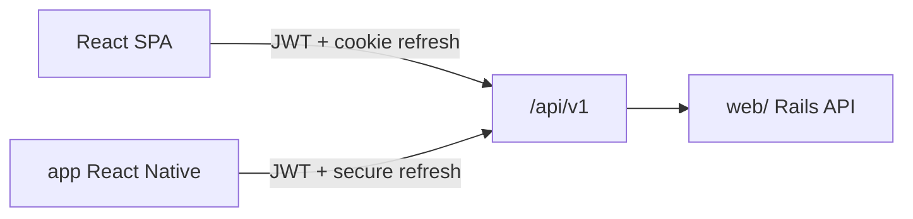

# API — School Lab

> Executable contract: OpenAPI generated by **rswag** in `web/swagger/v1/swagger.yaml`  
> Narrative auth model: [`docs/modeling/002-api-auth.md`](../modeling/002-api-auth.md)  
> Billing partner slice (historical baseline, implemented): [`v1/fintech-first.md`](v1/fintech-first.md)  
> Normative billing narrative: [`v1/billing.md`](v1/billing.md)  
> Identity & onboarding: [`v1/identity-onboarding.md`](v1/identity-onboarding.md)

Versioned JSON REST API consumed by **React web** (`frontend/app`) and **React Native** (`mobile/`).
Business rules live in Rails service objects — clients never duplicate domain logic.

## Base URL and versioning

| Item | Value |
|------|-------|
| Path prefix | `/api/v1` |
| Breaking changes | new major version (`/api/v2`) |
| JSON keys | `snake_case` |
| Locale | `Accept-Language: pt-BR` (error messages via i18n) |

## Architecture



- **`web/`** — Rails 8.1: API controllers, services, models, jobs.
- **`frontend/app`** — React SPA (Vite); the product web UI.
- **`mobile/`** — React Native mobile apps.

## Multi-school context

Tenant-scoped resources use the school in the path:

```
/api/v1/schools/:school_id/billing/charges
```

Global endpoints (no school): `auth/*`, `GET /me`, backoffice `schools`.

The client selects one profile/school membership after login using `GET /me`.

Tenant requests send:

```
X-Membership-Id: <membership.id>
```

The header is required when the user has more than one active membership for the path school and is
recommended on every tenant request. The API validates that it belongs to the authenticated user,
matches `:school_id`, and is kept with `status: active` before assigning `Current.membership`.
Missing context when selection is ambiguous returns `409 membership_context_required`; a header
that names a removed/suspended, other-user, or other-school membership returns `403
invalid_membership_context` without revealing membership metadata.

One account may hold distinct staff/teacher and guardian memberships in the same school. Selecting
one never merges permissions or family scope from another. Clients persist only the membership id
and clear school-scoped state when switching.

## Authentication

| Client | Access token | Refresh token |
|--------|--------------|---------------|
| **React web** | Memory (Bearer header) | **httpOnly Secure cookie** on refresh endpoint |
| **React Native** | Memory | **Keychain / Keystore** (body on refresh) |

Devise validates credentials; API issues JWT access + refresh (see `002-api-auth.md`).

```
Authorization: Bearer <access_token>
```

## Authorization

- **Pundit** policies on every mutating and tenant-scoped read.
- `Current.user` from JWT; `Current.school` from `:school_id`; `Current.membership` from the
  validated `X-Membership-Id` (or the sole eligible membership) for role/profile context.
- Guardian routes under `.../me/...` — family isolation (never another family's data).

## Request conventions

### Pagination (Pagy)

Query: `page`, `per_page` (default 25, max 100).

```json
{
  "data": [ ... ],
  "meta": { "page": 1, "per_page": 25, "total": 120 }
}
```

### Filtering

Domain-specific query params documented per resource, e.g.:

- `status` — comma-separated (`status=pending,overdue`)
- `from`, `to` — date ranges on `due_date`, `created_at`
- `sort` — `due_date`, `-due_date` (minus = descending)

### Soft delete (Discard)

`DELETE` HTTP calls `discard` internally (`discarded_at` set). Records stay in DB for
integrity and retention. OpenAPI describes these as soft delete.

### Business actions

Non-CRUD operations use `POST` on a member route:

```
POST /api/v1/schools/:school_id/billing/charges/:id/cancel
POST /api/v1/schools/:school_id/billing/charges/:id/reissue
```

## Error envelope

```json
{
  "error": {
    "code": "membership_suspended",
    "message": "Acesso suspenso nesta escola.",
    "details": {}
  }
}
```

| HTTP | When |
|------|------|
| `400` | Malformed request |
| `401` | Missing/invalid access token |
| `403` | Policy denied / wrong role |
| `404` | Not found or cross-tenant isolation |
| `409` | Conflict (duplicate email, **invalid state transition**) |
| `422` | Validation errors (`details` may hold field errors) |
| `501` | Planned route not implemented yet (phase 2 skeleton) |

## OpenAPI and testing (rswag)

| Gem | Role |
|-----|------|
| `rswag-specs` | Request specs with OpenAPI metadata |
| `rswag-api` | Serves `swagger/v1/swagger.yaml` at `/api-docs/v1/swagger.yaml` |
| `rswag-ui` | Swagger UI at `/api-docs` (local dev/test; staging when `EXPOSE_API_DOCS=true`, behind HTTP Basic Auth) |

Workflow:

1. Write `spec/requests/api/v1/*_spec.rb` with rswag DSL.
2. Run `rake rswag:specs:swaggerize` → `swagger/v1/swagger.yaml`.
3. Commit generated YAML; optional copy to `docs/api/` for review without running Rails.

OpenAPI **tags** currently emitted in `swagger/v1/swagger.yaml`: `Auth`, `Backoffice`,
`Billing`, `Communication`, `Documents`, `Guardian Me`, `Me`, `People`, `Role Templates`.

**Frozen narrative tags (Phase 4C.1 — Platform W1):** `Platform`, `School Years`,
`Academic Periods`, `Holidays` — see [`v1/platform-and-admin.md`](v1/platform-and-admin.md).
W2+ Platform tags (`Calendar`, `Backoffice`) pending Phase 4C.1b.

Optional client codegen: `openapi-typescript` or `orval` in `frontend/app` and `mobile/`.

## CORS

`rack-cors` allows the web SPA origin in development and production deploy URLs.
Mobile apps do not use CORS.

## Webhooks (not in public OpenAPI)

Payment-provider reconciliation — separate path, no user JWT:

```
POST /webhooks/:provider/:token
```

`:provider` is the provider key (`cora`, `fake`) and `:token` is the per-school
`school_payment_providers.webhook_endpoint_token`. An unknown pair returns `404`.

**There is no HMAC signature, and that is deliberate.** Cora's Direct Integration
notification has **no request body and no signature header** — it carries only event
headers (`Webhook-Event-Id`, `Webhook-Event-Type`, `Webhook-Resource-Id`), so there is
nothing to compute a signature over. Authenticity rests on two controls:

1. The secret, rotatable token in the URL, unique per school and provider.
2. The notification is **never a source of truth**. It only records a `webhook_events`
   row and enqueues a job; the outcome is decided by an authenticated mTLS read of the
   invoice (`fetch_invoice`) against the school's own Cora account. A forged
   notification can at most trigger a re-read that confirms the invoice is unpaid.

Do not "restore" HMAC verification here assuming it was left out by mistake.

## Domain route map (overview)

| Namespace | MVP phase | Doc |
|-----------|-----------|-----|
| `auth`, `me` | Fintech-first / identity | [`v1/fintech-first.md`](v1/fintech-first.md), [`v1/identity-onboarding.md`](v1/identity-onboarding.md) |
| `schools` (onboarding, handoff, invites) | Identity & onboarding | [`v1/identity-onboarding.md`](v1/identity-onboarding.md) |
| `schools/:id/school_years/*` (W1 **frozen** 4C.1) | Platform & admin | [`v1/platform-and-admin.md`](v1/platform-and-admin.md) |
| `schools/:id/calendar_events`, backoffice (W2–W5) | Platform & admin — **deferred 4C.1b** | [`v1/platform-and-admin.md`](v1/platform-and-admin.md) |
| `schools/:id/people/*`, enrollments, classes | Students & enrollments | [`v1/students-and-enrollments.md`](v1/students-and-enrollments.md) |
| `schools/:id/billing/*` | Billing (baseline shipped) | [`v1/billing.md`](v1/billing.md) extends [`v1/fintech-first.md`](v1/fintech-first.md) |
| `schools/:id/archive/*`, documents | Documents & archive | [`v1/documents-and-archive.md`](v1/documents-and-archive.md) |
| `schools/:id/communication/*` | Communication | [`v1/communication.md`](v1/communication.md) |
| `schools/:id/academic/*` | Academic | [`v1/academic.md`](v1/academic.md) |
| `schools/:id/me/*` | Guardian portal | [`v1/fintech-first.md`](v1/fintech-first.md), domain `me/*` sections above |

## Related documents

- Stack: `docs/web-stack.md`
- DB schema: `docs/database/database_dml.md`
- Identity modeling: `docs/modeling/003-identity-permissions.md`, `docs/modeling/004-school-onboarding.md`
- Billing baseline modeling: `docs/modeling/001-fintech-first.md`
- Auth lifecycle: `docs/modeling/002-api-auth.md`
