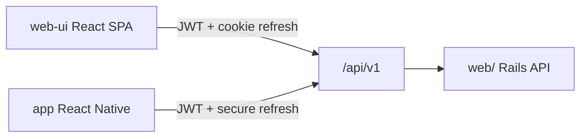

# API — School Lab

> Executable contract: OpenAPI generated by **rswag** in `web/swagger/v1/swagger.yaml`  
> Narrative auth model: [`docs/modeling/002-api-auth.md`](../modeling/002-api-auth.md)  
> Fintech-first routes (MVP): [`v1/fintech-first.md`](v1/fintech-first.md)

Versioned JSON REST API consumed by **React web** (`web-ui/`) and **React Native** (`app/`).
Business rules live in Rails service objects — clients never duplicate domain logic.

## Base URL and versioning

| Item | Value |
|------|-------|
| Path prefix | `/api/v1` |
| Breaking changes | new major version (`/api/v2`) |
| JSON keys | `snake_case` |
| Locale | `Accept-Language: pt-BR` (error messages via i18n) |

## Architecture



- **`web/`** — Rails 8.1: API controllers, services, models, jobs.
- **`web-ui/`** — React SPA (Vite); planned folder at monorepo root.
- **`app/`** — React Native mobile apps.

## Multi-school context

Tenant-scoped resources use the school in the path:

```
/api/v1/schools/:school_id/billing/charges
```

Global endpoints (no school): `auth/*`, `GET /me`, backoffice `schools`.

The client selects a school after login using memberships from `GET /me`.

## Authentication

| Client | Access token | Refresh token |
|--------|--------------|---------------|
| **React web** | Memory (Bearer header) | **httpOnly Secure cookie** on refresh endpoint |
| **React Native** | Memory | **Keychain / Keystore** (body on refresh) |

Devise validates credentials; API issues JWT access + refresh (see `002-api-auth.md`).

```
Authorization: Bearer <access_token>
```

## Authorization

- **Pundit** policies on every mutating and tenant-scoped read.
- `Current.user` from JWT; `Current.school` from `:school_id`; `Current.membership` for role.
- Guardian routes under `.../me/...` — family isolation (never another family's data).

## Request conventions

### Pagination (Pagy)

Query: `page`, `per_page` (default 25, max 100).

```json
{
  "data": [ ... ],
  "meta": { "page": 1, "per_page": 25, "total": 120 }
}
```

### Filtering

Domain-specific query params documented per resource, e.g.:

- `status` — comma-separated (`status=pending,overdue`)
- `from`, `to` — date ranges on `due_date`, `created_at`
- `sort` — `due_date`, `-due_date` (minus = descending)

### Soft delete (Discard)

`DELETE` HTTP calls `discard` internally (`discarded_at` set). Records stay in DB for
integrity and retention. OpenAPI describes these as soft delete.

### Business actions

Non-CRUD operations use `POST` on a member route:

```
POST /api/v1/schools/:school_id/billing/charges/:id/cancel
POST /api/v1/schools/:school_id/billing/charges/:id/reissue
```

## Error envelope

```json
{
  "error": {
    "code": "membership_suspended",
    "message": "Acesso suspenso nesta escola.",
    "details": {}
  }
}
```

| HTTP | When |
|------|------|
| `400` | Malformed request |
| `401` | Missing/invalid access token |
| `403` | Policy denied / wrong role |
| `404` | Not found or cross-tenant isolation |
| `409` | Conflict (duplicate email, **invalid state transition**) |
| `422` | Validation errors (`details` may hold field errors) |
| `501` | Planned route not implemented yet (phase 2 skeleton) |

## OpenAPI and testing (rswag)

| Gem | Role |
|-----|------|
| `rswag-specs` | Request specs with OpenAPI metadata |
| `rswag-api` | Swagger UI at `/api-docs` (development) |

Workflow:

1. Write `spec/requests/api/v1/*_spec.rb` with rswag DSL.
2. Run `rake rswag:specs:swaggerize` → `swagger/v1/swagger.yaml`.
3. Commit generated YAML; optional copy to `docs/api/` for review without running Rails.

OpenAPI **tags**: `Auth`, `Me`, `Schools`, `Billing`, `People`, `Documents`,
`Communication`, `Academic`, `Backoffice`.

Optional client codegen: `openapi-typescript` or `orval` in `web-ui/` and `app/`.

## CORS

`rack-cors` allows `web-ui` origin in development and production deploy URLs.
Mobile apps do not use CORS.

## Webhooks (not in public OpenAPI)

PSP reconciliation — separate path, HMAC auth, no user JWT:

```
POST /webhooks/psp
```

## Domain route map (overview)

| Namespace | MVP phase | Doc |
|-----------|-----------|-----|
| `auth`, `me` | Fintech-first | `v1/fintech-first.md` |
| `schools/:id/billing/*` | Fintech-first | `v1/fintech-first.md` |
| `schools/:id/people/*` | Fintech-first | `v1/fintech-first.md` |
| `schools/:id/documents/*` | Fintech-first | `v1/fintech-first.md` |
| `schools/:id/me/*` | Fintech-first (guardian app) | `v1/fintech-first.md` |
| `schools/:id/communication/*` | Phase 2 (skeleton in OpenAPI) | future PRD |
| `schools/:id/academic/*` | Phase 2 (skeleton in OpenAPI) | future PRD |

## Related documents

- Stack: `docs/web-stack.md`
- DB schema: `docs/database/database_dml.md`
- Identity modeling: `docs/modeling/001-fintech-first.md`
- Auth lifecycle: `docs/modeling/002-api-auth.md`
