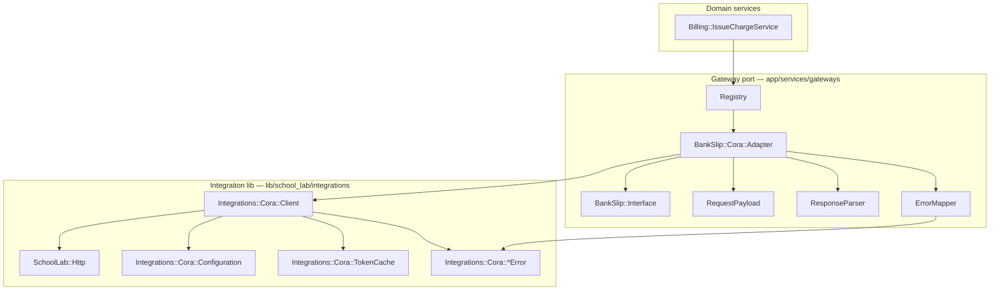

# Vendor Integrations (`SchoolLab::Integrations`)

Conventions for **third-party HTTP integrations** in `web/lib/school_lab/integrations/`.
Complements [`http-client.md`](http-client.md) (transport), [`gateways.md`](gateways.md) (domain
ports), and `docs/guidelines/process/design-principles.md`.

Rule: `.cursor/rules/web/integrations.mdc`. Skills: `use-vendor-integration`,
`review-vendor-integration`.

## Three layers

Outbound calls to external vendors follow a fixed stack. Each layer has a single
responsibility — do not skip layers or merge them.



| Layer | Path | Owns |
|-------|------|------|
| **1 — Transport** | `lib/school_lab/http.rb` | Faraday, mTLS from in-memory PEM, timeouts, infra `ConnectionError` |
| **2 — Vendor integration** | `lib/school_lab/integrations/<vendor>/` | HTTP client, OAuth/token cache, ENV config, vendor HTTP error taxonomy |
| **3 — Gateway port** | `app/services/gateways/<instrument>/` | Port contract, domain ↔ vendor mapping, registry, port error taxonomy |
| **4 — Service** | `app/services/<domain>/` | Orchestration, persistence, `ResponseService`, jobs |

Reference implementation: **Cora bank slip** — `SchoolLab::Integrations::Cora` +
`Gateways::BankSlip::Cora::Adapter`. **Spedy NFS-e** — `SchoolLab::Integrations::Spedy` +
`Gateways::ServiceInvoice::Spedy::Adapter`.

## Dependency rules

The lib layer must stay **vendor-pure** — no knowledge of School Lab domain or Rails
persistence:

| Lib must **not** import | Why |
|-------------------------|-----|
| `ActiveRecord`, models | Integration is deploy + credential config, not tenant data |
| `Gateways::BankSlip::*` (port errors, value objects) | Port errors belong in the adapter via `ErrorMapper` |
| `Registry`, `SchoolPaymentProvider` | Adapter factory wires school config → client |
| Business services | Orchestration stays above the port |

The adapter is the **only** place that knows both the lib client and the port contract.

## Error boundaries

Vendor HTTP failures are raised in the **lib** as `SchoolLab::Integrations::<Vendor>::*Error`.
The adapter maps them to **port** errors (`Gateways::BankSlip::*Error`) via `ErrorMapper`.

| Lib error (Cora) | Port error (BankSlip) |
|------------------|----------------------|
| `ConfigurationError` | `ProviderError` |
| `ValidationError` | `ValidationError` (preserve `details`) |
| `AuthenticationError` | `AuthenticationError` |
| `TransientError` | `TransientError` |
| `UnexpectedResponseError` | `ProviderError` |
| `SchoolLab::Http::ConnectionError` | `TransientError` ("Provider connection error") |

**Anti-pattern:** raising `Gateways::BankSlip::ValidationError` (or any port error) from
`lib/school_lab/integrations/`. Jobs and services depend on the port taxonomy — only the
adapter translates.

## Layout

```
web/lib/school_lab/
  http.rb
  integrations/
    cora/
      client.rb
      configuration.rb
      token_cache.rb
      error.rb
      configuration_error.rb
      validation_error.rb
      authentication_error.rb
      transient_error.rb
      unexpected_response_error.rb
    # fcm/  — future slot for push notifications

web/app/services/gateways/bank_slip/cora/
  adapter.rb           # port implementation + client factory
  error_mapper.rb      # lib errors → port errors
  request_payload.rb   # IssueRequest → vendor JSON
  response_parser.rb   # vendor JSON → value objects

web/spec/lib/school_lab/integrations/cora/
  client_spec.rb       # lib unit specs — assert Integrations::Cora::*Error
```

Do **not** move `RequestPayload` / `ResponseParser` into `lib/`: they depend on port
value objects (`Gateways::BankSlip::ValueObjects`) and `StatusNormalizer` — that is
instrument contract knowledge, not pure vendor API knowledge.

## Client design (lib)

Integration clients are **injectable and testable** — no `for_school` or Registry in lib.

```ruby
SchoolLab::Integrations::Cora::Client.new(
  client_id:,
  certificate_pem:,
  private_key_pem:,
  token_cache:,                              # Integrations::Cora::TokenCache
  billing_urls: Configuration.current       # or passed explicitly in specs
)
```

The adapter factory is the sole place that reads `Registry.active_config(school:)` and
builds the client:

```ruby
def build_client(school)
  config = Registry.active_config(school: school)
  token_cache = SchoolLab::Integrations::Cora::TokenCache.new(
    school_id: school.id,
    provider: config.provider,
    token_url: SchoolLab::Integrations::Cora::Configuration.current.fetch(:token_url)
  )
  SchoolLab::Integrations::Cora::Client.new(
    client_id: config.client_id,
    certificate_pem: config.certificate_pem,
    private_key_pem: config.private_key_pem,
    token_cache: token_cache
  )
end
```

Adapter methods wrap client calls in `with_port_errors { ... }` so lib errors surface as
port errors to billing services unchanged.

## Testing

| Spec location | Asserts |
|---------------|---------|
| `spec/lib/school_lab/integrations/<vendor>/` | Vendor client behavior; `Integrations::<Vendor>::*Error` |
| `spec/gateways/<instrument>/<vendor>/` | Adapter + port contract; `Gateways::<Instrument>::*Error` |
| `spec/services/<domain>/` | Inject `Fake` adapter — no HTTP stubs |

Gateway adapter specs cover `ErrorMapper` indirectly. Lib client specs must **not** expect
port error classes.

Run after integration changes:

```bash
bundle exec rspec spec/lib/school_lab/integrations/ spec/gateways/
bundle exec rspec spec/config/http_isolation_spec.rb
```

## Adding a new vendor integration

Use Cora as the reference. Steps:

1. **Lib namespace** — create `lib/school_lab/integrations/<vendor>/` with `Client`,
   `Configuration` (ENV, timeouts), vendor error classes, and any token/cache helpers.
2. **Gateway adapter** — under `app/services/gateways/<instrument>/<vendor>/`: `adapter.rb`,
   `error_mapper.rb`, `request_payload.rb`, `response_parser.rb`.
3. **Register** — add adapter class to `Registry::ADAPTERS` and credential requirements to
   `SchoolPaymentProvider::REQUIRED_CREDENTIALS`.
4. **Specs** — lib specs in `spec/lib/school_lab/integrations/<vendor>/`; adapter specs in
   `spec/gateways/<instrument>/<vendor>/`; pass shared examples for the port.
5. **Webhook parser** (if applicable) — separate ingress under `Webhooks::Parsers::<Vendor>`.

For a **new instrument** (e.g. card), create a sibling port under `app/services/gateways/card/`
— do not extend an existing port's interface.

### FCM (next expected integration)

Push notifications will follow the same pattern: `SchoolLab::Integrations::Fcm` in `lib/`
(API key auth, message send, vendor errors) and a gateway adapter under
`app/services/gateways/push/` (or equivalent port name) for domain mapping. Implement when
the push delivery PRD ships — the `integrations/` slot is reserved; do not pre-build FCM now.

## Out of scope

- Active Storage S3 — Rails / AWS SDK configuration.
- Inbound webhooks — Rack controllers + parsers, not outbound HTTP.
- Email — mailer + provider env until a second email provider forces abstraction.
