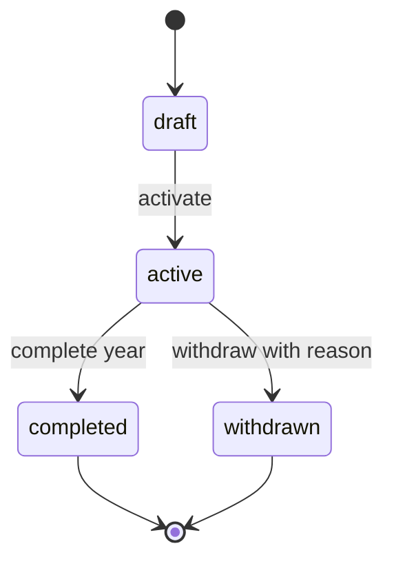
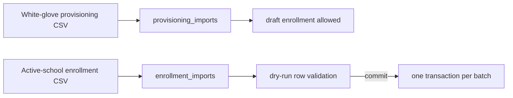
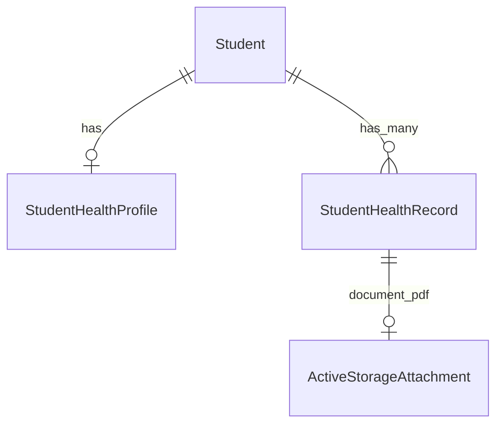

# Data Model — Students & Enrollments (005)

> PRDs: [`records.md`](../prds/students-and-enrollments/records.md),
> [`enrollments.md`](../prds/students-and-enrollments/enrollments.md),
> [`health-records.md`](../prds/students-and-enrollments/health-records.md), and
> [`consent.md`](../prds/identity-and-onboarding/consent.md)  
> Depends on: [`009-platform-admin.md`](009-platform-admin.md) (`school_year_id`)  
> Executable schema: [`schema.dbml`](../database/schema.dbml)  
> DER: [`der_005.png`](../database/der_005.png)

The stable student person record is separate from year-specific enrollment and class placement.
This prevents a new school year or withdrawal from mutating the child's identity record.

## Entity groups

| Table | Role |
|-------|------|
| `students` | School-scoped child record; cadastral PII, optional segment and legacy code |
| `guardians` | School-scoped responsible person; optional portal `user_id`; contact/address PII |
| `student_guardians` | Family authorization edge with relationship and role flags |
| `classes` | School-year class structure, capacity, shift, grade label, and multigrade hierarchy |
| `class_assignments` | Historical student-to-class placement; one kept assignment per student/year |
| `enrollments` | Year-specific matrícula lifecycle and current assignment pointer |
| `enrollment_contract_templates` | Versioned school-scoped HTML merge templates |
| `enrollment_contracts` | Enrollment/template binding and optional generated `archive_documents` PDF |
| `consent_records` | Versioned guardian consent with optional `archive_documents` paper evidence |
| `enrollment_imports` | Post-activation CSV preview/commit audit |
| `student_health_profiles` | One structured health profile per student (blood type, plan, emergency contact) |
| `student_health_records` | Many family-maintained health entries with optional PDF attachment |

`segments` is the full 003 entity, not a text stub. Schools may defer segment setup during
onboarding, but segment-scoped authorization applies once populated.

## Person records and family links

`students.name` is the persisted equivalent of the PRD's conceptual `full_name`.
`birth_date` is the other required MVP field. `cpf`, `ra`, `segment_id`, and `external_code` are
optional; `gender` and `nationality` are also optional and minimized. The exact student address
subset remains an open PRD decision and is not represented by an invented catch-all column. CPF is
partial-unique by kept `(school_id, cpf)`. Enrollment lifecycle no longer lives on
`students.status`; current state is resolved from the selected year's enrollment.

`guardians` retains the billing-era contact and address fields for live-data parity. Relationship
semantics live only on `student_guardians`:

- `relationship`: `parent | guardian | other`.
- `primary_contact`, `financial_responsible`, and `pickup_authorized`: independent booleans.
- A kept guardian/student pair is unique.
- A partial unique index permits at most one kept `financial_responsible = true` link per student.
  When billing is enabled, application validation warns when zero and blocks issuance unless
  exactly one can be resolved.

Creating a family link never creates a user or sends an identity invite.
At least one kept guardian link is required before an enrollment can become `active`; this
cross-row minimum is enforced transactionally by the enrollment service rather than a row-level
database constraint.

## Classes, assignment history, and capacity

`classes` belongs to one school and school year. `shift` accepts
`morning | afternoon | night | full`; capacity is null (unlimited) or greater than zero.
`parent_class_id` models a multigrade hierarchy. Kept class names are unique per
`(school_id, school_year_id)`.

`class_assignments` preserves placement history. The enrollment API exposes conceptual `class_id`,
but persistence resolves it to the kept assignment and stores `enrollments.class_assignment_id`.
Reassignment discards the prior assignment and creates a new one in the same transaction.

Capacity counts kept class assignments whose enrollments are `active`. Assignment at capacity
returns `class_at_capacity` unless an authorized staff member supplies `force` and an audited
reason. Transition to `withdrawn` frees capacity immediately because withdrawn enrollments are
excluded from the active count.

## Enrollment lifecycle



- Create may explicitly choose `draft`; the documented default is `active`.
- `active` creation and activation require a same-school, same-year class assignment and capacity
  check.
- `enrollment_kind` (`new | returning`) is reporting metadata only.
- `completed` and `withdrawn` are terminal in MVP.
- `withdrawal_reason` is required by the service on withdrawal and the transition is audited.
- At most one non-discarded enrollment with `status = active` exists per student/year. Draft and
  terminal history may coexist; activation is serialized against the partial unique index.

## Contract and document handoff

`enrollment_contract_templates` stores immutable numbered revisions of school-scoped HTML.
`enrollment_contracts.template_id` and `template_version` preserve the exact source revision;
nullable `document_id` references `archive_documents.id` for the generated PDF managed by the
documents/archive boundary.
`signature_status` begins at `pending`; unsigned contracts do not block enrollment, billing, or
guardian login.

Billing `contracts.enrollment_id` is nullable. It links new contracts to a stable enrollment while
preserving legacy student-only contracts; billing rules otherwise remain unchanged.

Every cross-domain binding validates denormalized tenancy: enrollment, assignment, template,
generated document, billing contract, student, and school year must share `school_id`; assignment
and billing contract must also match the enrollment's `student_id`, and assignment must match its
`school_year_id`. Individual foreign keys are not sufficient for these invariants.

## CSV import boundary



Provisioning import is identity/onboarding-owned and may run only while the school is provisioning.
Enrollment import requires `manage_enrollment` on an active school. It records filename, actor,
row count, row-level error report, status, and commit time. A failed row prevents the whole commit.
Neither path sends guardian invites.

## Consent

`consent_records` is append/version oriented: each row identifies school, child, guardian,
consent type, policy version, grant time, channel, and optional recording staff user. A partial
unique index permits one non-revoked consent per student/guardian/type. Re-consent atomically
revokes the prior policy version before inserting the new active row. `paper_scan` requires an
`archive_document_id` referencing `archive_documents.id` and belonging to the same school and
student. Revocation sets `revoked_at`; it does not erase historical messages.

## Family isolation

Guardian policy scopes must start from the authenticated user's guardian row and traverse the
kept family edge:

```text
guardians.user_id = current_user.id
AND guardians.school_id = current_school.id
AND student_guardians.guardian_id = guardians.id
AND student_guardians.discarded_at IS NULL
AND students.school_id = current_school.id
```

Cross-family and cross-school IDs return `404`. Staff scopes separately apply school and optional
segment constraints. No client-provided guardian or school ID broadens either scope.

## Health records (BC3)

DLA-11 splits **stable profile facts** from **multiple condition-specific records**:



### `student_health_profiles`

One row per student (`student_id` unique). School-scoped (`school_id`). Optional fields:

- `blood_type` — `A+`, `A-`, `B+`, `B-`, `AB+`, `AB-`, `O+`, `O-`, `unknown`.
- `health_plan_name` (120), `health_plan_number` (60).
- `emergency_contact_name` (120), `emergency_contact_phone` (30, digits normalized in model).
- `special_care_notes` (2000).

`SchoolAuditable`. Created or updated by guardians via portal `PUT`; staff read-only.

### `student_health_records`

Many rows per student (non-unique `student_id` index). School-scoped. Columns:

- `title` (required, 120) — distinguishes allergies, medications, conditions.
- `content` (optional, 5000) — free text retained from the original single-note design.
- `created_by_id`, `updated_by_id` → `users.id`; `content_updated_at` when body or document changes.
- `discarded_at` — `Discard::Model`; soft delete by guardian.

PDF attachment: `has_one_attached :document` (Active Storage). Validation: `application/pdf` only,
max 10 MB. Not stored in `archive_documents` in MVP.

Authorization mirrors authorized pickups: guardian write, staff with `manage_people` read.
`StudentHealthRecordPolicy::Scope` returns `kept` rows for the current school.

### Data migration (DLA-11)

1. Drop unique index `index_student_health_records_on_student`.
2. Add `title`, `discarded_at`, `created_by_id`.
3. Backfill existing non-empty `content` with `title = 'Health information'`.
4. Delete lazy-created empty rows (`content = ''` and blank title).
5. Create `student_health_profiles` table.

## PRD-to-schema audit

| Requirement | Result | Schema evidence / boundary |
|-------------|--------|----------------------------|
| BR-R01 | OK | School-scoped `students`; no student account FK |
| BR-R02 | Partial / open item | Required fields and named optional fields modeled; exact address subset remains undecided |
| BR-R03 | OK | Partial unique student CPF intent |
| BR-R04 | OK | Guardian distinct from nullable portal user |
| BR-R05 | OK | Link and invite boundaries remain separate |
| BR-R06 | OK | Relationship/flags plus activation-time minimum guardian guard |
| BR-R07 | OK | Partial unique responsible link plus issuance validation |
| BR-R08 | OK | Capacity check, audited override, and withdrawn capacity release documented |
| BR-R09 | OK | Year, segment, grade, all shifts, and parent class |
| BR-R10 | OK | Assignment history resolves API `class_id` |
| BR-R11 | OK | Discard preserves FKs; dependency guard is service-owned |
| BR-R12 | OK | Direct segment FKs support partial policy scopes |
| BR-E01 | OK | Enrollment + assignment bind student, school, year, and class |
| BR-E02 | OK | Partial unique non-discarded `status = active` student/year enrollment plus serialized transition guard |
| BR-E03 | OK | PRD-aligned four-state lifecycle |
| BR-E04 | OK | `enrollment_kind` enum |
| BR-E05 | OK | Denormalized school/year FKs support same-scope validation |
| BR-E06 | OK | Preview and transactional commit semantics on `enrollment_imports` |
| BR-E07 | OK | CPF uniqueness and import error report |
| BR-E08 | OK | Versioned templates, binding, PDF handoff, signature state |
| BR-E09 | OK | Actor recorded; permission enforcement remains policy/service-owned |
| BR-E10 | OK | No extra persistence needed for read-only/async exports |
| BR-E11 | OK | Withdrawal preserves people and billing records |
| BR-E12 | OK | Separate provisioning and enrollment import tables |
| BR-C01 | OK | Three consent types documented on `consent_type` |
| BR-C02 | OK | Nullable `recorded_by_id` distinguishes self-service/staff |
| BR-C03 | OK | `policy_version` persisted |
| BR-C04 | OK | Activation gate is identity service-owned |
| BR-C05 | OK | `revoked_at` preserves history |
| BR-H01 | OK | `student_health_profiles` one per student |
| BR-H02 | OK | Profile field lengths and blood-type enum in model |
| BR-H03 | OK | `student_health_records` plural; title required; PDF attach |
| BR-H04 | OK | Attribution columns and Discard on records |
| BR-H05 | OK | Guardian write / staff read — policy-owned |
| BR-H06 | OK | Family isolation via guardian policy scope |
| BR-H07 | OK | PDF content-type and size validation in model |
| BR-H08 | OK | Migration backfill and empty-row cleanup documented |
| BR-H09 | OK | `SchoolAuditable` on both tables; read audit deferred |

The audit found no remaining MVP entity gap. Export job persistence is intentionally deferred to
the API/engineering increment because BR-E10 does not define a database entity.

## Fintech-first migration delta

| Live baseline | Target model | Engineering implication |
|---------------|--------------|-------------------------|
| `school_classes.year` | `classes.school_year_id` | Backfill or map each integer year before renaming |
| `students.school_class_id` | `enrollments` + `class_assignments` | Create year enrollment/assignment before removing pointer |
| `students.rg` and `students.status` | `students.ra`; lifecycle on `enrollments` | Data mapping requires explicit validation; do not silently copy RG to RA |
| `student_guardians.financial_percentage`, `primary_guardian`, father/mother enum | PRD relationship and role flags | Migration script and partner-data review required |
| `contracts.student_id` only | Optional `contracts.enrollment_id` | Backfill only where year enrollment can be resolved safely |

These are future `web/` migrations, not changes claimed by this documentation increment.

## LGPD and retention

| Data | Risk / handling |
|------|-----------------|
| Student `birth_date`, `cpf`, `ra`, address-related future fields | Child data; minimize collection and require guardian consent |
| Guardian CPF, email, phone, and address | Personal/contact data; restrict to authorized staff and linked family |
| Import error reports | May echo both student and guardian PII; redact logs and restrict download |
| Contract PDFs and consent records | Legal/audit artifacts; access audit required |
| Health profile and health record fields | Sensitive health data (LGPD Art. 11); guardian consent basis |
| Health record PDF attachments | Active Storage blobs; retention and download audit open |

Retention periods for child records, import reports, contracts, consent, and health PDFs remain pending legal
validation. Soft delete does not authorize indefinite retention.
