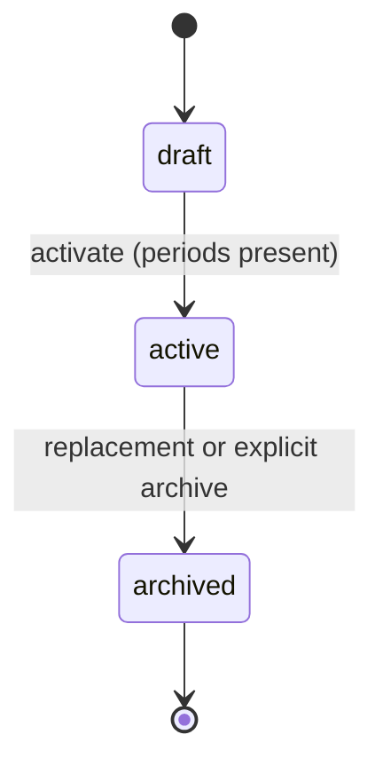
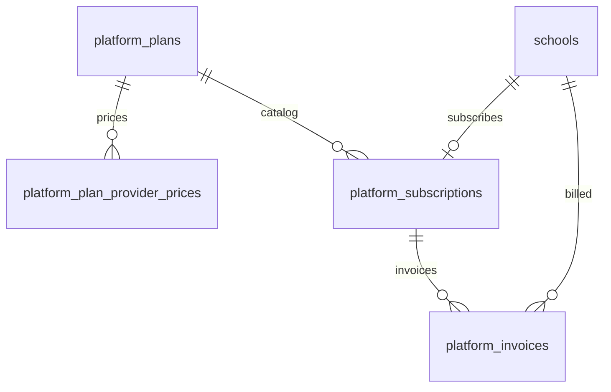
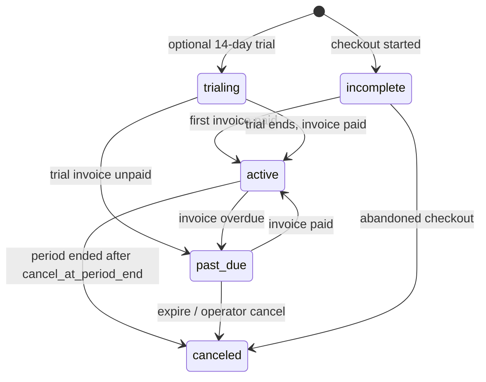
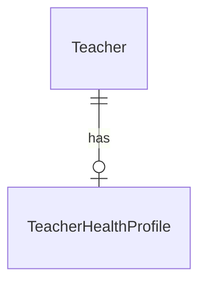

# Data Model — Platform & Admin (009)

> PRDs: [`school-year.md`](../prds/platform-and-admin/school-year.md),
> [`calendar.md`](../prds/platform-and-admin/calendar.md),
> [`platform-subscription-billing.md`](../prds/platform-and-admin/platform-subscription-billing.md)  
> Executable schema: [`schema.dbml`](../database/schema.dbml)  
> DER: [`der_009.png`](../database/der_009.png)

This increment hardens Wave 1 (`school_years`, periods, and holidays) plus the minimum calendar
stub required by the validated PRDs. Backoffice, staff administration, onboarding, and full
product configuration remain later 009 increments.

## Entity groups

| Table | Role and ownership |
|-------|--------------------|
| `schools` | Tenant root; `timezone` supplies the IANA timezone inherited by school years and calendar views |
| `school_years` | School-scoped year container; one kept `active` row per school |
| `academic_periods` | Ordered, non-overlapping date boundaries; Platform owns dates, Academic owns `closure_status` |
| `school_holidays` | Institutional non-school days and attendance suppression marker |
| `calendar_events` | Unified institutional/personal event storage; nullable `user_id` distinguishes ownership |

All domain rows carry `school_id` directly, including children of `school_years`, so policy scopes
never infer tenancy through a cross-domain join.

## School year lifecycle



- Create defaults to `draft` with `period_template = trimester`.
- Activation requires at least one valid period and atomically archives the prior active year.
- A partial unique index enforces one kept active year per school.
- Archived years remain readable but reject new enrollments and charge generation.
- Deletion is soft-delete only after application checks that no enrollment or charge references
  the year; referenced years return `year_in_use`.
- Activation and archive transitions are audited per NFR-005.

## Period and holiday invariants

`academic_periods.sequence` is unique within each kept year. Application validation and migration
check/exclusion constraints must enforce `starts_on <= ends_on`, year-bound containment, and no
date overlap. DBML records this migration intent because DBML cannot express PostgreSQL exclusion
constraints. `closure_status` (`open | closing | closed`) lives on the same row but is changed only
by Academic BC6.

`school_holidays` is unique by kept `(school_year_id, date)`.
`applies_to_attendance = true` suppresses normal attendance expectations while the calendar can
still display holidays whose value is false.

## Calendar stub

The MVP uses one `calendar_events` table:

- `user_id IS NULL` means an institutional event.
- `user_id IS NOT NULL` means a personal event visible only to that owner; policy scope is
  `(school_id, user_id)` and takes precedence over `visibility`.
- `school_year_id` is nullable because date-window queries may include events outside the active
  year.
- `visibility` is `school | staff_only` and defaults to `school`. In MVP, `school` means all
  authenticated staff/teacher memberships in that school; it does not grant guardian access.
- Timestamps are stored in UTC and displayed using `schools.timezone`.

This unified representation replaces the earlier conceptual `personal_calendar_events` table for
MVP. Recurrence and communication publication are not modeled.

## Cross-domain contract

Enrollment, attendance, grades, and archive records use explicit `school_year_id`.
Clients select the active year from `GET /api/v1/school_years/active`, then send either the
`school_year_id` query parameter or `X-School-Year-Id` where the eventual API narrative permits
the header. Services must still validate that the selected year belongs to the route's
`school_id`; the header never establishes tenancy.

New billing contracts may resolve the year through nullable `contracts.enrollment_id`. Legacy
student-only contracts do not have a reliable year FK, so year deletion/charge-generation guards
must treat them as migration input and must not infer a year from dates. A direct billing
`school_year_id` is outside this increment; the unresolved legacy policy is tracked in
`open-questions.md`.

Examples:

```text
GET /api/v1/schools/:school_id/enrollments?school_year_id=:id
GET /api/v1/schools/:school_id/academic/attendance_sessions?school_year_id=:id
```

## PRD-to-schema audit

| Requirement | Result | Schema evidence / boundary |
|-------------|--------|----------------------------|
| BR-SY01 | OK | Partial unique active year intent on `school_years` |
| BR-SY02 | OK | Year fields plus inherited `schools.timezone` |
| BR-SY03 | OK | `academic_periods`; overlap/range checks recorded as migration intent |
| BR-SY04 | OK | `period_template`, default `trimester` |
| BR-SY05 | OK | `school_holidays.applies_to_attendance` |
| BR-SY06 | OK | Lifecycle and transactional activation documented; service-owned |
| BR-SY07 | OK | Archive restrictions documented; enforced by consuming services |
| BR-SY08 | OK | FK-preserving soft delete plus `year_in_use` service guard |
| BR-SY09 | OK | Direct `school_id` on every scoped table |
| AC-SY01 | OK | Template and period model support three generated periods |
| AC-SY02 | OK | State machine plus partial unique index |
| AC-SY03 | OK | Holiday attendance flag is explicit |
| AC-SY04 | OK | References remain preserved and delete guard is explicit |
| BR-CA01–06 | OK for stub | Unified events satisfy fields, ownership, tenancy, visibility, soft delete, and no recurrence |

No unresolved schema blocker remains for 009 Wave 1 itself. Period overlap is intentionally a
PostgreSQL migration concern, not a missing DBML entity; legacy billing-year resolution remains a
cross-domain migration question rather than a reason to add an undocumented charge column here.

## Fintech-first delta

No 009 table exists in `web/db/schema.rb` at this documentation baseline.
`schools.timezone`, `school_years`, `academic_periods`, `school_holidays`, and `calendar_events`
therefore require greenfield migrations. This file defines the target; it does not claim those
migrations have shipped.

## LGPD and retention

`calendar_events.title` and `description` may contain personal data. Institutional reads are
school-scoped; personal reads additionally require owner scope. Creation, edits, and discards must
be audited. The retention window for calendar text remains pending legal validation; do not assume
indefinite storage.

- [x] Help taxonomy CMS: same SPA — `/help-taxonomy` in backoffice (E3 shipped)

## E3 P2 — platform ops entities (Aug 2026)

| Table | Role |
|-------|------|
| `school_groups` | Optional network/holding container; `schools.school_group_id` nullable FK |
| `platform_plans` | Seeded SaaS catalog (`starter` / `pro` / `enterprise`) with `monthly_amount_cents` (kept during dual-write) |
| `platform_subscriptions` | One kept subscription per school (extended below) |
| `platform_impersonation_sessions` | Short-lived support sessions; operator + target staff + school scope |
| `help_taxonomy_categories` | Operator-maintained help structure; `persona_tags` jsonb + optional `module_key` |

Platform-scoped tables have no `school_id` except subscriptions, invoices, and impersonation
sessions (which reference `school_id` for tenancy context). Cross-tenant analytics reads
aggregate only.

## Platform subscription billing (gateway increment)

PRD: [`platform-subscription-billing.md`](../prds/platform-and-admin/platform-subscription-billing.md).  
ADR: [`002-platform-billing-gateway.md`](../adr/002-platform-billing-gateway.md).

This increment is **DLA → school** recurring collection. It does not reuse
`school_payment_providers` or Cora webhook ingress. Keep `platform_plans`. **Do not drop**
`schools.saas_plan`; stop treating it as source of truth for list filters (join
`platform_subscriptions`).

### Entity groups

| Table | Role |
|-------|------|
| `platform_plans` | Product catalog (`key`: `starter` \| `pro` \| `enterprise`). `monthly_amount_cents` remains until Phase 6 dual-write retirement. |
| `platform_plan_provider_prices` | Maps `(platform_plan_id, provider, billing_interval)` to vendor plan identifiers and `amount_cents`. `billing_interval` ∈ `month \| year`. Unique on that triple. Asaas yearly = vendor `interval: 12`, `interval_type: months`. Seed identifiers (e.g. `starter_monthly`) via ops/rake — not in the request path. |
| `platform_subscriptions` | One kept row per school. Extended columns: `billing_interval`, `provider` (`asaas` \| `manual` \| `fake`), `external_customer_id`, `external_subscription_id`, `current_period_start`, `cancel_at_period_end`, `canceled_at`, `collection_method` (`automatic` \| `send_invoice` \| `manual`). Status ∈ `trialing \| active \| past_due \| canceled \| incomplete` (E3 `trial` → `trialing`). |
| `platform_invoices` | DLA invoices to a school. `school_id` + `platform_subscription_id` + `provider` + `external_invoice_id`. Status ∈ `draft \| open \| paid \| void \| uncollectible`. `amount_cents`, `due_at`, `paid_at`, `hosted_invoice_url`, `payment_method` (`credit_card` \| `bank_slip` \| `pix`). Unique `(provider, external_invoice_id)`. |
| `platform_billing_settings` | **Singleton** deploy config: `active_provider`, `webhook_endpoint_token`. Asaas API credentials stay in ENV (`ASAAS_API_TOKEN`, `ASAAS_API_BASE_URL`) — never on this row or on `schools`. |
| `webhook_events` | Reused. `school_id` nullable until reconcile matches `external_subscription_id`. `provider` includes `asaas`. Idempotent `(provider, provider_event_id)`. |



### Lifecycle



- `provider: manual` never calls Asaas; status is operator-maintained (`active` / `trialing` /
  `past_due` / `canceled`).
- Checkout after `canceled` reuses or discards the kept row (service-owned).
  `409 subscription_exists` if a non-canceled kept row already exists.
- **Past due does not lock** the school product (banner only).
- MRR: billable `active` + `trialing`; yearly contribution `amount_cents / 12`.
- List filters that today read `schools.saas_plan` should join `platform_subscriptions`.

### Auth and isolation

- Operator collection `/api/v1/platform/subscriptions*` — backoffice + `manage_platform_billing`.
- School-scoped `/api/v1/schools/:school_id/platform_subscription*` —
  `manage_school_settings` on that school. Cross-school → `404`. Guardians/teachers → `403`/`404`.
- School staff on operator collection → `403 backoffice_only`.
- School JSON omits raw Asaas IDs; backoffice may include `provider` + `external_*_id`.

### LGPD and retention

Asaas receives **school** CNPJ (`schools.cnpj`) and a staff billing email (`users.email` of
the checkout actor or owner/director) — processor. Do not send guardian or student PII.
Checkout is `422` when CNPJ or email is missing. `platform_invoices.hosted_invoice_url` is not family data but is school-confidential.
`webhook_events` follows the existing 180-day processed purge; unprocessed rows are retained.
Retention of platform invoice rows pending legal validation — do not assume indefinite storage.

Credentials: ENV only. `webhook_endpoint_token` is a URL secret (rotate by updating the
singleton); it is not the Asaas API token.

## Collaborator health profile (BC6)

PRD: [`collaborator-health.md`](../prds/platform-and-admin/collaborator-health.md).

A `Teacher` (collaborator) self-reported health profile, field-for-field identical to
`student_health_profiles` (005) but scoped to a `Teacher` instead of a `Student`. Profile only —
no records list, no document attachments; both are explicitly out of scope for this increment.



### `teacher_health_profiles`

One row per teacher (`teacher_id` unique). School-scoped (`school_id`). Same optional fields as
`student_health_profiles`:

- `blood_type` — `A+`, `A-`, `B+`, `B-`, `AB+`, `AB-`, `O+`, `O-`, `unknown`.
- `health_plan_name` (120), `health_plan_number` (60).
- `emergency_contact_name` (120), `emergency_contact_phone` (30, digits normalized in model).
- `special_care_notes` (2000).

`SchoolAuditable`. Created or updated only by the logged-in collaborator; staff with
`manage_people` read-only.

### Teacher self-resolution

`Teacher` rows carry no FK back to `users`/`memberships` — "a collaborator here is a person on
file and needs no login" (`app/models/teacher.rb`). The logged-in teacher's own `Teacher` row is
resolved by matching email, the same idiom already used elsewhere in the academic domain
(`Current.school.teachers.kept.find_by!(email: Current.user.email)`), not by trusting a
`:teacher_id` path/body param — this is what keeps a teacher from reading or writing a colleague's
profile by changing the URL.

### PRD-to-schema audit

| Requirement | Result | Schema evidence / boundary |
|--------------|--------|-----------------------------|
| BR-CH01 | OK | `teacher_health_profiles` one per teacher; same fields/enum as `student_health_profiles` |
| BR-CH02 | OK | Policy: teacher write/read own (email-matched), `manage_people` read any |
| BR-CH03 | OK | No write-on-behalf path for staff; empty profile is a valid roster state `[product decision]` |
| BR-CH04 | OK | `school_id` on `teacher_health_profiles`; policy scope enforces same-school |

## Out of scope

- `menu_visibility_overrides` and `school_product_settings`.
- A separate `personal_calendar_events` table.
- Recurring events and automatic publication to communication.
- Multi-unit roll-up years, transport routes.
- Pre-aggregated analytics materialized views (E3 uses live aggregates).
- Dropping `schools.saas_plan`.
- NFS-e for DLA→school; Stripe columns; per-student SaaS pricing.
