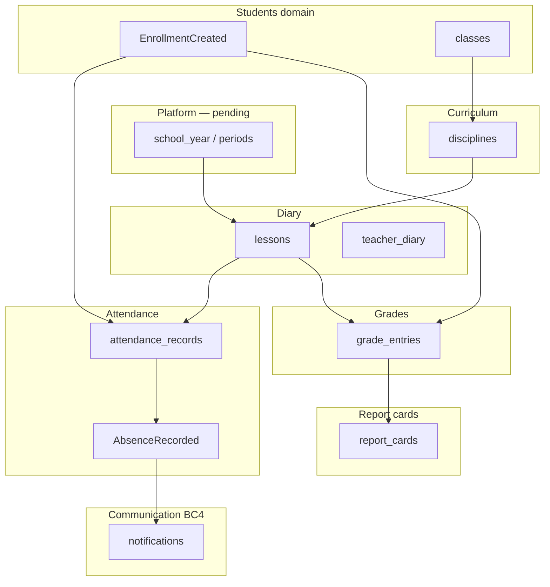

# PRD — Academic

> Status: validated  
> Relation to School Lab: core MVP domain #6 per [`docs/product-map.md`](../../product-map.md) §5 — **MVP pillar #2** (reliability-critical)  
> Capability IDs: see [Competitive grounding](#competitive-grounding) — **22** MVP canonical `academic.*` rows in [`mvp-scope.md`](../../product/mvp-scope.md); **34** canonicals total in taxonomy  
> Domain PRDs: [`attendance.md`](attendance.md) (BC1), [`grades.md`](grades.md) (BC2), [`report-cards.md`](report-cards.md) (BC3), [`diary.md`](diary.md) (BC4), [`curriculum.md`](curriculum.md) (BC5), [`periods.md`](periods.md) (BC6), [`incidents.md`](incidents.md) (BC7), [`coordination.md`](coordination.md) (BC8), [`preceptorship.md`](preceptorship.md) (BC9 shipped backfill), [`lesson-plans.md`](lesson-plans.md) (BC10)
> Modeling: [`docs/modeling/007-academic.md`](../../modeling/007-academic.md)  
> API: [`docs/api/v1/academic.md`](../../api/v1/academic.md)  
> Traceability: BR-/UC-/AC- IDs per bounded context — see [`traceability.md`](../../product/traceability.md)

---

## 1. Context and motivation

School Lab's validated roadmap places **academic** as the **second product pillar** after
communication ([`vision.md`](../../vision.md) §6; Jul 2026 stakeholder validation). Schools
require **reliable attendance**, **grade entry**, **report cards (boletim)**, and **class diaries**
— errors create legal conflict with guardians and regulators
([`open-questions.md`](../../open-questions.md) § Academic).

The fintech-first partner slice shipped **no** academic module. Billing validation used minimal
people and enrollment hooks only. This folder defines the **API-first SIS** academic core
([`DIV-academic-006`](../../ref/divergencias.md)) with self-service evaluation setup
([`DIV-academic-001`](../../ref/divergencias.md)) and school-level attendance policy
([`DIV-academic-002`](../../ref/divergencias.md)).

**Gaps today**

- No attendance, grade, diary, curriculum, or report card entities in `web/`.
- No `AbsenceRecorded` event contract for communication handoff.
- No academic period or school-year calendar integration (platform PRD pending).
- No coordination dashboard or diary submission workflow.

**Dependencies satisfied by prior increments**

- Identity: JWT auth, role templates, permission keys ([`identity-and-onboarding/`](../identity-and-onboarding/)).
- Students: enrollments, classes, guardian links, roster events
  ([`students-and-enrollments/`](../students-and-enrollments/)).
- Communication: notification BC consumes `AbsenceRecorded`; delivers on `attendance` channel only
  ([`communication/notifications.md`](../communication/notifications.md)).

---

## 2. Objective (north star)

Ship **reliable academic operations** — attendance with validated absence notifications,
self-service evaluation templates and grade scales, teacher diary and grade entry, report card
publish with guardian visibility, curriculum matrix, period closure, and coordination monitoring —
with **NFR-001 reliability** on attendance and grades, per-school isolation, and per-family
guardian views.

---

## Competitive grounding

All **34** canonical `academic.*` capabilities from [`capability-map.md`](../../product/capability-map.md#academic).
Competitor depth reference: Proesc, Agenda Edu ([`parity-matrix.md`](../../product/parity-matrix.md#academic)).

### MVP capability map (22)

| Capability | `capability_id` | Covered in | Evidence |
|------------|-----------------|------------|----------|
| Record attendance | `academic.record_attendance` | [`attendance.md`](attendance.md) | [`DIV-academic-002`](../../ref/divergencias.md), [`proesc/gestao-academica/funcionalidades-por-ator.md`](../../ref/proesc/gestao-academica/funcionalidades-por-ator.md), [`classapp/gestao-academica/funcionalidades-por-ator.md`](../../ref/classapp/gestao-academica/funcionalidades-por-ator.md) |
| Manage attendance policy | `academic.manage_attendance_policy` | [`attendance.md`](attendance.md) | [`DIV-academic-002`](../../ref/divergencias.md), Proesc frequency rules |
| Justify absence | `academic.justify_absence` | [`attendance.md`](attendance.md) | Proesc justification flows |
| Export attendance | `academic.export_attendance` | [`attendance.md`](attendance.md) | Proesc blank frequency sheets |
| Configure evaluation template | `academic.configure_evaluation_template` | [`grades.md`](grades.md) | [`DIV-academic-001`](../../ref/divergencias.md), Proesc evaluation setup |
| Manage grade scale | `academic.manage_grade_scale` | [`grades.md`](grades.md) | [`DIV-academic-001`](../../ref/divergencias.md), Proesc grading criteria |
| Enter grades | `academic.enter_grades` | [`grades.md`](grades.md) | Proesc diary grade entry — **differentiator** |
| Manage recovery grades | `academic.manage_recovery_grades` | [`grades.md`](grades.md) | Proesc recovery/reassessment |
| Publish report card | `academic.publish_report_card` | [`report-cards.md`](report-cards.md) | Proesc boletim release — **differentiator** |
| View report card | `academic.view_report_card` | [`report-cards.md`](report-cards.md) | Proesc guardian boletim |
| Configure report card | `academic.configure_report_card` | [`report-cards.md`](report-cards.md) | Proesc hide discipline/grade rules |
| Manage class diary | `academic.manage_class_diary` | [`diary.md`](diary.md) | [`DIV-academic-005`](../../ref/divergencias.md), Proesc lessons/activities |
| Log lesson content | `academic.log_lesson_content` | [`diary.md`](diary.md) | Proesc diary content copy-from-prior |
| Manage teacher diary | `academic.manage_teacher_diary` | [`diary.md`](diary.md) | Proesc diary delivery monitoring |
| Assign teacher to subject | `academic.assign_teacher_to_subject` | [`diary.md`](diary.md) | Proesc teacher–discipline links |
| Manage curriculum matrix | `academic.manage_curriculum_matrix` | [`curriculum.md`](curriculum.md) | [`DIV-academic-001`](../../ref/divergencias.md), Proesc disciplines matrix |
| Manage period closure | `academic.manage_period_closure` | [`periods.md`](periods.md) | Proesc period/year close checklist |
| Record incidents | `academic.record_incidents` | [`incidents.md`](incidents.md) | Proesc occurrences |
| View academic dashboard | `academic.view_academic_dashboard` | [`coordination.md`](coordination.md) | Proesc coordination analytics |
| General academic operations | `academic.manage_academic_operations` | [`diary.md`](diary.md) | Catch-all for miscatalogued tasks |
| Configure multi-school views | `academic.configure_multi_school` | — *(platform)* | [`DIV-academic-008`](../../ref/divergencias.md) → `prds/platform/multi-school.md` |
| Search help center | `academic.search_help_center` | — *(platform)* | [`DIV-academic-009`](../../ref/divergencias.md) → `prds/platform/help-center.md` |

### P2 / N/A (not in this increment)

| Capability | Phase | Notes |
|------------|-------|-------|
| `academic.log_daily_routine` | P2 | Infantil routine — [`DIV-academic-004`](../../ref/divergencias.md); MVP comms photos cover gap |
| `academic.deliver_diary_to_families` | P2 | Push routine diary to guardians |
| `academic.process_reenrollment` | P2 | Online trilha — [`DIV-academic-003`](../../ref/divergencias.md); staff enrollment in students BC1 |
| `academic.schedule_lesson` | P2 | [`DIV-academic-005`](../../ref/divergencias.md) — MVP diary creates lessons inline |
| `academic.manage_lesson_lifecycle` | P2 | Cancel/makeup explicit rules — diary documents MVP minimal cancel |
| `academic.manage_live_lesson` | P2 | Meet/adapter links |
| `academic.sync_academic_with_erp` | P2 | [`DIV-academic-006`](../../ref/divergencias.md) — integrations PRD |
| `academic.view_corporate_guardian_students` | P2 | [`DIV-academic-007`](../../ref/divergencias.md) — students corporate-partner PRD |
| `academic.issue_transcript` | P2 | Documents/certificates PRD |
| `academic.manage_transcript_record` | P2 | Documents/certificates PRD |
| `academic.manage_special_education` | P2 | AEE module deferred |
| `academic.quality_signal_support` | N/A | Help friction signal |

Requirements without market anchor: `[product decision]` or `[invented]` per [`traceability.md`](../../product/traceability.md).

**Related P2 capabilities in other domains** (boundary, not owned here):

| Capability | Domain | Boundary |
|------------|--------|----------|
| `students.run_online_enrollment_trail` | students | Trilha data → contract → plan → pay — billing increment 5 |
| `billing.select_plan_on_enrollment` | billing | Payment plan on trilha |
| `platform.configure_school_year` | platform | School year and period boundaries — academic consumes |

---

## 3. Target audience

| Audience | Need |
|----------|------|
| Teachers | Record attendance (app), enter grades, fill diary, justify absences |
| Coordination / Secretaria | Evaluation templates, report card publish, period close, dashboard |
| Guardians | View report cards and justified absences; receive absence push (via comms) |
| Engineering | NFR-001 on attendance/grades; `AbsenceRecorded` event contract; family isolation |
| Communication PRD | Consumes `AbsenceRecorded` only — no absence logic in comms BC |
| Billing PRD (increment 5) | Enrollment → contract linkage; no grade-based billing in MVP |

---

## 4. MVP scope

### In scope

- **BC1 Attendance** — record, policy (lesson vs period), justify, export, `AbsenceRecorded` event.
- **BC2 Grades** — evaluation templates, grade scales, entry, recovery, launch to report card.
- **BC3 Report cards** — configure display, publish schedule, guardian view.
- **BC4 Diary** — lessons, content, teacher assignment, submission workflow.
- **BC5 Curriculum** — disciplines matrix linked to class and diary.
- **BC6 Periods** — academic period closure checklist.
- **BC7 Incidents** — typed occurrences with family visibility policy.
- **BC8 Coordination** — dashboard for diary/grade/attendance status.
- **BC9 Preceptorship** — shipped teacher narrative `draft` → `published`, family read/PDF;
  explicitly not PEI/AEE.

### Out of scope

- **Online re-enrollment trilha** — P2 (`academic.process_reenrollment`); MVP staff rematrícula via
  [`students-and-enrollments/enrollments.md`](../students-and-enrollments/enrollments.md) § Re-enrollment boundary.
- **Early childhood daily routine** — P2 (`academic.log_daily_routine`); infantil covered by comms photos
  until routine module ([`mvp-scope.md`](../../product/mvp-scope.md) § Deferred).
- **Lesson scheduling / cancel-makeup lifecycle** — P2 full rules; MVP supports lesson cancel flag only
  ([`diary.md`](diary.md) BR-D12).
- **ERP sync mode** — P2; MVP is self-service SIS ([`DIV-academic-001`](../../ref/divergencias.md)).
- **Transcripts and official certificates** — documents domain P2.
- **Multi-school group roll-ups** — platform P2 (`platform.manage_multi_unit`).
- **Student portal login** — guardian proxy for report cards in MVP.
- **Billing, documents, platform PRDs** — separate increments; cross-links only.

---

## 5. Bounded contexts

| BC | Document | Answers |
|----|----------|---------|
| **BC1 — Attendance** | [`attendance.md`](attendance.md) | How is presence recorded? What policy counts absences? When is `AbsenceRecorded` emitted? |
| **BC2 — Grades** | [`grades.md`](grades.md) | Evaluation templates, scales, entry, recovery, launch? |
| **BC3 — Report cards** | [`report-cards.md`](report-cards.md) | Boletim configure, publish, guardian view? |
| **BC4 — Diary** | [`diary.md`](diary.md) | Lessons, content, teacher links, submission? |
| **BC5 — Curriculum** | [`curriculum.md`](curriculum.md) | Disciplines matrix for turmas? |
| **BC6 — Periods** | [`periods.md`](periods.md) | Period/year closure gates? |
| **BC7 — Incidents** | [`incidents.md`](incidents.md) | Occurrences and guardian visibility? |
| **BC8 — Coordination** | [`coordination.md`](coordination.md) | Monitoring dashboard? |
| **BC9 — Preceptorship** | [`preceptorship.md`](preceptorship.md) | Shipped narrative publish, family isolation, PDF, and PEI/AEE boundary? |



---

## 6. Actors and surfaces

| Actor | Surfaces | Primary actions in this domain |
|-------|----------|--------------------------------|
| teacher | Web SPA + mobile (attendance priority on mobile) | Record attendance, enter grades, diary content, justify absences |
| staff (coordination, secretary) | Web SPA + mobile read | Templates, report card publish, period close, overrides with audit, dashboard |
| guardian (UI: **Responsável**) | Web first for portal reads; mobile parity and absence push | View released report cards and justified-absence summaries for linked children |
| student | — *(MVP)* | No login; grades via guardian ([`actors-and-surfaces.md`](../../actors-and-surfaces.md)) |
| backoffice | Web SPA (backoffice) | Module enablement; no grade content access in MVP |

Detail: [`docs/actors-and-surfaces.md`](../../actors-and-surfaces.md). Jul 2026 decision: grades and
lesson plans on web; messages and attendance on app (both channels available).

---

## Segment applicability

| Segment | Applies | Notes |
|---------|---------|-------|
| `infantil` | partial | Attendance and diary yes; structured routine P2; comms photos cover daily updates |
| `fundamental_medio` | yes | Primary target for grades, boletim, frequency |
| `pj_financeiro` | yes | Same academic rules; financial guardian unchanged |
| `multi_unidade` | partial | All academic data scoped per `school_id`; group roll-ups platform P2 |

Open segment decisions: assessment model (bimester vs trimester) — [`open-questions.md`](../../open-questions.md) § Academic.

---

## 7. Integration contract

Shared with [`students-and-enrollments/`](../students-and-enrollments/index.md),
[`communication/`](../communication/index.md), and platform (pending):

1. **Roster resolution** — attendance and grade entry lists derive from active `enrollments` for
   `class_id` + `school_year_id`. Events consumed: `EnrollmentCreated`, `EnrollmentClassChanged`,
   `EnrollmentWithdrawn`.
2. **Family isolation (NFR-002)** — guardian `/schools/:school_id/me/academic/*` returns only
   linked students' report cards and absences. Cross-family access returns `404`.
3. **School year / periods** — `platform.configure_school_year` supplies `academic_period_id` on
   diary, grades, and attendance aggregates. MVP may stub one active year with 2–4 periods
   `[product decision]`.
4. **Absence notification handoff** — academic BC1 emits **`AbsenceRecorded`** after validated
   absence state (BR-AT08). Communication notifications BC subscribes and delivers on
   `attendance` channel policy only ([`communication/notifications.md`](../communication/notifications.md)
   BR-N02). **Comms does not validate absence** — NFR-001 correctness owned here.
5. **Report card publish event** — academic always emits `ReportCardPublished` per active snapshot;
   whether comms consumes it and which channel it uses remain unresolved.
6. **Permissions** — fixed key `manage_academic` covers staff school-wide administration;
   target teacher writes use `teach` intersected with class/subject assignment.
   `record_attendance`, `enter_grades`, and `publish_report_card` are capability ids, not
   permission keys. The shipped Preceptoria exception is recorded next.
7. **Re-enrollment** — staff returning-student enrollment is students BC1; online trilha is P2
   ([`enrollments.md`](../students-and-enrollments/enrollments.md) § Re-enrollment boundary).
8. **Preceptoria** — shipped create/roll applies assignment narrowing only to teacher-role
   memberships; existing-report policy scope is currently school-wide for every `teach` holder.
   Narrowing that application authorization is a blocker, not behavior this PRD can claim as
   shipped. Guardians receive only published reports for linked students. It remains separate from
   PEI/AEE and special-education records.

```mermaid
sequenceDiagram
    participant T as Teacher (mobile)
    participant API as Academic API
    participant ATT as Attendance BC
    participant Comms as Notifications BC
    participant G as Guardian

    T->>API: POST attendance (lesson, absent)
    API->>ATT: Validate policy + persist
    ATT->>ATT: State absent → confirmed
    ATT-->>Comms: AbsenceRecorded event
    Comms->>G: Push (attendance channel)
    Note over ATT,Comms: Idempotent event id; NFR-001
```

---

## 8. Delivery waves

| Wave | Primary doc | Deliverable |
|------|-------------|-------------|
| **W1** | curriculum.md + diary.md | Disciplines, teacher assignment, lesson shell |
| **W2** | attendance.md | Record attendance, policy, justify, `AbsenceRecorded` |
| **W3** | grades.md | Templates, scales, grade entry, recovery |
| **W4** | report-cards.md + periods.md | Boletim publish, period close |
| **W5** | coordination.md + incidents.md | Dashboard, occurrences |
| **Phase 2** | — | Routine infantil, lesson lifecycle, re-enrollment trilha, ERP sync |

W1 depends on students W1–W2 and platform school-year stub. W2 depends on W1 (lesson-attendance link).

---

## 9. Key decisions

| # | Decision | Status |
|---|----------|--------|
| D1 | Self-service evaluation templates; ERP mode P2 | Documented — [`DIV-academic-001`](../../ref/divergencias.md) |
| D2 | School-level attendance policy with per-period override | Documented — [`DIV-academic-002`](../../ref/divergencias.md) |
| D3 | Academic owns `AbsenceRecorded`; comms delivers only | Documented — communication index §7 |
| D4 | Online re-enrollment P2; staff enrollment MVP | Documented — [`DIV-academic-003`](../../ref/divergencias.md) |
| D5 | Routine infantil P2; comms covers MVP gap | Documented — [`DIV-academic-004`](../../ref/divergencias.md) |
| D6 | MVP diary inline lessons; full lifecycle P2 | Documented — [`DIV-academic-005`](../../ref/divergencias.md) |
| D7 | API-first SIS; adjunct ERP sync P2 | Documented — [`DIV-academic-006`](../../ref/divergencias.md) |
| D8 | NFR-001 mandatory on attendance and grades | Documented — §10 below |
| D9 | Secretary grade override with audit | Documented — [`grades.md`](grades.md) BR-G08 |
| D10 | Assessment period model (bimester/trimester) | Open — [`open-questions.md`](../../open-questions.md) |

---

## 10. Non-functional requirements

Cross-cutting catalog: [`docs/product/non-functional-requirements.md`](../../product/non-functional-requirements.md).

| NFR | Domain application |
|-----|-------------------|
| [NFR-001](../../product/non-functional-requirements.md#nfr-001--reliability-critical-domains) | **Critical** — attendance and grades; idempotent saves, no silent loss, explicit state machines, audit on change, immutable publish snapshots |
| [NFR-002](../../product/non-functional-requirements.md#nfr-002--lgpd-and-privacy) | Guardian report cards and incidents family-scoped; sensitive incident fields flagged |
| [NFR-003](../../product/non-functional-requirements.md#nfr-003--multi-tenancy) | All academic entities include `school_id` |
| [NFR-004](../../product/non-functional-requirements.md#nfr-004--push-notifications) | Absence push via comms `attendance` channel after `AbsenceRecorded` |
| [NFR-005](../../product/non-functional-requirements.md#nfr-005--observability-and-audit) | Grade overrides, attendance edits after confirm, report card publish audited |
| [NFR-006](../../product/non-functional-requirements.md#nfr-006--availability-and-performance-baseline) | Mobile attendance write requires connectivity; optimistic UI with server reconciliation |

### NFR-001 acceptance examples (domain-level)

These criteria span BCs; detailed ACs live in [`attendance.md`](attendance.md) and [`grades.md`](grades.md).

- **Idempotent attendance save** — Given the same `(lesson_id, student_id, recorded_by, client_request_id)` submitted twice, When the second request arrives, Then one attendance row exists and the API returns `200` with the same payload (no duplicate `AbsenceRecorded`).
- **No silent loss** — Given attendance save fails after DB commit but before event publish, When the outbox job retries, Then `AbsenceRecorded` is emitted exactly once or a failed job surfaces in ops dashboard (NFR-005).
- **Validated absence before notify** — Given a student marked `pending` absent, When justification approves or policy auto-confirms, Then and only then `AbsenceRecorded` is emitted; comms never receives premature events.
- **Grade publish immutability** — Given a report card snapshot is published, When staff attempts in-place grade mutation on published period, Then API returns `409 report_card_frozen` and prior snapshot unchanged.
- **Audit on correction** — Given confirmed attendance is edited, When secretary applies override, Then `audited` row captures prior status, actor, reason code.

Domain-specific bullets:

- **Legal impact** — wrong absence notification or wrong boletim grade is a support/legal incident;
  prefer blocking publish over best-effort partial data.
- **Offline attendance** — MVP does not queue offline writes; teacher sees clear error (NFR-006).
- **ERP mode** — when P2 sync lands, NFR-001 applies to import idempotence as well.

---

## 11. Open items / pending decisions

See [`docs/open-questions.md`](../../open-questions.md) § Academic:

- [x] Assessment model — trimester default; per [`open-questions.md`](../../open-questions.md) § Academic.
- [x] Report card format — per-school template ref ([`report-cards.md`](report-cards.md)).
- [x] Attendance reliability rules — 15-minute auto-confirm, NFR-001 ([`attendance.md`](attendance.md)).
- [ ] Quiet hours bypass for `attendance` channel (comms BR-N08 cross-ref).
- [x] Partner workshop deferred — documentation-phase sign-off Aug 2026 ([`open-questions.md`](../../open-questions.md)).

---

## 12. Relation to fintech-first

[`fintech-first.md`](../fintech-first.md) explicitly excludes academic module implementation.
Greenfield on shared tenancy, students, and enrollments. Billing does not gate report card access
in MVP (unsigned contract rule BR-O11 applies to enrollment only).

---

## 13. Definition of Done (documentation)

- [x] Ten PRD files in `docs/prds/academic/` (index + BC1–BC9) with complete sections.
- [x] All **22** MVP `academic.*` capabilities mapped (20 in this folder + 2 platform cross-refs).
- [x] All **34** canonicals enumerated in competitive grounding.
- [x] BR-/UC-/AC- IDs standardized per BC prefix.
- [x] `AbsenceRecorded` event contract and NFR-001 AC examples.
- [x] DIV-academic-001…009 reflected in decisions.
- [x] Re-enrollment and routine infantil P2 boundaries documented.
- [x] Status promoted to `validated` (2026-08-15).
- [x] Modeling [`007-academic.md`](../../modeling/007-academic.md) locally DBML-validated,
      including attendance support tables; API [`academic.md`](../../api/v1/academic.md) remains
      draft pending OpenAPI freeze.
- [x] Partner workshop deferred — live stakeholder session is a separate milestone.
