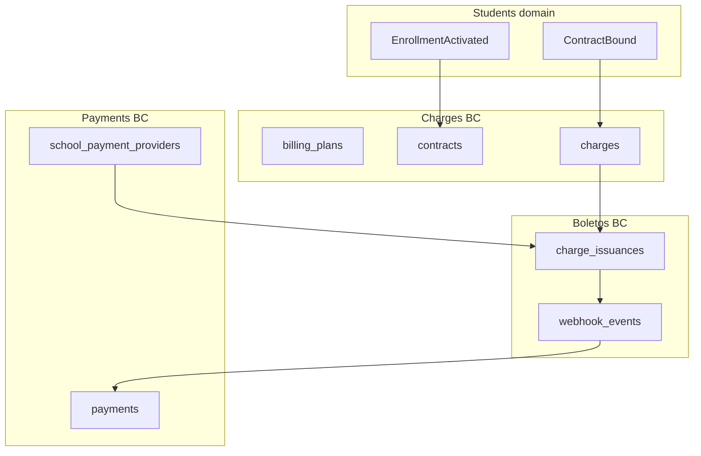

# PRD — Billing

> Status: validated  
> Relation to School Lab: core MVP domain #7 per [`docs/product-map.md`](../../product-map.md) §5  
> Capability IDs: see [Competitive grounding](#competitive-grounding) — **32** MVP canonical `billing.*` rows in [`mvp-scope.md`](../../product/mvp-scope.md); **46** canonicals total in taxonomy  
> Domain PRDs: [`charges.md`](charges.md) (BC1), [`boletos.md`](boletos.md) (BC2), [`payments.md`](payments.md) (BC3), [`dunning.md`](dunning.md) (BC4), [`settings.md`](settings.md) (BC5), [`guardian-portal.md`](guardian-portal.md) (BC6), [`invoices.md`](invoices.md) (BC7 — P2 scope), [`tax-declarations.md`](tax-declarations.md) (BC8 — automatic annual payer declaration)
> Modeling: [`docs/modeling/001-fintech-first.md`](../../modeling/001-fintech-first.md) *(implemented baseline; extend for MVP gaps)*  
> API: [`docs/api/v1/billing.md`](../../api/v1/billing.md) extends [`fintech-first.md`](../../api/v1/fintech-first.md) *(implemented baseline)*  
> Traceability: BR-/UC-/AC- IDs per bounded context — see [`traceability.md`](../../product/traceability.md)

---

## 1. Context and motivation

Billing is a **vision-aligned pillar** ([`vision.md`](../../vision.md) §6) and the **first shipped
domain** in the monorepo via the fintech-first partner slice ([`fintech-first.md`](../fintech-first.md)).
Core charge generation, Cora boleto issuance, webhook reconciliation, overdue detection, and
guardian billing portal are **implemented in `web/`**. This folder is the **official domain PRD**
for full MVP billing — it **extends and supersedes gaps** in fintech-first without duplicating
identity, students, or documents scope.

**Aug 2026 decisions** ([`open-questions.md`](../../open-questions.md); [`fintech-first.md`](../fintech-first.md) open items):

- **Collection régua** — platform automation **out of MVP** (stub notifier only). Overdue
  detection, delinquency dashboard, and bank-side mora on the registered boleto ship first.
- **Mora, multa, pontualidade** — **per-school** configuration on `school_billing_settings`;
  no platform defaults for interest rate; issuance blocked until mora rate is set.
- **Boleto protest** — **default off**; softer dunning first ([`DIV-financial-003`](../../ref/divergencias.md)).
- **Payment history** — **forward-only** on platform (`source: platform`); migrated history P2.

**Gaps today** (MVP PRD vs implemented code)

| Area | Implemented (fintech-first) | MVP gap (this PRD) |
|------|----------------------------|-------------------|
| Charges | Contract-driven generation, cancel, list/filter | Ad-hoc charges, charge types, adjustments, negotiation status, student receivables search |
| Boletos | Cora issue, reissue, webhook + daily reconcile | Staff resend + push ([`resend-boleto`](../fintech-first/resend-boleto.md)), CNAB remessa export |
| Payments | Boleto/Pix artifacts on slip | Card checkout, payment links, manual receipt, batch pay, recurring card |
| Dunning | Overdue job + summary counts | Visual régua builder, platform reminders — **deferred**; dashboard extensions |
| Settings | Grace, mora, fine, pontualidade fields | Tiered early-payment rules UI, notification channel policy |
| Guardian portal | Open charges, history, reissue | Mobile parity, pay-online checkout breadth |
| Invoices | — | NFS-e — **P2** ([`DIV-financial-005`](../../ref/divergencias.md)) |
| Treasury / reports | — | Cash register, financial exports — **out of this increment** (capability-map targets) |

**Dependencies satisfied**

- Identity: JWT, permissions, guardian family scope ([`identity-and-onboarding/`](../identity-and-onboarding/)).
- Students: enrollments, guardian links, contracts handoff ([`students-and-enrollments/`](../students-and-enrollments/)).
- Communication: FCM pipeline for billing push (reuse adapter; rules stay in billing).

---

## 2. Objective (north star)

Deliver **enrollment receivables** ([`DIV-financial-001`](../../ref/divergencias.md)) — charge
issuance, boleto tracking, guardian pay view, and delinquency visibility — with **reliable
settlement** (NFR-001), **per-school payment terms**, and an **abstract payment gateway**, so
schools eliminate secretarial boleto rework without surprise automated collection.

---

## 3. Relation to fintech-first (supersede notes)

| fintech-first artifact | This folder |
|------------------------|-------------|
| [`fintech-first.md`](../fintech-first.md) BR-001–BR-017, UC-01–UC-08 | **Billing subset retained** where not superseded by identity/students PRDs |
| UC-06, UC-08, BR-009, § Permissions | **Superseded** by [`identity-and-onboarding/`](../identity-and-onboarding/) |
| UC-07 documents | **Superseded** by documents increment (increment 6) — enrollment/KYC only in fintech-first |
| UC-03 régua steps 3–4 | **Superseded** — platform reminders and visual builder deferred; see [`dunning.md`](dunning.md) |
| [`resend-boleto.md`](../fintech-first/resend-boleto.md) | **Absorbed** into [`boletos.md`](boletos.md) BC2; slice remains codelet contract until shipped |
| Open items: negotiated discount, NFS-e, SaaS billing | Split across [`charges.md`](charges.md), [`invoices.md`](invoices.md), platform P2 |

**Code status:** `web/` implementation traces to fintech-first until W1–W7 billing waves in this
folder ship. PRD status is **validated** while code remains **implemented** for the partner slice.

---

## 4. Competitive grounding

All **46** canonical `billing.*` capabilities from [`capability-map.md`](../../product/capability-map.md#billing).
Financial divergence decisions: [`DIV-financial-001`…`008`](../../ref/divergencias.md#financial-domain).

### MVP capability map (32)

| Capability | `capability_id` | Covered in | Code status |
|------------|-----------------|------------|-------------|
| Issue charge | `billing.issue_charge` | [`charges.md`](charges.md) | **partial** — contract/recurring only |
| Manage payment plan | `billing.manage_payment_plan` | [`charges.md`](charges.md) | **partial** — `billing_plans`, `contracts` |
| Manage charge types | `billing.manage_charge_types` | [`charges.md`](charges.md) | planned |
| Adjust charge / scholarship | `billing.adjust_charge` | [`charges.md`](charges.md) | **partial** — plan discount bands only |
| Cancel charge | `billing.cancel_charge` | [`charges.md`](charges.md) | **implemented** |
| Negotiate receivable | `billing.negotiate_receivable` | [`charges.md`](charges.md) | planned |
| View student receivables | `billing.view_student_receivables` | [`charges.md`](charges.md) | **partial** — list filters |
| General finance operations | `billing.manage_financial_operations` | [`charges.md`](charges.md) | planned (catch-all) |
| Issue boleto | `billing.issue_boleto` | [`boletos.md`](boletos.md) | **implemented** (Cora) |
| Track boleto status | `billing.track_boleto_status` | [`boletos.md`](boletos.md) | **implemented** |
| Resend boleto | `billing.resend_boleto` | [`boletos.md`](boletos.md) | **partial** — reissue yes; staff resend+push draft |
| Integrate boleto bank | `billing.integrate_boleto_bank` | [`boletos.md`](boletos.md) | **implemented** (Cora mTLS) |
| Send boleto remittance | `billing.send_boleto_remittance` | [`boletos.md`](boletos.md) | planned (CNAB) |
| Accept Pix payment | `billing.accept_pix_payment` | [`payments.md`](payments.md) | **partial** — embedded on boleto |
| Accept card payment | `billing.accept_card_payment` | [`payments.md`](payments.md) | planned |
| Pay online | `billing.pay_online` | [`payments.md`](payments.md), [`guardian-portal.md`](guardian-portal.md) | **partial** — slip URLs |
| Configure payment gateway | `billing.configure_payment_gateway` | [`payments.md`](payments.md) | **partial** — bank slip instrument |
| Onboard payment gateway | `billing.onboard_payment_gateway` | [`payments.md`](payments.md) | **partial** — Cora credentials upload |
| Record manual payment | `billing.record_manual_payment` | [`payments.md`](payments.md) | planned |
| Process batch payment | `billing.process_batch_payment` | [`payments.md`](payments.md) | planned |
| Manage payment links | `billing.manage_payment_links` | [`payments.md`](payments.md) | planned |
| Manage recurring card | `billing.manage_recurring_card` | [`payments.md`](payments.md) | planned |
| View delinquency dashboard | `billing.view_delinquency_dashboard` | [`dunning.md`](dunning.md) | **partial** — summary API |
| Build dunning workflow | `billing.build_dunning_workflow` | [`dunning.md`](dunning.md) | **deferred** (post-MVP automation) |
| Send payment reminder | `billing.send_payment_reminder` | [`dunning.md`](dunning.md) | **deferred** — stub notifier |
| Configure billing notifications | `billing.configure_billing_notifications` | [`dunning.md`](dunning.md) | planned |
| Configure early-payment discount | `billing.configure_early_payment_discount` | [`settings.md`](settings.md) | **partial** — single percent field |
| Mora / multa / pontualidade | *(settings)* | [`settings.md`](settings.md) | **partial** — per-school Cora terms |
| View guardian charges | `billing.view_guardian_charges` | [`guardian-portal.md`](guardian-portal.md) | **implemented** |
| View payment history | `billing.view_payment_history` | [`guardian-portal.md`](guardian-portal.md) | **implemented** (forward-only) |
| Issue NFS-e | `billing.issue_service_invoice` | [`invoices.md`](invoices.md) | **P2** — scope note only |
| Export financial report | `billing.export_financial_report` | § Out of scope | planned — separate `reports` slice |
| Treasury / cash register | `billing.manage_cash_register` | § Out of scope | planned — `treasury` slice |

### P2 / N/A (not in MVP delivery)

| Capability | Phase | Notes |
|------------|-------|-------|
| `billing.configure_nf_settings` | P2 | Per-city NFS-e parameters — [`invoices.md`](invoices.md) |
| `billing.manage_protest` | P2 | Default off — [`DIV-financial-003`](../../ref/divergencias.md) |
| `billing.manage_corporate_payer` | P2 | PJ financial payer |
| `billing.import_erp_charges` | P2 | ERP adjunct |
| `billing.sync_erp_financial` | P2 | Bi-directional sync |
| `billing.reconcile_bank_statement` | P2 | Treasury |
| `billing.manage_multi_unit_billing` | P2 | Group roll-ups |
| `billing.view_classpay_dashboard` | P2 | Embedded pay product |
| `billing.meter_digital_signatures` | P2 | [`DIV-financial-007`](../../ref/divergencias.md) |
| `billing.pay_enrollment_online` | P2 | Students trilha |
| `billing.select_plan_on_enrollment` | P2 | Students trilha |
| `billing.sign_enrollment_contract` | P2 | Documents infra |
| `billing.manage_guaranteed_revenue` | N/A | [`DIV-financial-008`](../../ref/divergencias.md) — document only |

---

## 5. Target audience

| Audience | Need |
|----------|------|
| Director / finance staff | Delinquency visibility, payment terms, exports, gateway config |
| Secretaria | Charge lookup by student, resend boleto, manual receipts |
| Guardians | Open charges, pay online, history |
| Engineering | BC boundaries, gateway port, NFR-001 settlement |
| Students increment | Contract → charge handoff after enrollment activation |

---

## 6. MVP scope

### In scope (this folder)

- **BC1 Charges** — plans, contracts, generation, types, adjustments, cancellation, negotiation, receivables search.
- **BC2 Boletos** — issuance, tracking, reissue/resend, bank integration, remittance export.
- **BC3 Payments** — Pix/card checkout, gateway onboarding, manual and batch settlement.
- **BC4 Dunning** — delinquency dashboard; reminder **policy** documented; platform régua automation **deferred**.
- **BC5 Settings** — mora, multa, pontualidade, grace days per school.
- **BC6 Guardian portal** — family-scoped charges and forward-only history.
- **BC7 Invoices** — NFS-e **P2 scope note** only ([`DIV-financial-005`](../../ref/divergencias.md)).
- **BC8 Tax declarations** — one automatic annual declaration per payer/school/year, consolidating
  eligible settled payments across children with immutable versions and PDF. Release is legally
  gated.

### Out of scope

- **Treasury / Meu caixa** — `billing.manage_cash_register` → future `treasury` PRD.
- **Financial report exports** — `billing.export_financial_report` → future `reports` PRD.
- **Platform collection régua automation** — email/WhatsApp sequence builder (Aug 2026 decision).
- **Boleto protest workflow** — P2, default off.
- **NFS-e issuance** — P2 ([`invoices.md`](invoices.md)).
- **ERP import/sync** — P2 integrations.
- **Corporate PJ payer portal** — P2.
- **Platform SaaS billing** for schools — commercial decision.
- **Documents & digital archive** — increment 6.
- **Guaranteed revenue / anticipation** — N/A fintech pattern only.

---

## 7. Bounded contexts

| BC | Document | Answers |
|----|----------|---------|
| **BC1 — Charges** | [`charges.md`](charges.md) | What is charged, how plans/contracts drive parcels, adjustments? |
| **BC2 — Boletos** | [`boletos.md`](boletos.md) | How are bank slips issued, tracked, resent, remitted? |
| **BC3 — Payments** | [`payments.md`](payments.md) | How do guardians pay (Pix, card), staff record cash, gateway onboarding? |
| **BC4 — Dunning** | [`dunning.md`](dunning.md) | How is delinquency visible; what reminders ship in MVP? |
| **BC5 — Settings** | [`settings.md`](settings.md) | Per-school mora, multa, pontualidade, grace? |
| **BC6 — Guardian portal** | [`guardian-portal.md`](guardian-portal.md) | Family billing UX and API contract? |
| **BC7 — Invoices** | [`invoices.md`](invoices.md) | NFS-e phase boundary? |
| **BC8 — Tax declarations** | [`tax-declarations.md`](tax-declarations.md) | Which settled payments are eligible, consolidated, versioned, and exposed to the payer? |

---

## 8. Actors and surfaces

| Actor | Surfaces | Primary actions |
|-------|----------|-----------------|
| staff (financial, secretary, director) | Web SPA | Plans, charges, boleto ops, dashboard, settings, manual pay |
| guardian | Web SPA (MVP); mobile (parity) | View/pay charges, history, reissue |
| backoffice | Web SPA | Gateway onboarding assist, tenant health — no charge content by default |
| student | — *(MVP)* | No login; charges via guardian |

Detail: [`docs/actors-and-surfaces.md`](../../actors-and-surfaces.md).

---

## 9. Segment applicability

| Segment | Applies | Notes |
|---------|---------|-------|
| `infantil` | yes | Partner validating school; same receivables model |
| `fundamental_medio` | yes | Primary volume; charge types may include material fees |
| `pj_financeiro` | partial | Guardian as payer in MVP; corporate payer P2 |
| `multi_unidade` | partial | Per-`school_id` billing; group reports P2 |

---

## 10. Integration contract

1. **Enrollment → contract** — active enrollment may bind a billing `contract` ([`students-and-enrollments/enrollments.md`](../students-and-enrollments/enrollments.md) BR-E11). Charge generation reads active contracts, not enrollments directly, until enrollment-scoped refactor (W2).
2. **Family isolation (NFR-002)** — guardian routes under `/schools/:school_id/me/charges*` scope via `student_guardians` + financially responsible `guardian_id`.
3. **Permissions** — `manage_billing`, `view_billing_summary`, `billing.resend` (identity BC1 templates); fintech-first binary `school` role maps to `staff` + presets.
4. **Communication handoff** — billing push (resend, payment confirmed) uses notification infrastructure; templates and triggers owned by billing services ([`DIV-communication-007`](../../ref/divergencias.md)).
5. **Absence of silent settlement** — webhooks trigger `fetch_invoice`; daily reconciliation backfills ([`fintech-first.md`](../fintech-first.md) UC-02) — NFR-001.
6. **Annual declaration calculation** — derives only from immutable `payments` + each charge's
   captured payer/purpose eligibility, never from the management ledger. Documents/archive may
   store the PDF but does not own calculation.

---

## 11. Delivery waves

| Wave | Primary doc | Deliverable | Baseline |
|------|-------------|-------------|----------|
| **W0** | *(fintech-first)* | Cora boleto, webhooks, summary, guardian read | **shipped** |
| **W1** | settings.md | Tiered pontualidade, validation UX, settings API completeness | partial |
| **W2** | charges.md | Charge types, ad-hoc charges, adjustment workflow, receivables search | partial |
| **W3** | boletos.md | Staff resend + push ([`resend-boleto`](../fintech-first/resend-boleto.md)), remittance export | partial |
| **W4** | payments.md | Manual receipt, batch pay, payment links, card instrument | planned |
| **W5** | dunning.md | Dashboard filters, notification policy config; régua builder **phase 2** | partial |
| **W6** | guardian-portal.md | Mobile parity, checkout embed | partial |
| **W7** | tax-declarations.md | Purpose classification/configuration, annual versions, PDF, guardian web | planned; legal/accounting release gate |
| **P2** | invoices.md | NFS-e settings + issuance | — |

W2 depends on students W1–W2 (enrollments) for enrollment-scoped contracts.

---

## 12. Key decisions

| # | Decision | Status |
|---|----------|--------|
| D1 | Core unit: enrollment receivables (débito + parcelas) | [`DIV-financial-001`](../../ref/divergencias.md) |
| D2 | Abstract payment gateway; guided onboarding | [`DIV-financial-002`](../../ref/divergencias.md) |
| D3 | No boleto protest default | [`DIV-financial-003`](../../ref/divergencias.md) |
| D4 | Tiered early-payment discounts per school | [`DIV-financial-004`](../../ref/divergencias.md) |
| D5 | NFS-e services P2; product NF later | [`DIV-financial-005`](../../ref/divergencias.md) |
| D6 | Visual dunning + audit; no surprise automation | [`DIV-financial-006`](../../ref/divergencias.md) |
| D7 | Platform régua automation deferred Aug 2026 | [`fintech-first.md`](../fintech-first.md) UC-03 |
| D8 | Mora on bank slip; per-school rate required | [`fintech-first.md`](../fintech-first.md) BR-011 |
| D9 | Payment history forward-only MVP | [`fintech-first.md`](../fintech-first.md) open items |
| D10 | Cora Direct Integration for bank slip MVP | [`fintech-first.md`](../fintech-first.md) open items |

---

## 13. Non-functional requirements

Cross-cutting catalog: [`docs/product/non-functional-requirements.md`](../../product/non-functional-requirements.md).

| NFR | Domain application |
|-----|-------------------|
| [NFR-001](../../product/non-functional-requirements.md#nfr-001--reliability-critical-domains) | Idempotent webhooks; immutable `payments`; charge AASM; issuance/reconcile alerting |
| [NFR-002](../../product/non-functional-requirements.md#nfr-002--lgpd-and-privacy) | Guardian CPF/financial data; per-family charge scope |
| [NFR-003](../../product/non-functional-requirements.md#nfr-003--multi-tenancy) | All billing tables carry `school_id` |
| [NFR-004](../../product/non-functional-requirements.md#nfr-004--push-notifications) | Finance push separate from comms; régua deferred |
| [NFR-005](../../product/non-functional-requirements.md#nfr-005--observability-and-audit) | `audited` on charges, contracts, settings changes |

Domain-specific:

- **Issuance blocked without mora rate** — prevents non-compliant slips (BR-S03).
- **Daily reconciliation** — 14-day lookback; unissued charge alerting (`Billing::MonitorBillingHealthJob`).

---

## 14. Open items / pending decisions

See [`docs/open-questions.md`](../../open-questions.md) § Billing:

- [ ] Manually negotiated discount approval workflow (scholarship, one-off).
- [ ] Card gateway provider beyond Cora (second instrument row).
- [ ] CNAB layout/version for remittance export.
- [ ] Exact tier schema for early-payment discounts (single vs multi-band).
- [ ] Migrated payment history import scope.
- [ ] Platform SaaS billing model.
- [x] Partner workshop deferred — documentation-phase sign-off Aug 2026 ([`open-questions.md`](../../open-questions.md)).

---

## 15. Definition of Done (documentation)

- [x] Nine PRD files in `docs/prds/billing/` (index + BC1–BC8) with complete sections.
- [x] All **32** MVP `billing.*` capabilities mapped (30 in folder + 2 out-of-scope refs).
- [x] BR-/UC-/AC- IDs standardized per BC prefix.
- [x] fintech-first supersede notes and implementation status explicit.
- [x] DIV-financial-001…008 reflected.
- [x] Aug 2026 régua deferral documented.
- [x] Status promoted to `validated` (2026-08-15).
- [x] API narrative [`billing.md`](../../api/v1/billing.md) drafted; extends fintech-first baseline.
- [x] Modeling baseline [`001-fintech-first`](../../modeling/001-fintech-first.md) plus locally
      validated DBML extensions; API/OpenAPI freeze remains pending.
- [x] Partner workshop deferred — live stakeholder session is a separate milestone.
