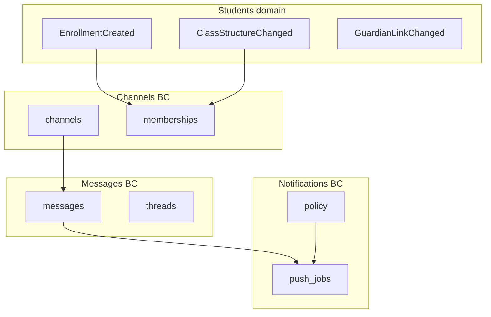

# PRD — Communication

> Status: validated  
> Relation to School Lab: core MVP domain #5 per [`docs/product-map.md`](../../product-map.md) §5 — **MVP priority #1**  
> Capability IDs: see [Competitive grounding](#competitive-grounding) — **37** MVP canonical `communication.*` rows in [`mvp-scope.md`](../../product/mvp-scope.md); **46** canonicals total in taxonomy  
> Domain PRDs: [`messages.md`](messages.md) (BC1), [`channels.md`](channels.md) (BC2), [`announcements.md`](announcements.md) (BC3), [`notifications.md`](notifications.md) (BC4), [`media.md`](media.md) (BC5)  
> Modeling: [`docs/modeling/006-communication.md`](../../modeling/006-communication.md)  
> API: [`docs/api/v1/communication.md`](../../api/v1/communication.md)  
> Traceability: BR-/UC-/AC- IDs per bounded context — see [`traceability.md`](../../product/traceability.md)

---

## 1. Context and motivation

School Lab's validated roadmap places **communication** as the **first product pillar** after
identity and students ([`vision.md`](../../vision.md) §6; Jul 2026 stakeholder validation).
Parents expect reliable two-way messaging with teachers and the school, image sharing, push
alerts, and service channels — without real-time chat infrastructure.

The fintech-first partner slice shipped **no** communication module. Billing validation used
minimal people records only. This folder defines the **official audited channel** model
([`DIV-communication-001`](../../ref/divergencias.md)) that differentiates School Lab from
vanity feeds and bolt-on ERP messaging.

**Gaps today**

- No message, channel, announcement, or notification entities in `web/`.
- No FCM push pipeline beyond stack decision ([`web-stack.md`](../../web-stack.md)).
- No recipient resolution from enrollments/classes.
- No per-family isolation enforcement for guardian comms routes.
- No media retention policy (LGPD open item).

**Dependencies satisfied by prior increments**

- Identity: JWT auth, role templates, invite flow ([`identity-and-onboarding/`](../identity-and-onboarding/)).
- Students: enrollments, classes, guardian links, events for roster changes
  ([`students-and-enrollments/`](../students-and-enrollments/)).

---

## 2. Objective (north star)

Ship **official audited communication channels** — direct and group messages, service channels
with tickets and CSAT, targeted announcements, push/email/WhatsApp adapters, and photo/media
sharing — with **per-family isolation** and **explicit per-channel notification policy**, so
guardians and teachers can communicate reliably at semester start without real-time sync.

---

## Competitive grounding

All **46** canonical `communication.*` capabilities from [`capability-map.md`](../../product/capability-map.md#communication).
Competitor depth reference: ClassApp and Agenda Edu ([`parity-matrix.md`](../../product/parity-matrix.md#communication)).

### MVP capability map (37)

| Capability | `capability_id` | Covered in | Evidence |
|------------|-----------------|------------|----------|
| Send direct message | `communication.send_direct_message` | [`messages.md`](messages.md) | [`DIV-communication-001`](../../ref/divergencias.md), [`classapp/comunicacao/funcionalidades-por-ator.md`](../../ref/classapp/comunicacao/funcionalidades-por-ator.md), [`agenda-edu/comunicacao/funcionalidades-por-ator.md`](../../ref/agenda-edu/comunicacao/funcionalidades-por-ator.md), [`proesc/comunicacao/funcionalidades-por-ator.md`](../../ref/proesc/comunicacao/funcionalidades-por-ator.md) |
| Send group or class message | `communication.send_group_message` | [`messages.md`](messages.md) | [`DIV-communication-001`](../../ref/divergencias.md), ClassApp group messaging |
| Manage message inbox | `communication.manage_message_inbox` | [`messages.md`](messages.md) | Agenda Edu, ClassApp inbox patterns |
| Edit sent message with audit | `communication.edit_message_content` | [`messages.md`](messages.md) | Agenda Edu, ClassApp edit history |
| Schedule message delivery | `communication.schedule_message_delivery` | [`messages.md`](messages.md) | ClassApp scheduled send |
| General comms operations | `communication.manage_communication_operations` | [`messages.md`](messages.md) | Proesc/Agenda Edu/ClassApp catch-all |
| Manage communication groups | `communication.manage_communication_groups` | [`channels.md`](channels.md) | [`DIV-communication-001`](../../ref/divergencias.md), ClassApp channel types |
| Assign recipients to channel | `communication.assign_recipients_to_channel` | [`channels.md`](channels.md) | Class membership routing |
| Manage service channel with SLA | `communication.manage_service_channel` | [`channels.md`](channels.md) | [`DIV-communication-002`](../../ref/divergencias.md), ClassApp + Agenda Edu CSAT channels |
| Open support ticket | `communication.open_support_ticket` | [`channels.md`](channels.md) | [`DIV-communication-002`](../../ref/divergencias.md), Proesc Lia → ticket pattern (human, not AI) |
| Collect CSAT on service channels | `communication.collect_channel_csat` | [`channels.md`](channels.md) | [`DIV-communication-002`](../../ref/divergencias.md), [`classapp/comunicacao/funcionalidades-por-ator.md`](../../ref/classapp/comunicacao/funcionalidades-por-ator.md) |
| Track service inbox | `communication.track_service_inbox` | [`channels.md`](channels.md) | Agenda Edu canais de atendimento |
| Manage channel permissions | `communication.manage_channel_permissions` | [`channels.md`](channels.md) | ClassApp staff channel access revoke |
| Escalate to human support | `communication.escalate_to_human_support` | [`channels.md`](channels.md) | [`DIV-communication-006`](../../ref/divergencias.md) — human path; AI deferred |
| Send individual announcement | `communication.send_individual_announcement` | [`announcements.md`](announcements.md) | Agenda Edu comunicados individuais |
| Manage announcement categories | `communication.manage_announcement_categories` | [`announcements.md`](announcements.md) | Agenda Edu typed comunicados |
| Manage announcement templates | `communication.manage_announcement_templates` | [`announcements.md`](announcements.md) | Agenda Edu model comunicados |
| Approve pending communication | `communication.approve_pending_communication` | [`announcements.md`](announcements.md) | Agenda Edu moderation queue |
| Publish calendar event | `communication.publish_calendar_event` | [`announcements.md`](announcements.md) | Proesc/Agenda Edu/ClassApp events as comms objects |
| Configure push policy | `communication.configure_push_policy` | [`notifications.md`](notifications.md) | [`DIV-communication-007`](../../ref/divergencias.md) |
| Send email notification | `communication.send_email_notification` | [`notifications.md`](notifications.md) | [`DIV-communication-007`](../../ref/divergencias.md) |
| Send WhatsApp notification | `communication.send_whatsapp_notification` | [`notifications.md`](notifications.md) | [`DIV-communication-003`](../../ref/divergencias.md) — adapter only |
| Manage notification inbox | `communication.manage_notification_inbox` | [`notifications.md`](notifications.md) | ClassApp notification list |
| Manage message templates | `communication.manage_message_templates` | [`notifications.md`](notifications.md) | [`DIV-communication-003`](../../ref/divergencias.md) |
| Track delivery status | `communication.track_delivery_status` | [`notifications.md`](notifications.md) | Agenda Edu delivery tracking |
| Attach files to messages | `communication.attach_files_to_message` | [`media.md`](media.md) | ClassApp attachments — **differentiator** (images in MVP) |
| Share photo update | `communication.share_photo_update` | [`media.md`](media.md) | [`DIV-communication-005`](../../ref/divergencias.md) |
| Manage photo album | `communication.manage_photo_album` | [`media.md`](media.md) | [`DIV-communication-005`](../../ref/divergencias.md), Agenda Edu mural |
| Share video content | `communication.share_video_content` | [`media.md`](media.md) | ClipEscola/Agenda Edu video in agenda |
| Distribute learning materials | `communication.distribute_learning_materials` | [`media.md`](media.md) | Proesc material distribution — not LMS |
| Configure communication module | `communication.configure_communication_module` | § Module settings below | Proesc, Agenda Edu, ClassApp module settings |
| Onboard users to communication | `communication.onboard_communication_users` | § Integration contract | Agenda Edu, ClassApp comms onboarding checklists |
| Manage emergency contacts | `communication.manage_emergency_contacts` | § Out of scope (blocked) | Proesc — blocked [`open-questions.md`](../../open-questions.md) |
| Collect guardian CPF | `communication.collect_guardian_cpf` | — *(identity)* | [`DIV-communication-004`](../../ref/divergencias.md) → [`identity-and-onboarding/profiles.md`](../identity-and-onboarding/index.md) *(pending slice)* |
| Manage user profiles / multi-profile | `communication.manage_user_profiles` | — *(identity)* | Agenda Edu, ClassApp → identity `profiles.md` |
| Switch active child context | `communication.switch_active_child` | — *(identity)* | Guardian app UX → identity `profiles.md` |
| Update guardian profile | `communication.update_guardian_profile` | — *(identity)* | [`DIV-communication-004`](../../ref/divergencias.md) → identity |

### P2 / N/A (not in this increment)

| Capability | Phase | Notes |
|------------|-------|-------|
| `communication.send_mass_announcement` | P2 | Whole-school blast — [`open-questions.md`](../../open-questions.md) |
| `communication.send_poll_survey` | P2 | Polls as announcement type |
| `communication.manage_social_reactions` | P2 | Likes/comments off by default ([`DIV-communication-005`](../../ref/divergencias.md)) |
| `communication.manage_network_broadcast` | P2 | Multi-unit network comms |
| `communication.embed_video_call` | P2 | Meet/Zoom adapter links |
| `communication.track_event_engagement` | P2 | Event metrics |
| `communication.view_communication_engagement` | P2 | Analytics reports |
| `communication.defer_ai_assistant` | N/A | Document only — [`DIV-communication-006`](../../ref/divergencias.md) |
| `communication.quality_signal_support` | N/A | Help friction signal |

Requirements without market anchor: `[product decision]` or `[invented]` per [`traceability.md`](../../product/traceability.md).

---

## 3. Target audience

| Audience | Need |
|----------|------|
| Guardians | Message teachers/school, receive push, view photos, open tickets |
| Teachers | Class/group messages, inbox, photo updates, moderation submit |
| Secretaria / Coordenação | Service channels, announcements, module config, push policy |
| Engineering | BC boundaries, events, family isolation, FCM pipeline |
| Academic PRD (increment 4) | Absence notification **handoff** only — reliability per NFR-001 |

---

## 4. MVP scope

### In scope

- **BC1 Messages** — this cut: one family thread per school and student, class notice copied into each thread, no edit or delete. Broader inbox, edit audit, and scheduled send stay a later wave ([`messages.md`](messages.md)).
- **BC2 Channels** — group vs channel vs DM model, service channels, tickets, CSAT, staff inbox.
- **BC3 Announcements** — individual targeted comunicados, categories, templates, moderation, calendar events.
- **BC4 Notifications** — FCM push, email adapter, WhatsApp adapter, delivery tracking, notification inbox, push policy.
- **BC5 Media** — this cut: image, audio, and short video on the family thread (10 MB, 5 files, no transcoding). Photo albums and learning materials remain a later wave.
- Module settings (branding, defaults, enablement) at school level.
- Recipient resolution from students enrollments/classes/guardian links.
- Per-family isolation on all guardian routes (NFR-002).

### Out of scope

- **Real-time messaging** — timely delivery via queue + push, not live sync ([`open-questions.md`](../../open-questions.md)).
- **Audio and short video** are in this cut, on the same attachment as images
  ([`media.md`](media.md) BR-D02, [`messages.md`](messages.md) BR-M09). Long-form video stays out.
- **AI virtual assistant** — `communication.defer_ai_assistant` / Lia / Duda patterns documented only
  ([`DIV-communication-006`](../../ref/divergencias.md)).
- **Mass announcements** — P2 (`communication.send_mass_announcement`).
- **Read receipts** — P2; not auditable archive in MVP.
- **Emergency broadcast button** — `communication.manage_emergency_contacts` blocked pending legal/product decision.
- **Guardian progressive profiling, multi-profile, active child** — identity PRD slices (cross-ref only).
- **Academic absence notification logic** — academic domain; comms only delivers notification payload when academic emits event (link NFR-001).

---

## 5. Bounded contexts

| BC | Document | Answers |
|----|----------|---------|
| **BC1 — Messages** | [`messages.md`](messages.md) | How do DMs and group threads work? Inbox, edit audit, scheduling? |
| **BC2 — Channels** | [`channels.md`](channels.md) | What is a channel vs group vs DM? Service tickets, CSAT, SLA? |
| **BC3 — Announcements** | [`announcements.md`](announcements.md) | How are targeted comunicados and calendar events published and moderated? |
| **BC4 — Notifications** | [`notifications.md`](notifications.md) | What triggers push/email/WhatsApp? Per-channel policy? |
| **BC5 — Media** | [`media.md`](media.md) | Attachments, albums, retention/LGPD? |

---

## 6. Actors and surfaces

| Actor | Surfaces | Primary actions in this domain |
|-------|----------|--------------------------------|
| guardian (UI: **Responsável**) | Web and mobile MVP; mobile priority for push-driven communication | DM, group read, tickets, announcements, photos, notification inbox, push receive; web routes live in `frontend/app`, never `frontend/backoffice` |
| teacher | Web SPA + mobile | Send/receive messages, class groups, photo updates, submit announcements for approval |
| staff (secretary, coordination, director) | Web SPA + mobile | Channels, moderation, announcements, module config, push policy, service inbox |
| backoffice | Web SPA (backoffice) | Module enablement per tenant; no school message content access in MVP |
| student | — *(MVP)* | No login; content addressed via guardian/staff ([`actors-and-surfaces.md`](../../actors-and-surfaces.md)) |

Detail: [`docs/actors-and-surfaces.md`](../../actors-and-surfaces.md).

---

## Segment applicability

| Segment | Applies | Notes |
|---------|---------|-------|
| `infantil` | yes | Family thread plus the Infantil daily routine ([`daily-routine.md`](../academic/daily-routine.md)); photos alone no longer stand in for that card |
| `fundamental_medio` | yes | Primary messaging volume; class-based group threads |
| `pj_financeiro` | partial | Comms unchanged; financial guardian from students BC for billing notifications only |
| `multi_unidade` | partial | All comms scoped per `school_id`; network broadcast P2 |

---

## 7. Integration contract

Shared with [`students-and-enrollments/`](../students-and-enrollments/index.md) and
[`identity-and-onboarding/`](../identity-and-onboarding/index.md):

1. **Recipient resolution** — channel and group membership derives from active
   `enrollments.class_id`, `student_guardians`, and staff class assignments. Events consumed:
   `EnrollmentCreated`, `EnrollmentClassChanged`, `ClassStructureChanged`, `GuardianLinkChanged`
   ([`students-and-enrollments/enrollments.md`](../students-and-enrollments/enrollments.md) Events).
2. **Family isolation (NFR-002)** — this cut's guardian routes are under `/schools/:school_id/me/conversations` and `/me/daily_routines`. Cross-family access returns `404` `not_found`.
3. **Active child context** — guardian API accepts optional `student_id` query param for
   multi-child households; enforcement uses `student_guardians` (identity `profiles.md` slice owns UX).
4. **Permissions (this cut)** — teacher send requires role `teacher` plus a `teaching_assignment`.
   No new `send_messages` key. `moderate_messages` does not open a private thread. Later waves may
   still use `manage_communication` and related keys; they are not created here.
5. **Onboarding** — `communication.onboard_communication_users` reuses identity invite flow;
   comms module adds post-accept checklist (FCM token, notification prefs) — not a parallel auth path.
6. **Academic absence handoff** — when academic domain emits `AbsenceRecorded` (increment 4),
   notification BC delivers push/email per policy. Comms does **not** decide absence validity —
   reliability requirements cite [NFR-001](../../product/non-functional-requirements.md#nfr-001--reliability-critical-domains)
   in academic PRD only.
7. **Billing WhatsApp** — billing régua may reuse WhatsApp adapter infrastructure; business rules
   stay in billing services ([`fintech-first.md`](../fintech-first.md)).

### Module settings (cross-cutting)

School-scoped `communication_settings` (proposed entity group):

- Default push policy template on module enable.
- Branding header for guardian app comms tab.
- Teacher message moderation required (boolean).
- Quiet hours window (timezone-aware) — `[product decision]` pending open questions.

Capability: `communication.configure_communication_module`.

---

## 8. Delivery waves

| Wave | Primary doc | Deliverable |
|------|-------------|-------------|
| **W1** | messages.md + media.md | Family thread per school and student, class notice, image/audio/short-video attachments. No push |
| **W2** | channels.md | Service channels, tickets, CSAT, staff inbox |
| **W3** | announcements.md + media.md | Individual announcements, moderation, attachments, photo albums |
| **W4** | notifications.md | FCM pipeline, push policy, email/WhatsApp adapters, delivery tracking |
| **Phase 2** | — | Mass announcements, polls, read receipts, network broadcast |

W1 depends on students W1–W2 (classes, enrollments, guardian links).

---

## 9. Key decisions

| # | Decision | Status |
|---|----------|--------|
| D1 | Official audited channels, not vanity feed | Documented — [`DIV-communication-001`](../../ref/divergencias.md) |
| D2 | Service channels with tickets + CSAT | Documented — [`DIV-communication-002`](../../ref/divergencias.md) |
| D3 | WhatsApp as adapter; rules in API | Documented — [`DIV-communication-003`](../../ref/divergencias.md) |
| D4 | Photos with retention; no public reactions in MVP | Documented — [`DIV-communication-005`](../../ref/divergencias.md) |
| D5 | Defer AI; human escalation in service channels | Documented — [`DIV-communication-006`](../../ref/divergencias.md) |
| D6 | Explicit per-channel push policy | Documented — [`DIV-communication-007`](../../ref/divergencias.md) |
| D7 | Not real-time — queue + FCM | Documented — [`open-questions.md`](../../open-questions.md) |
| D8 | Individual announcements MVP; mass P2 | Documented — [`mvp-scope.md`](../../product/mvp-scope.md) |
| D9 | Image, audio, and short video on the family thread — 10 MB, 5 files, no transcoding | Documented — [`vision.md`](../../vision.md) §3, [`media.md`](media.md) BR-D02 |
| D10 | Emergency contacts / broadcast — blocked | Open — [`open-questions.md`](../../open-questions.md) |
| D11 | This cut: one thread per school and student; no edit/delete; no push | Documented — [`messages.md`](messages.md) § Family thread slice |

---

## 10. Non-functional requirements

Cross-cutting catalog: [`docs/product/non-functional-requirements.md`](../../product/non-functional-requirements.md).

| NFR | Domain application |
|-----|-------------------|
| [NFR-002](../../product/non-functional-requirements.md#nfr-002--lgpd-and-privacy) | Per-family isolation on all guardian comms; children's photos/messages; retention TBD |
| [NFR-003](../../product/non-functional-requirements.md#nfr-003--multi-tenancy) | All comms entities include `school_id`; threads never cross schools |
| [NFR-004](../../product/non-functional-requirements.md#nfr-004--push-notifications) | FCM via Solid Queue; per-channel policy; not real-time |
| [NFR-005](../../product/non-functional-requirements.md#nfr-005--observability-and-audit) | Message edits, moderation actions, ticket status changes audited |
| [NFR-006](../../product/non-functional-requirements.md#nfr-006--availability-and-performance-baseline) | Timely delivery within minutes; mobile offline read cache acceptable |

**Academic boundary:** absence-triggered notifications reference [NFR-001](../../product/non-functional-requirements.md#nfr-001--reliability-critical-domains)
in academic PRD — communication delivers the notification only after academic confirms absence.

Domain-specific bullets:

- **Sent messages stay sent** — this cut has no edit or delete. A correction is a new message.
  Edit history (BR-M06) is a later wave.
- **Attachment limits** — 10 MB, 5 files, allow-list in [`media.md`](media.md) BR-D02. Any cap
  above 10 MB, and resolution, stay open ([`open-questions.md`](../../open-questions.md) § Communication).
- **Access audit for sensitive threads** — who viewed message content — open LGPD item (NFR-005).

---

## 11. Open items / pending decisions

See [`docs/open-questions.md`](../../open-questions.md) § Communication and § LGPD:

- [ ] Mass vs individual announcement boundary in UX copy (mass is P2).
- [ ] Push immediacy vs daily digest for non-urgent messages.
- [ ] Teacher quiet hours / response-time expectations.
- [ ] Escalation when teacher does not reply within X hours.
- [x] This cut: 10 MB per file, 5 files, image/audio/short-video allow-list. Resolution and any cap above 10 MB stay open.
- [ ] Image resolution limit, and any size cap above 10 MB.
- [ ] Message/photo retention windows and post-enrollment deletion.
- [ ] Access audit (view logging) for conflict cases.
- [ ] Emergency contacts and school alert button — legal review.
- [ ] FCM token lifecycle and multi-device policy.
- [ ] WhatsApp provider selection and template approval workflow.
- [x] Partner workshop deferred — documentation-phase sign-off Aug 2026 ([`open-questions.md`](../../open-questions.md)).

---

## 12. Relation to fintech-first

[`fintech-first.md`](../fintech-first.md) explicitly excludes communication module implementation.
No migration from existing comms code — greenfield on shared `school_id` tenancy and people records.

---

## 13. Definition of Done (documentation)

- [x] Six PRD files in `docs/prds/communication/` with complete sections.
- [x] All **37** MVP `communication.*` capabilities mapped (33 in this folder + 4 identity cross-refs).
- [x] BR-/UC-/AC- IDs standardized per BC prefix.
- [x] Cross-links to students (recipient events) and identity (profiles, invites, NFR-002).
- [x] DIV-communication-001…007 reflected in decisions.
- [x] AI assistant and mass comms documented out of scope.
- [x] Academic absence handoff links NFR-001 without specifying academic rules.
- [x] Status promoted to `validated` (2026-08-15).
- [x] Modeling [`006-communication.md`](../../modeling/006-communication.md) + API [`communication.md`](../../api/v1/communication.md) drafted; DBML hardening pending (Phase 4B).
- [x] Partner workshop deferred — live stakeholder session is a separate milestone.
