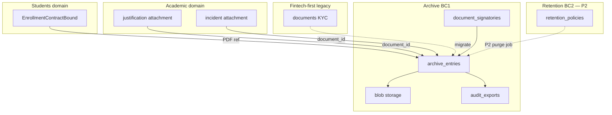
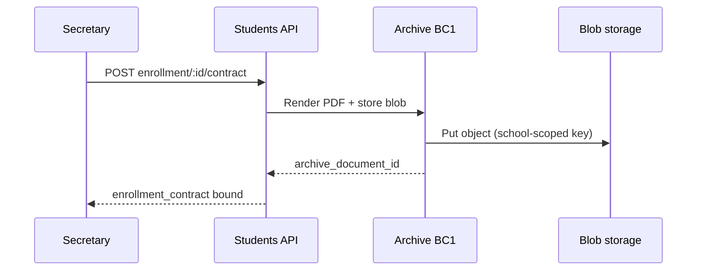

# PRD — Documents & Archive

> Status: validated  
> Relation to School Lab: core MVP domain #8 per [`docs/product-map.md`](../../product-map.md) §5  
> Capability IDs: see [Competitive grounding](#competitive-grounding) — **12** canonical `documents.*` rows in [`capability-taxonomy.yaml`](../../product/capability-taxonomy.yaml) (**5** MVP)  
> Domain PRDs: [`archive.md`](archive.md) (BC1 — MVP), [`retention.md`](retention.md) (BC2 — P2 hooks), [`guardian-requests.md`](guardian-requests.md) (BC3 — implemented backfill)
> Modeling: [`docs/modeling/008-documents-archive.md`](../../modeling/008-documents-archive.md)  
> API: [`docs/api/v1/documents-and-archive.md`](../../api/v1/documents-and-archive.md)  
> Traceability: BR-/UC-/AC- IDs per bounded context — see [`traceability.md`](../../product/traceability.md)

---

## 1. Context and motivation

The **digital archive** is a **vision-aligned pillar** ([`vision.md`](../../vision.md) §3, §6):
a single audit-ready repository per student and school, replacing physical rooms of paper and
supporting Conselho/Secretaria de Educação inspections. MVP delivers **store, search, guardian
view, audit export, and signatory configuration** — not Livro Ata generation or e-signatures.

**Corpus note:** Phase 1 taxonomy maps **1 raw catalog entry** to **12 canonical** `documents.*`
capabilities; competitor help-center coverage is thin compared to billing or academic. Requirements
here are **vision-led** with selective Proesc/ClassApp grounding where documented.

**Gaps today**

- Fintech-first shipped **enrollment/KYC document upload** with staff review
  ([`fintech-first.md`](../fintech-first.md) UC-07) — not a full archive.
- No school-year or document-type taxonomy, search, or audit package export.
- No shared **blob storage contract** for cross-domain attachments (enrollment contract PDFs,
  absence justifications, incident files).
- Active Storage production backend unresolved ([`open-questions.md`](../../open-questions.md) § Infrastructure).

**Dependencies satisfied**

- Identity: JWT, permissions, guardian family scope ([`identity-and-onboarding/`](../identity-and-onboarding/)).
- Students: student records, enrollments, contract binding handoff ([`students-and-enrollments/`](../students-and-enrollments/)).
- Academic: attachment references in attendance justification and incidents ([`academic/`](../academic/)).

---

## 2. Objective (north star)

Deliver an **audit-ready digital archive** — per-school, per-student document storage with staff
search, guardian read access under family isolation, Conselho-oriented export packages, and
signatory blocks for future official document generation — as the **shared file layer** for
enrollment contracts, academic attachments, and (P2) Livro Ata and e-signatures.

---

## 3. Relation to fintech-first (supersede notes)

| fintech-first artifact | This folder |
|------------------------|-------------|
| UC-07 Document upload and review (enrollment/KYC) | **Superseded** by [`archive.md`](archive.md) BC1 — extends scope to typed archive, search, audit export; migrates existing `documents` table semantics |
| `POST /documents`, `approve`/`reject` workflow | **Retained** as subset of staff upload + optional review queue for `visibility: guardian` docs |
| Guardian `GET /me/documents` | **Superseded** by family-scoped archive read ([`archive.md`](archive.md) UC-DA04) |
| BR/permissions on `documents/*` | **Extended** — archive permissions replace KYC-only mental model |

Fintech-first explicitly excluded "full digital archive" ([`fintech-first.md`](../fintech-first.md) § Out of Scope).
This folder is the official domain PRD; code in `web/` remains on the partner slice until W1–W3
archive waves ship.

**Billing boundary:** NFS-e (Nota Fiscal de Serviço eletrônica) PDFs belong in
[`billing/invoices.md`](../billing/invoices.md) BC7 (P2) — **not** this domain. Tax documents may
**link** to archive entries but issuance stays in billing. Automatic annual tax-declaration
eligibility, calculation, versioning, and payer API are owned by
[`billing/tax-declarations.md`](../billing/tax-declarations.md).

---

## 4. Competitive grounding

All **12** canonical `documents.*` capabilities from [`capability-map.md`](../../product/capability-map.md#documents--archive).
Competitor presence: [`parity-matrix.md`](../../product/parity-matrix.md#documents--archive).

| Capability | `capability_id` | Phase | Covered in | Evidence |
|------------|-----------------|-------|------------|----------|
| Store document in digital archive | `documents.store_student_document` | MVP | [`archive.md`](archive.md) | [`proesc/gestao-academica/funcionalidades-por-ator.md`](../../ref/proesc/gestao-academica/funcionalidades-por-ator.md) (matrícula docs), [`agenda-edu/gestao-academica/funcionalidades-por-ator.md`](../../ref/agenda-edu/gestao-academica/funcionalidades-por-ator.md), [`classapp/gestao-academica/funcionalidades-por-ator.md`](../../ref/classapp/gestao-academica/funcionalidades-por-ator.md), [`parity-matrix.md`](../../product/parity-matrix.md#documents--archive) |
| Search digital archive | `documents.search_archive` | MVP | [`archive.md`](archive.md) | Proesc archive search patterns (4 aliases), ClassApp (1) — basic metadata search MVP |
| View student documents in archive | `documents.view_student_documents` | MVP | [`archive.md`](archive.md) | `[product decision]` — per-family guardian read; vision §6 digital archive |
| Export audit-ready package | `documents.export_audit_package` | MVP | [`archive.md`](archive.md) | `[product decision]` — Conselho audit readiness per [`vision.md`](../../vision.md) §3 |
| Configure document signatories | `documents.configure_document_signatories` | MVP | [`archive.md`](archive.md) | [`documents-and-archive.create_adicionar_os_dados_de_secretar`](../../ref/catalogo-funcionalidades.md) — Proesc secretary/director on generated docs |
| Manage retention policy | `documents.manage_retention_policy` | P2 | [`retention.md`](retention.md) | NFR-002; [`open-questions.md`](../../open-questions.md) § Digital archive |
| Generate official minutes (Livro Ata) | `documents.generate_official_minutes` | P2 | — *(future `livro-ata.md`)* | [`vision.md`](../../vision.md) §6 — high priority phase 2 |
| Collect minutes signatures | `documents.collect_minutes_signatures` | P2 | — *(future `livro-ata.md`)* | Valid digital signature for Conselho audits |
| Semantic archive search | `documents.search_archive_semantic` | P2 | — *(future `livro-ata.md`)* | Vision stakeholder interest; pgvector TBD |
| Issue school transcript | `documents.issue_transcript` | P2 | — *(future `certificates.md`)* | Under-represented in competitor catalog |
| Issue official declarations | `documents.issue_official_declaration` | P2 | — *(future `certificates.md`)* | Enrollment, quitação, formal certificates |
| Collect contract signatures | `documents.collect_contract_signatures` | P2 | — *(future `contracts.md`)* | [`DIV-financial-007`](../../ref/divergencias.md) — shares signature infra with Livro Ata |

Requirements without market anchor: `[product decision]` or `[invented]` per [`traceability.md`](../../product/traceability.md).

**Related capabilities in other domains** (boundary, not owned here):

| Capability | Domain | Boundary |
|------------|--------|----------|
| `students.manage_enrollment_contract` | students | Template binding + PDF generation trigger — storage in archive BC1 |
| `students.sign_enrollment_contract` | students | P2 — signature flow uses documents infra phase 2 |
| `billing.sign_enrollment_contract` | billing | P2 trilha signature gate — same infra |
| `academic.justify_absence` | academic | Optional attachment **reference** to archive blob |
| `academic.record_incidents` | academic | Incident attachments via shared storage contract |
| `communication.attach_files_to_message` | communication | Message media — separate retention policy; not student archive |
| `billing.issue_service_invoice` | billing | NFS-e PDF — billing BC7 P2; optional archive link |

---

## 5. Target audience

| Audience | Need |
|----------|------|
| Secretaria / Direção | Upload and organize student/school documents; search; export audit packages |
| Guardians | View documents shared with the family (children linked via `student_guardians`) |
| Conselho / auditors | Receive structured export bundles (MVP: staff-triggered ZIP + manifest) |
| Engineering | Shared blob storage API, family isolation, cross-domain `document_id` references |
| Students PRD | Enrollment contract PDF storage after UC-E03 render |
| Academic PRD | Justification and incident attachment handoff |

---

## 6. MVP scope

### In scope (BC1 — [`archive.md`](archive.md))

| Capability | Summary |
|------------|---------|
| `documents.store_student_document` | Upload and classify documents per student/school; staff review optional |
| `documents.search_archive` | Metadata search (student, type, year, title, date range) |
| `documents.view_student_documents` | Guardian/staff read with per-family isolation |
| `documents.export_audit_package` | Async ZIP + manifest for audit scope |
| `documents.configure_document_signatories` | Secretary/director letterhead block for future generated docs |

### Out of scope (MVP)

| Item | Phase | Target PRD |
|------|-------|------------|
| Livro Ata generation | P2 | `livro-ata.md` *(not written)* |
| Minutes and contract e-signatures | P2 | `livro-ata.md`, `contracts.md` |
| Semantic / vector search | P2 | `livro-ata.md` |
| Official transcripts and declarations | P2 | `certificates.md` |
| Configurable retention policies (UI) | P2 | [`retention.md`](retention.md) |
| NFS-e and fiscal PDF issuance | P2 | [`billing/invoices.md`](../billing/invoices.md) |
| Communication photo/message retention | MVP comms | [`communication/media.md`](../communication/media.md) — parallel policy, shared storage adapter |
| Platform help center | P2 | platform increment 7 |

### Vision §6 alignment

MVP matches [`vision.md`](../../vision.md) §6 **in**: "Digital archive: document repository per
student/school."

MVP matches **out**: Livro Ata, digital signatures, semantic search — **phase 2 high priority**
([`vision.md`](../../vision.md) §6 Out of MVP; [`mvp-scope.md`](../../product/mvp-scope.md) § Deferred).

---

## 7. Bounded contexts

| BC | Document | Answers |
|----|----------|---------|
| **BC1 — Archive** | [`archive.md`](archive.md) | How are files stored, typed, searched, shared with guardians, and exported for audit? |
| **BC2 — Retention** | [`retention.md`](retention.md) | What retention hooks exist in MVP? What is deferred for configurable policy (P2)? |
| **BC3 — Guardian requests** | [`guardian-requests.md`](guardian-requests.md) | How do Responsáveis create/follow Meus pedidos and staff work the Solicitações queue? |

**Future P2 bounded contexts** (not in this increment):

| BC | Planned file | Capabilities |
|----|--------------|--------------|
| Livro Ata | `livro-ata.md` | `generate_official_minutes`, `collect_minutes_signatures`, `search_archive_semantic` |
| Certificates | `certificates.md` | `issue_transcript`, `issue_official_declaration` |
| Contracts / e-sign | `contracts.md` | `collect_contract_signatures` (+ students/billing sign flows) |

---

## 8. Actors and surfaces

| Actor | Surfaces | Primary actions in this domain |
|-------|----------|--------------------------------|
| staff (secretary, director) | Web SPA + mobile | Upload, classify, search, review, export audit package, configure signatories |
| staff (teacher) | Web SPA + mobile | Upload student docs where permitted; attach via academic flows |
| guardian (UI: **Responsável**) | Web first; mobile parity | View documents shared for linked children |
| student | — *(MVP)* | No login; documents via guardian ([`actors-and-surfaces.md`](../../actors-and-surfaces.md)) |
| backoffice | Web SPA (backoffice) | Storage backend config; retention policy P2 |

Detail: [`docs/actors-and-surfaces.md`](../../actors-and-surfaces.md).

---

## Segment applicability

| Segment | Applies | Notes |
|---------|---------|-------|
| `infantil` | yes | Health/consent documents common; same archive model |
| `fundamental_medio` | yes | Primary audit and transcript use case (transcript issuance P2) |
| `pj_financeiro` | partial | Contract PDFs may name PJ payer; archive stores file only |
| `multi_unidade` | partial | All archive data scoped per `school_id`; group export P2 |

Open segment decisions: official Conselho document list — [`open-questions.md`](../../open-questions.md) § Digital archive.

---

## 9. Integration contract

Shared with [`students-and-enrollments/`](../students-and-enrollments/),
[`academic/`](../academic/), [`billing/`](../billing/), and [`communication/`](../communication/):

1. **Shared storage service** — `Documents::StoreBlobService` (name TBD) is the **only** entry
   point for durable file bytes. Domains store **`archive_entry_id`** (or signed URL token), not
   duplicate blobs. Max size and MIME allowlist enforced centrally (BR-ARC07).
2. **Enrollment contract PDF** — students UC-E03 calls render → `StoreBlobService`, creates an
   `archive_documents` row, and stores its id in `enrollment_contracts.document_id`. Signature P2
   attaches to the same archive-document lineage.
3. **Academic attachments** — `attendance_justifications.document_id` and
   `incident_attachments.document_id` reference archive entries with
   `source: academic` and appropriate `visibility` (BR-ARC09).
4. **Family isolation (NFR-002)** — guardian `/schools/:school_id/me/documents` and
   `/me/students/:id/documents` return only entries linked to students in `student_guardians`
   where `visibility` includes guardian. Cross-family access returns `404`.
5. **School isolation (NFR-003)** — all queries scoped by `school_id`; audit export never
   crosses schools.
6. **Fintech-first migration** — existing `documents` rows map to `archive_entries` with
   `legacy_source: fintech_kyc`; approve/reject workflow preserved for guardian-visible uploads.
7. **Billing NFS-e** — when P2 ships, NFS-e PDF may create `archive_entry` with
   `document_type: tax_invoice` and link from billing — **issuance logic stays in billing**.
8. **Permissions** — keys `manage_archive`, `view_archive`, `export_audit_package`,
   `configure_signatories` on secretary/director templates (identity BC1).
9. **Retention** — MVP uses **platform default retention** (no UI); P2 `manage_retention_policy`
   in [`retention.md`](retention.md). Communication media follows comms policy — not auto-deleted
   when archive policy changes.
10. **Guardian requests** — the request queue records the ask and resolution; a future generated
    document is a separate archive entry. Automatic income-tax declarations bypass this queue and
    are billing-owned.

---

## 10. Delivery waves

| Wave | Scope | Depends on |
|------|-------|------------|
| **W1** | Blob storage adapter + `archive_entries` model; staff upload/list (supersedes UC-07 core) | Identity, students records |
| **W2** | Document types, school-year tagging, metadata search | W1, platform school-year *(stub acceptable)* |
| **W3** | Guardian read, visibility/review workflow, family isolation | W1, guardian links |
| **W4** | Audit package export (async job + manifest) | W1–W2 |
| **W5** | Signatory configuration (letterhead metadata) | W1 |
| **W6** | Cross-domain hooks: enrollment PDF, academic attachment refs | Students W4, academic W1 |

**P2 waves** (not this increment): Livro Ata, e-sign provider, semantic index, retention UI,
certificates generation.

---

## 11. Non-functional requirements

Cross-cutting catalog: [`non-functional-requirements.md`](../../product/non-functional-requirements.md).

| NFR | Domain application |
|-----|-------------------|
| **NFR-002** | Children's documents — minimize access; guardian sees only shared entries; sensitive types flagged (`health`, `incident`) |
| **NFR-003** | Strict `school_id` on entries, blobs, exports |
| **NFR-005** | Audit trail on upload, visibility change, review decision, export request |
| **NFR-001** | Audit export jobs idempotent; failed export surfaces retry without duplicate ZIP |

Domain-specific:

- **Blob integrity** — content hash (SHA-256) stored on upload; export manifest includes hashes.
- **Immutability** — archive entry **content** is append-only; corrections upload new version
  (`version` + `supersedes_id`) rather than overwrite bytes `[product decision]`.
- **Backup** — production object storage with backup policy before school onboarding
  ([`open-questions.md`](../../open-questions.md) § Infrastructure).

---

## 12. Decisions log

| ID | Decision | Status |
|----|----------|--------|
| D1 | MVP = repository + search + guardian view + audit export; no Livro Ata | Documented — vision §6 |
| D2 | Fintech-first UC-07 superseded by archive BC1 | Documented — §3 above |
| D3 | Shared blob service for cross-domain attachments | Documented — §9 |
| D4 | NFS-e stays in billing P2 | Documented — [`billing/invoices.md`](../billing/invoices.md) |
| D5 | E-signatures P2; [`DIV-financial-007`](../../ref/divergencias.md) metering deferred | Documented — open questions |
| D6 | Basic metadata search MVP; semantic P2 | Documented — taxonomy |
| D7 | Signatory config MVP for future generated docs | Documented — Proesc corpus |
| D8 | Versioning via supersedes chain, not in-place overwrite | Documented — BR-ARC06 |
| D9 | Default retention platform-wide until P2 policy UI | Documented — [`retention.md`](retention.md) |

---

## 13. Open items / pending decisions

- [ ] Official Conselho/Secretaria required document list — [`open-questions.md`](../../open-questions.md) § Digital archive
- [ ] Archive organization: by student vs class vs school year — [`open-questions.md`](../../open-questions.md) § Digital archive
- [ ] Retention windows and versioning policy — [`open-questions.md`](../../open-questions.md) § Digital archive; [`retention.md`](retention.md)
- [ ] Production object storage (S3) before document-heavy onboarding — [`open-questions.md`](../../open-questions.md) § Infrastructure
- [ ] E-sign provider (Authentic vs Clicksign vs proprietary) — phase 2 — [`DIV-financial-007`](../../ref/divergencias.md)
- [ ] Livro Ata types and generation flow — phase 2 — [`open-questions.md`](../../open-questions.md) § Contracts, signature, and Livro Ata

---

## 14. Definition of Done (documentation)

- [x] Index with vision grounding, MVP vs P2, fintech-first supersede
- [x] Archive BC1 with 5 MVP capabilities, BR/UC/AC
- [x] Retention BC2 P2 hooks documented
- [x] Cross-links: students contracts, academic attachments, billing NFS-e boundary
- [x] P2 canonicals listed with future file targets
- [x] Partner validation deferred — documentation-phase sign-off Aug 2026 ([`open-questions.md`](../../open-questions.md)).
- [x] Modeling [`008-documents-archive.md`](../../modeling/008-documents-archive.md) aligned with
      locally validated DBML; API [`documents-and-archive.md`](../../api/v1/documents-and-archive.md)
      remains draft pending OpenAPI freeze.

---

## 15. Out of Scope

- **Platform & admin** domain (increment 7) — school year, calendar, backoffice ops
- **Livro Ata, transcripts, declarations, e-sign** — P2 separate PRDs
- **NFS-e issuance** — billing BC7
- **Communication media** lifecycle — comms BC5 (parallel retention)
- **web/ implementation** — follows PRD approval + modeling
