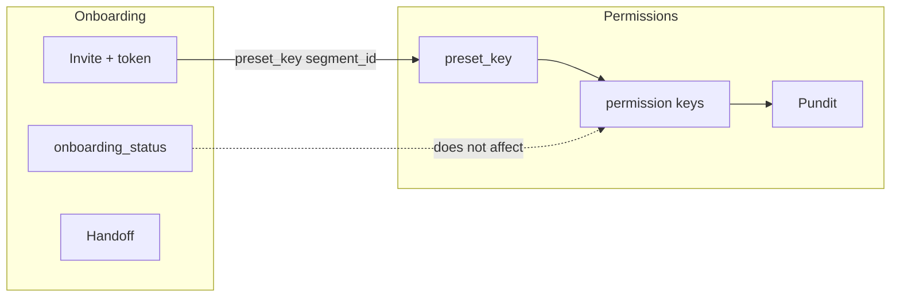
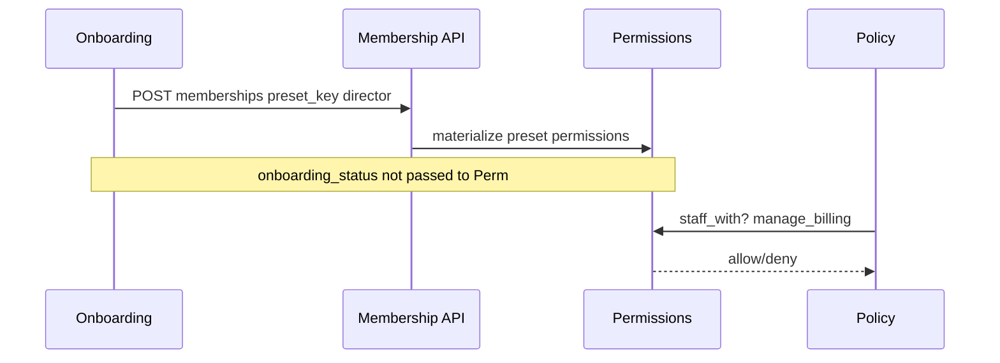

# PRD — Identity & Onboarding

> Status: draft  
> Relation to School Lab: core MVP domains #2–3 per [`docs/product-map.md`](../../product-map.md) §5  
> Domain PRDs: [`permissions.md`](permissions.md) (BC1), [`onboarding.md`](onboarding.md) (BC2)  
> Modeling: [`003-identity-permissions.md`](../../modeling/003-identity-permissions.md), [`004-school-onboarding.md`](../../modeling/004-school-onboarding.md)  
> API: [`docs/api/v1/identity-onboarding.md`](../../api/v1/identity-onboarding.md)

---

## 1. Context and motivation

School Lab's validated roadmap places **multi-tenancy** and **identity** before students,
communication, and academic features. The fintech-first partner slice shipped JWT auth, four
binary membership roles, and minimal invite/onboarding stubs — sufficient for billing validation
but not for official launch with Direção, Secretaria, Coordenação, and Professor workflows
([`docs/main-menu-description.md`](../../main-menu-description.md)).

**Gaps today**

- `school_staff?` treats all school admins equally.
- No owner (`is_owner`) or preset model.
- `CreateSchoolService` does not provision an owner.
- Invites use random passwords instead of secure token + set-password flow.
- No distinction between self-serve signup and premium white-glove provisioning.

**Scholar Premium alignment:** sindicato GTM includes schools requesting full setup by DLA
backoffice with formal handoff to the director.

---

## 2. Objective (north star)

Ship **granular staff authorization** and **two onboarding modes** (self-serve + white-glove) so
a school can go from contract to operational tenant with audited provisioning, correct presets,
and a single owner — without blocking the communication MVP that follows.

---

## 3. Target audience

| Audience | Need |
|----------|------|
| Partner / early adopter schools | Reliable onboarding and role-appropriate menus |
| DLA backoffice | Premium provisioning with audit trail |
| Engineering | Clear BC boundaries and migration from fintech-first |
| Future domains (communication, academic) | Stable `staff_with?` and segment scope hooks |

---

## 4. MVP scope

### In scope

- Permissions engine (roles + presets + permission keys + segment scope) — BC1.
- School lifecycle (`provisioning` → `pending_handoff` → `active`) and modes — BC2.
- Invite token + set password; membership accept flow.
- Owner wizard (self-serve) and backoffice provisioning wizard (white-glove).
- Provisioning and activation handoff checklists and events.
- Data migration `school` → `staff` role.
- `GET /me` permission payload for SPA route gating.

### Out of scope

- Digital enrollment contract signature via Authentic (phase 2 — proposed vendor).
- Impersonation / "login as school" for support (future PRD).
- Commercial SaaS contract in product.
- Full `segments` academic model (MVP minimum or stub — D6).
- Individual permission editor UI beyond API (phase 1.1 / W5).

---

## 5. Bounded contexts

| BC | Document | Answers |
|----|----------|---------|
| **BC1 — Permissions** | [`permissions.md`](permissions.md) | Who can do what inside a school? How do presets map to permission keys? How do policies resolve scope? |
| **BC2 — Onboarding** | [`onboarding.md`](onboarding.md) | How does a school enter the platform? What states and modes exist? How do invites and handoff work? |

---

## 6. Actors and surfaces

Stakeholder → authorization mapping (presets, not new roles):

| Stakeholder (pt-BR UI) | `memberships.role` | `preset_key` | Primary surface |
|------------------------|-------------------|--------------|-----------------|
| Diretor / Vice-diretor | `staff` | `director` | Web SPA (school) |
| Secretaria | `staff` | `secretary` | Web SPA |
| Coordenação | `staff` or `teacher` | `coordination` | Web SPA |
| Professor | `teacher` | `teacher` | Web + app |
| Responsável | `guardian` | — | App (+ web per channel decision) |
| DLA backoffice | `backoffice` | — | Web SPA (backoffice) |

Detail: [`docs/actors-and-surfaces.md`](../../actors-and-surfaces.md) (updated in this initiative).

---

## 7. Integration contract

All three PRDs share this contract:

1. **Onboarding uses permissions** — every staff/teacher invite includes `preset_key` and
   optional `segment_id`; onboarding services call `People::CreateMembershipService` (extended),
   not a parallel authorization path.
2. **Permissions engine is onboarding-agnostic** — effective permissions depend on membership,
   `staff_profiles`, and grants only; not on `onboarding_mode` or `onboarding_status`.
3. **Backoffice provisioning** — uses platform permission `provision_school` while
   `school.onboarding_status == provisioning`; backoffice does **not** receive a staff
   membership on the tenant for this purpose (D4).

4. **Enrollment contract signatures (phase 2)** — onboarding reaches `active` without signed
   enrollment contracts. Future **Authentic** integration (proposed vendor) updates
   `enrollment_contract.signature_status` via webhook; may gate billing/enrollment completion
   but **not** login. See [`onboarding.md`](onboarding.md) § Future integration — Authentic.
   Distinct from the commercial SaaS agreement between DLA and the school.

---

## 8. Delivery waves

Documentary and implementation order:

| Wave | Primary doc | Deliverable |
|------|-------------|-------------|
| **W1** | permissions.md | Permission model, presets, `school`→`staff` migration, extended `GET /me` |
| **W2** | onboarding.md | Invite token table, `POST /auth/invite/accept`, membership accept |
| **W3** | onboarding.md | Self-serve: owner wizard + team invites |
| **W4** | onboarding.md | White-glove: backoffice provisioning + handoff + CSV import |
| **W5** | permissions.md | Individual permission adjustments (phase 1.1) |
| **Phase 2** | onboarding.md + enrollments PRD | Enrollment contract digital signature via **Authentic** (proposed vendor) — see § Future integration |

W1 is a hard dependency for W2–W4 (presets on invites). W5 can ship after schools are active.
Phase 2 signature work starts after W4; it does **not** block login (BR-O11).

---

## 9. Key decisions

| # | Decision | Status |
|---|----------|--------|
| D1 | Rename `school` → `staff` in code; UI "Escola/Equipe" | Documented — migration in UC-P04 |
| D2 | Presets: `director`, `secretary`, `coordination`, `teacher` | Documented |
| D3 | Coordinating teacher = `teacher` role + coordination permissions | Documented |
| D4 | Backoffice uses `provision_school` during provisioning | Documented |
| D5 | Single-use invite token + set password | Documented |
| D6 | `segments` entity — MVP minimum or stub | Open — see [`open-questions.md`](../../open-questions.md) |

---

## 10. Non-functional requirements

- **Per-school isolation** unchanged — all tenant data scoped by `school_id`.
- **LGPD** — provisioning audit trail for backoffice actions on behalf of schools; invite
  tokens stored as digests only; CPF not required for login (boleto rules unchanged).
- **Security** — invite tokens single-use, time-limited; passwords never returned by API.
- **Auditing** — permission changes and provisioning actions audited (`audited` gem).
- **Compatibility** — fintech-first billing policies migrate to permission checks without
  behaviour regression for existing partner school (director preset backfill).

---

## 11. Open items / pending decisions

See [`docs/open-questions.md`](../../open-questions.md) § Identity & Onboarding:

- [ ] Transactional email provider for invites (Postmark, SES, …).
- [ ] LGPD consent record location for staff/guardian onboarding.
- [ ] `segments` MVP depth (full entity vs nullable stub).
- [ ] Partner workshop to validate preset × permission matrix before `validated` status.
- [ ] Terms acknowledgment persistence for handoff checklists.
- [ ] Confirm **Authentic** as enrollment signature vendor (proposed — see onboarding PRD).
- [ ] Authentic webhook/auth model and signed PDF LGPD retention.
- [ ] Who triggers enrollment contract send: backoffice vs owner/secretary.

---

## 12. Relation to fintech-first

`docs/prds/fintech-first.md` remains the historical record for the billing slice. UC-06, UC-08,
and § Permissions are **superseded by** this folder for new work; implementation in `web/` will
converge through the waves above without duplicating billing business rules.

---

## 13. Definition of Done (documentation)

- [x] Three PRD files in `docs/prds/identity-and-onboarding/` with complete sections.
- [x] Preset × permission matrix and provisioning/activation handoff checklists documented.
- [x] BRs numbered; supersession notes in fintech-first.
- [x] Modeling 003 + 004 + schema.dbml aligned.
- [x] `open-questions.md` Identity section added.
- [x] Internal doc-consistency pass complete (2026-08-08); critical diagram/handoff fixes in follow-up PR.
- [ ] Partner workshop completed or explicitly flagged.
