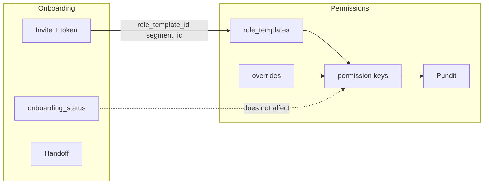
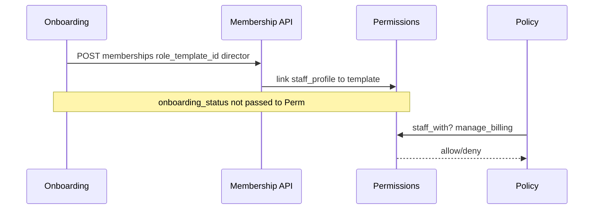

# PRD — Identity & Onboarding

> Status: validated  
> Relation to School Lab: core MVP domains #2–3 per [`docs/product-map.md`](../../product-map.md) §5  
> Capability IDs (MVP): see [Competitive grounding](#competitive-grounding) — **13** canonical `identity.*` rows in [`capability-map.md`](../../product/capability-map.md#identity--onboarding)  
> Domain PRDs: [`permissions.md`](permissions.md) (BC1), [`onboarding.md`](onboarding.md) (BC2), [`auth.md`](auth.md), [`invites.md`](invites.md), [`profiles.md`](profiles.md), [`consent.md`](consent.md)  
> Modeling: [`003-identity-permissions.md`](../../modeling/003-identity-permissions.md), [`004-school-onboarding.md`](../../modeling/004-school-onboarding.md)  
> API: [`docs/api/v1/identity-onboarding.md`](../../api/v1/identity-onboarding.md)  
> Traceability: BR-/UC-/AC- IDs per bounded context (`BR-P*`, `UC-P*`, `AC-P*` in permissions; `BR-O*`, `UC-O*`, `AC-O*` in onboarding) — see [`traceability.md`](../../product/traceability.md)

---

## 1. Context and motivation

School Lab's validated roadmap places **multi-tenancy** and **identity** before students,
communication, and academic features. The fintech-first partner slice shipped JWT auth, four
binary membership roles, and minimal invite/onboarding stubs — sufficient for billing validation
but not for official launch with Direção, Secretaria, Coordenação, and Professor workflows
([`docs/main-menu-description.md`](../../main-menu-description.md)).

**Gaps today**

- `school_staff?` treats all school admins equally.
- No owner (`is_owner`) or role template model.
- `CreateSchoolService` does not provision an owner.
- Invites use random passwords instead of secure token + set-password flow.
- No distinction between self-serve signup and premium white-glove provisioning.

**Scholar Premium alignment:** sindicato GTM includes schools requesting full setup by DLA
backoffice with formal handoff to the director.

---

## 2. Objective (north star)

Ship **granular staff authorization** and **two onboarding modes** (self-serve + white-glove) so
a school can go from contract to operational tenant with audited provisioning, system role templates,
and a single owner — without blocking the communication MVP that follows.

---

## Competitive grounding

MVP identity capabilities from [`capability-map.md`](../../product/capability-map.md) and
[`capability-taxonomy.yaml`](../../product/capability-taxonomy.yaml). Competitor presence:
[`parity-matrix.md`](../../product/parity-matrix.md#identity--onboarding).

| Capability | `capability_id` | Covered in | Evidence |
|------------|-----------------|------------|----------|
| Manage roles and permissions | `identity.manage_roles` | [`permissions.md`](permissions.md) | [`proesc/gestao-academica/funcionalidades-por-ator.md`](../../ref/proesc/gestao-academica/funcionalidades-por-ator.md), [`classapp/gestao-academica/funcionalidades-por-ator.md`](../../ref/classapp/gestao-academica/funcionalidades-por-ator.md), [`parity-matrix.md`](../../product/parity-matrix.md#identity--onboarding) |
| Manage user accounts | `identity.manage_user_accounts` | [`permissions.md`](permissions.md) | [`proesc/gestao-academica/funcionalidades-por-ator.md`](../../ref/proesc/gestao-academica/funcionalidades-por-ator.md) (activate/deactivate users) |
| Provision school tenant | `identity.provision_school` | [`onboarding.md`](onboarding.md) | [`DIV-integration-001`](../../ref/divergencias.md) — self-serve + optional white-glove |
| Onboard staff and guardians | `identity.onboard_team` | [`onboarding.md`](onboarding.md) | [`proesc/gestao-academica/funcionalidades-por-ator.md`](../../ref/proesc/gestao-academica/funcionalidades-por-ator.md) (first access), [`DIV-integration-001`](../../ref/divergencias.md) |
| Invite user to school | `identity.invite_user` | [`onboarding.md`](onboarding.md) | Proesc, Agenda Edu, ClassApp — [`parity-matrix.md`](../../product/parity-matrix.md#identity--onboarding) |
| Complete registration from invite | `identity.complete_registration` | [`onboarding.md`](onboarding.md) UC-O04 | [`classapp/gestao-academica/funcionalidades-por-ator.md`](../../ref/classapp/gestao-academica/funcionalidades-por-ator.md) (self-register via invite) |
| Set password from invite token | `identity.set_password` | [`onboarding.md`](onboarding.md) BR-O07 | `[product decision]` — single-use digest token replaces competitor temp-password patterns |
| Configure school profile | `identity.configure_school_profile` | [`onboarding.md`](onboarding.md) UC-O03 | `[product decision]` — owner wizard during self-serve handoff |
| Authenticate user | `identity.authenticate_user` | [`auth.md`](auth.md), [`002-api-auth.md`](../../modeling/002-api-auth.md) | JWT baseline shipped |
| Reset or change password | `identity.reset_password` | [`auth.md`](auth.md) | [`parity-matrix.md`](../../product/parity-matrix.md#identity--onboarding) |
| Manage guardian consent (LGPD) | `identity.manage_consent` | [`consent.md`](consent.md) | ClassApp consent pattern |
| Manage user profile | `identity.manage_user_profile` | [`profiles.md`](profiles.md) | [`DIV-communication-004`](../../ref/divergencias.md) |
| General identity operations | `identity.manage_identity_operations` | catch-all | `[invented]` per taxonomy |

Requirements without market anchor are marked `[product decision]` or `[invented]` per
[`traceability.md`](../../product/traceability.md). P2: `identity.configure_multi_factor`.

---

## 3. Target audience

| Audience | Need |
|----------|------|
| Partner / early adopter schools | Reliable onboarding and role-appropriate menus |
| DLA backoffice | Premium provisioning with audit trail |
| Engineering | Clear BC boundaries and migration from fintech-first |
| Future domains (communication, academic) | Stable `staff_with?` and segment scope hooks |

---

## 4. MVP scope

### In scope

- Permissions engine (role templates — system + custom — + permission keys + overrides + segment scope) — BC1.
- School lifecycle (`provisioning` → `pending_handoff` → `active`) and modes — BC2.
- Invite token + set password; membership accept flow.
- Owner wizard (self-serve) and backoffice provisioning wizard (white-glove).
- Provisioning and activation handoff checklists and events.
- Data migration `school` → `staff` role.
- `GET /me` permission payload for SPA route gating.

### Out of scope

- Digital enrollment contract signature via Authentic (phase 2 — proposed vendor).
- Impersonation / "login as school" for support (future PRD).
- Commercial SaaS contract in product.
- Full `segments` academic model (MVP minimum or stub — D6).
- Visual permission editor UI deferred to layer SPA PRD (APIs in W1–W2 are in scope).

---

## 5. Bounded contexts

| BC | Document | Answers |
|----|----------|---------|
| **BC1 — Permissions** | [`permissions.md`](permissions.md) | Who can do what inside a school? How do role templates map to permission keys? How do overrides and policies resolve scope? |
| **BC2 — Onboarding** | [`onboarding.md`](onboarding.md) | How does a school enter the platform? What states and modes exist? How do invites and handoff work? |

---

## 6. Actors and surfaces

Stakeholder → authorization mapping (system role templates by default, not new roles):

| Stakeholder (pt-BR UI) | `memberships.role` | Default system template (`system_key`) | Primary surface |
|------------------------|-------------------|----------------------------------------|-----------------|
| Diretor / Vice-diretor | `staff` | `director` | Web SPA (school) |
| Secretaria | `staff` | `secretary` | Web SPA |
| Coordenação | `staff` or `teacher` | `coordination` | Web SPA |
| Professor | `teacher` | `teacher` | Web + app |
| Responsável | `guardian` | — | App (+ web per channel decision) |
| DLA backoffice | `backoffice` | — | Web SPA (backoffice) |

Schools may create custom templates; invites use `role_template_id`.

Detail: [`docs/actors-and-surfaces.md`](../../actors-and-surfaces.md) (updated in this initiative).

| Actor | Surfaces | Primary actions in this domain |
|-------|----------|--------------------------------|
| backoffice | Web SPA (backoffice) | Create school, white-glove provisioning, `provision_school` during lifecycle |
| staff (owner, secretary, director) | Web SPA (school) | Role templates, team invites, owner wizard, handoff |
| teacher | Web SPA + mobile | Invite accept, `role_template_id` assignment |
| guardian | Mobile (+ web per channel decision) | Invite accept, set password; no permission keys |
| student | — | No student login in MVP; proxy via guardian/staff |

---

## Segment applicability

| Segment | Applies | Notes |
|---------|---------|-------|
| `infantil` | yes | Same staff role templates; guardian onboarding unchanged |
| `fundamental_medio` | yes | Primary target for system templates (Direção, Secretaria, Coordenação, Professor) |
| `pj_financeiro` | partial | School `cnpj` at create; guardian CPF deferred to boleto issuance (BR-O10) |
| `multi_unidade` | partial | Per-school tenant isolation (NFR-003); group roll-ups deferred to platform P2 |

Open segment decisions: [`open-questions.md`](../../open-questions.md) § Identity & Onboarding (D6 segments depth).

---

## 7. Integration contract

All three PRDs share this contract:

1. **Onboarding uses permissions** — school create provisions system role templates; every
   staff/teacher invite includes `role_template_id` and optional `segment_id`; onboarding
   services call `People::CreateMembershipService` (extended), not a parallel authorization path.
2. **Permissions engine is onboarding-agnostic** — effective permissions depend on membership,
   `staff_profiles`, and grants only; not on `onboarding_mode` or `onboarding_status`.
3. **Backoffice provisioning** — uses platform permission `provision_school` while
   `school.onboarding_status == provisioning`; backoffice does **not** receive a staff
   membership on the tenant for this purpose (D4).

4. **Enrollment contract signatures (phase 2)** — onboarding reaches `active` without signed
   enrollment contracts. Future **Authentic** integration (proposed vendor) updates
   `enrollment_contract.signature_status` via webhook; may gate billing/enrollment completion
   but **not** login. See [`onboarding.md`](onboarding.md) § Future integration — Authentic.
   Distinct from the commercial SaaS agreement between DLA and the school.

---

## 8. Delivery waves

Documentary and implementation order:

| Wave | Primary doc | Deliverable |
|------|-------------|-------------|
| **W1** | permissions.md | Role templates CRUD, system template provisioning, `school`→`staff` migration, extended `GET /me` |
| **W2** | permissions.md + onboarding.md | Membership overrides API, `staff_with?` policies; invite token + accept |
| **W3** | onboarding.md | Self-serve: owner wizard + team invites |
| **W4** | onboarding.md | White-glove: backoffice provisioning + handoff + CSV import |
| **Phase 2** | onboarding.md + enrollments PRD | Enrollment contract digital signature via **Authentic** (proposed vendor) — see § Future integration |

W1 is a hard dependency for W2–W4 (templates on invites). W2 permissions overrides can ship
alongside invite accept. Former W5 (individual permission adjustments) is merged into W2.
Phase 2 signature work starts after W4; it does **not** block login (BR-O11).

---

## 9. Key decisions

| # | Decision | Status |
|---|----------|--------|
| D1 | Rename `school` → `staff` in code; UI "Escola/Equipe" | Documented — migration in UC-P04 |
| D2 | System role templates + custom templates (Level A) | Documented |
| D3 | Coordinating teacher = `teacher` role + coordination permissions | Documented |
| D4 | Backoffice uses `provision_school` during provisioning | Documented |
| D5 | Single-use invite token + set password | Documented |
| D6 | `segments` entity — MVP minimum or stub | Open — see [`open-questions.md`](../../open-questions.md) |
| D7 | Template propagation: immediate runtime; overrides preserved | Documented |

---

## 10. Non-functional requirements

Cross-cutting catalog: [`docs/product/non-functional-requirements.md`](../../product/non-functional-requirements.md).

| NFR | Domain application |
|-----|-------------------|
| [NFR-002](../../product/non-functional-requirements.md#nfr-002--lgpd-and-privacy) | Invite tokens as digests only; CPF not required at login (BR-O10); consent slice pending (`identity.manage_consent`) |
| [NFR-003](../../product/non-functional-requirements.md#nfr-003--multi-tenancy) | All tenant data scoped by `school_id`; backoffice provisioning uses `on_behalf_of: school_id` audit metadata (BR-O04) |
| [NFR-005](../../product/non-functional-requirements.md#nfr-005--observability-and-audit) | Permission template edits, provisioning handoff, and invite acceptance audited via `audited` gem (BR-P09, BR-O04) |

Domain-specific bullets:

- **Security** — invite tokens single-use, time-limited (BR-O06, BR-O19); passwords never returned by API.
- **Compatibility** — fintech-first billing policies migrate to `staff_with?` without behaviour regression for existing partner school (director system template backfill, UC-P04).

---

## 11. Open items / pending decisions

See [`docs/open-questions.md`](../../open-questions.md) § Identity & Onboarding:

- [ ] Transactional email provider for invites (Postmark, SES, …).
- [x] LGPD consent record location — [`consent.md`](consent.md); see [`open-questions.md`](../../open-questions.md).
- [x] `segments` MVP depth — full entity; optional skip at handoff ([`onboarding.md`](onboarding.md) D6).
- [x] Partner workshop deferred — documentation-phase sign-off Aug 2026 ([`open-questions.md`](../../open-questions.md)).
- [x] Terms acknowledgment persistence — owner UI acknowledgment MVP; dedicated table deferred P2.
- [ ] Confirm **Authentic** as enrollment signature vendor (proposed — see onboarding PRD).
- [ ] Authentic webhook/auth model and signed PDF LGPD retention.
- [ ] Who triggers enrollment contract send: backoffice vs owner/secretary.

---

## 12. Relation to fintech-first

`docs/prds/fintech-first.md` remains the historical record for the billing slice. UC-06, UC-08,
and § Permissions are **superseded by** this folder for new work; implementation in `web/` will
converge through the waves above without duplicating billing business rules.

---

## 13. Definition of Done (documentation)

- [x] Three PRD files in `docs/prds/identity-and-onboarding/` with complete sections.
- [x] System template × permission matrix (appendix) and role template model documented.
- [x] BR-/UC-/AC- IDs standardized (no `RN-` prefixes); supersession notes in fintech-first.
- [x] Modeling 003 + 004 + schema.dbml aligned.
- [x] `open-questions.md` Identity section added.
- [x] Internal doc-consistency pass complete (2026-08-08); critical diagram/handoff fixes in follow-up PR.
- [x] Competitive grounding with canonical `capability_id` + `docs/ref/` / parity-matrix links (Phase 3 increment 1).
- [x] Segment applicability and NFR hooks to `non-functional-requirements.md`.
- [x] Status promoted to `validated` (2026-08-15).
- [x] Partner workshop deferred — live stakeholder session is a separate milestone ([`open-questions.md`](../../open-questions.md)).
