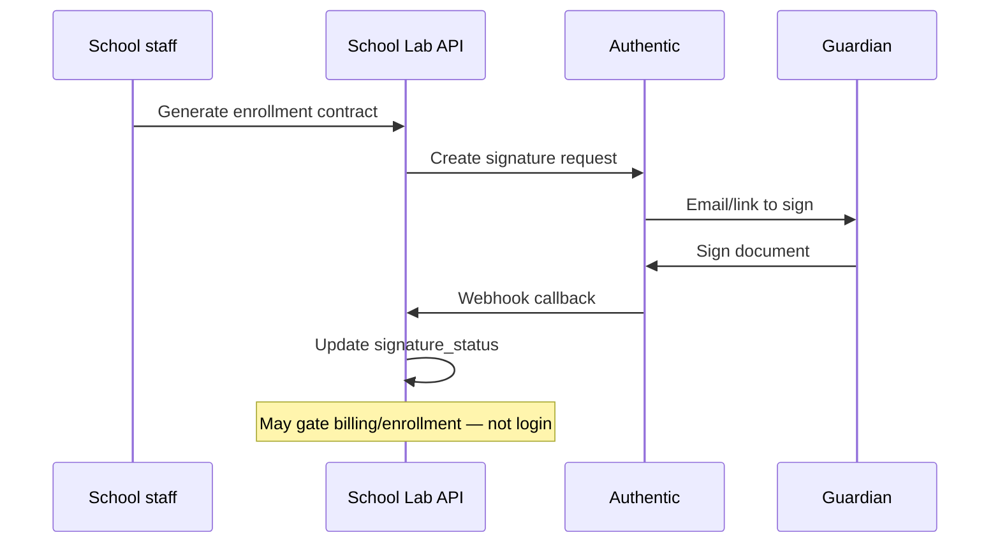
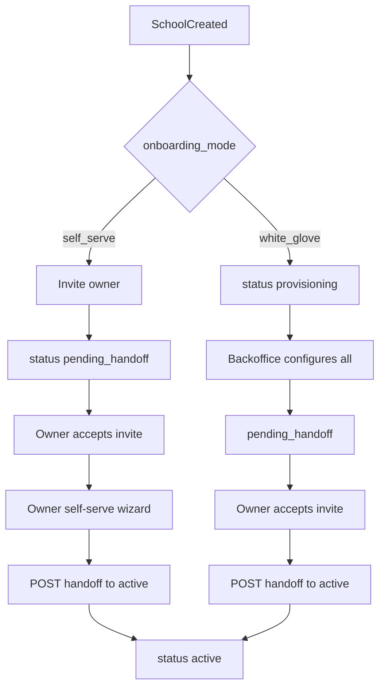

# PRD — Identity: School Onboarding (BC2)

> Status: validated  
> Parent PRD: [`index.md`](index.md)  
> Capability IDs: `identity.provision_school`, `identity.onboard_team`, `identity.invite_user`, `identity.complete_registration`, `identity.set_password`, `identity.configure_school_profile`  
> Related BC: [`permissions.md`](permissions.md)  
> Modeling: [`docs/modeling/004-school-onboarding.md`](../../modeling/004-school-onboarding.md)  
> API narrative: [`docs/api/v1/identity-onboarding.md`](../../api/v1/identity-onboarding.md)  
> Supersedes: `docs/prds/fintech-first.md` UC-06, UC-08 (extended); see parent integration contract.

---

## Objective

Enable schools and users to enter School Lab through **self-serve** (owner-led) or **premium
white-glove** (backoffice-led) onboarding, with a formal handoff, secure invite acceptance, and
audited provisioning — without coupling lifecycle state to the permissions engine.

---

## Competitive grounding

| Capability | `capability_id` | Evidence |
|------------|-----------------|----------|
| Provision school tenant | `identity.provision_school` | [`DIV-integration-001`](../../ref/divergencias.md), [`parity-matrix.md`](../../product/parity-matrix.md#identity--onboarding) |
| Onboard staff and guardians | `identity.onboard_team` | [`proesc/gestao-academica/funcionalidades-por-ator.md`](../../ref/proesc/gestao-academica/funcionalidades-por-ator.md) (first access), [`DIV-integration-001`](../../ref/divergencias.md) |
| Invite user | `identity.invite_user` | Proesc, Agenda Edu, ClassApp — [`parity-matrix.md`](../../product/parity-matrix.md#identity--onboarding) |
| Complete registration | `identity.complete_registration` | [`classapp/gestao-academica/funcionalidades-por-ator.md`](../../ref/classapp/gestao-academica/funcionalidades-por-ator.md) |
| Set password from invite | `identity.set_password` | `[product decision]` — digest token + set-password (BR-O07); replaces competitor temp-password flows |
| Configure school profile | `identity.configure_school_profile` | `[product decision]` — owner wizard (UC-O03) |

Auth capabilities (`identity.authenticate_user`, `identity.reset_password`) remain in
[`002-api-auth.md`](../../modeling/002-api-auth.md) and future `auth.md` slice — see parent index.

---

## Segment applicability

| Segment | Applies | Notes |
|---------|---------|-------|
| `infantil` | yes | Same onboarding modes; CSV import may include guardian/student rows (UC-O06) |
| `fundamental_medio` | yes | Primary GTM; owner wizard covers billing and team invites |
| `pj_financeiro` | partial | Optional `cnpj` at school create; billing setup in handoff checklists |
| `multi_unidade` | partial | One school per tenant in MVP; backoffice creates each tenant separately |

---

## Context

GTM includes sindicato partnerships and schools requesting full setup ("Scholar Premium").
Today `CreateSchoolService` creates a tenant without an owner; `CreateMembershipService`
generates a random password and does not send a real invite. Fintech-first UC-06 and UC-08
document minimal flows that this PRD extends.

**Self-serve mode** does not mean public self-registration: backoffice (or sales) still
creates the tenant via `POST /schools`. The owner then completes setup in the school wizard
after accepting the invite — owner-led configuration, not DLA provisioning.

**Actor mapping (UI pt-BR → system role template, not role)**

| Stakeholder (menu) | Membership role | Default system template (`system_key`) |
|--------------------|-----------------|----------------------------------------|
| Diretor / Vice-diretor | `staff` | `director` |
| Secretaria | `staff` | `secretary` |
| Coordenação | `staff` or `teacher` | `coordination` |
| Professor | `teacher` | `teacher` |
| Responsável | `guardian` | — |

**Integration contract (with permissions BC)**

- School create invokes `Identity::ProvisionSystemRoleTemplatesService` (four system templates).
- Every staff/teacher invite carries `role_template_id` and optional `segment_id` (permissions PRD).
- Permissions engine does not read `onboarding_mode` or `onboarding_status`.
- Backoffice during `provisioning` uses platform permission `provision_school` (D4), not staff
  membership on the school.

**Key decisions**

| # | Decision | PRD stance |
|---|----------|------------|
| D4 | Backoffice provisioning | `provision_school` while `onboarding_status == provisioning` |
| D5 | Invite | Single-use opaque token + set password via `POST /auth/invite/accept` |
| D6 | Segments | `segments` entity — **full** MVP (id + name per school); optional at handoff via `segments_skipped_at` |

---

## Business Rules

BR-O01

`schools.onboarding_status` ∈ `provisioning | pending_handoff | active`.

BR-O02

`schools.onboarding_mode` ∈ `self_serve | white_glove`. Set at school creation; immutable
after `active` unless backoffice support intervention (out of MVP).

BR-O03

Backoffice actors with `provision_school` may execute staff-level configuration actions
(people, billing setup, documents) while `onboarding_status == provisioning`, regardless of
staff membership.

BR-O04

All backoffice actions during provisioning are audited with `actor_type: backoffice` and
`on_behalf_of: school_id` metadata on audit rows or a dedicated `provisioning_audit_log`
(implementation choice — minimum: `audits.comment` JSON).

BR-O05

Lifecycle transitions use **two checklists** (see below). `provisioning` → `pending_handoff`
(white-glove only) requires the **provisioning handoff checklist** — owner membership may still
be `invited`. `pending_handoff` → `active` requires the **activation checklist**, including
owner membership `active`. Incomplete checklist returns `422` with `details.checklist`.

BR-O06 — `capability_id`: `identity.set_password`, `identity.invite_user`

Invite delivery uses an opaque single-use token stored as `token_digest` on
`membership_invite_tokens`; default expiry **7 days** (configurable per environment).

BR-O07 — `capability_id`: `identity.set_password`, `identity.complete_registration`

Invite acceptance: `POST /auth/invite/accept` with `token` + `password` (and `name` if new
user). System must **not** rely on server-generated opaque passwords for invitees.

BR-O08

Membership remains `status: invited` until accept; school-scoped routes return `403` for
invited members (existing auth behaviour per `002-api-auth.md`).

BR-O09

First owner invite: director system template `role_template_id`, `staff_profiles.is_owner: true`,
`role: staff`.

BR-O10

Guardian profile may exist before portal invite. **CPF is required for boleto issuance**, not
for login or invite acceptance.

BR-O11

Signed enrollment contract (**contrato de matrícula**) does **not** block login or invite
acceptance. A separate phase 2 gate may require signature before billing charge generation or
enrollment completion — orthogonal to `onboarding_status`.

BR-O12

Premium (`white_glove`): backoffice may import families/students via CSV with **preview then
commit** (`POST .../provisioning/import?dry_run=true|false`).

BR-O13

After `onboarding_status == active`, backoffice loses operational write access to school data
unless a future support PRD defines read-only or break-glass access.

BR-O14

Self-serve: after owner accepts invite, owner wizard covers segments (if enabled), billing
provider setup or waive, and team invites before handoff.

BR-O15 — `capability_id`: `identity.provision_school`

`POST /schools` with `onboarding_mode: white_glove` sets `onboarding_status: provisioning`
and notifies backoffice queue (implementation: job or manual ops — email provider open).

BR-O16

`POST /schools` with `onboarding_mode: self_serve` sets `onboarding_status: pending_handoff`
after owner invite is sent (school not operational until owner accepts and checklist met).

BR-O17

Resend invite invalidates previous unused token and issues a new digest.

BR-O18

Handoff `POST /schools/:id/handoff` transitions `pending_handoff` → `active` when owner has
accepted and checklist passes; emits `SchoolHandedOff` and `OwnerActivated`.

BR-O19

Token used twice or expired returns `401` with `error.code: invalid_invite_token`.

BR-O20

Deleting a school in `provisioning` is allowed for backoffice; soft delete via Discard as today.

BR-O21

`enrollment_contract.signature_status` (phase 2) is tracked **separately** from
`schools.onboarding_status`. Onboarding can reach `active` while enrollment contracts remain
`pending_signature`.

BR-O22

Guardian portal login and staff access are never blocked solely by unsigned enrollment
contracts (reinforces BR-O11).

BR-O23

When phase 2 signature integration ships, schools may configure whether unsigned contracts
block charge generation or student enrollment activation — default TBD; login remains unblocked.

---

## Future integration — Authentic (digital signatures)

> **Proposed vendor:** [Authentic](https://authentic.com.br/) (Brazilian e-signature) — not
> confirmed; evaluate against legal requirements in `docs/open-questions.md`.

**Scope:** enrollment contracts (**contrato de matrícula**) between school and guardian — phase 2,
after onboarding waves W1–W4. **Not** the commercial SaaS agreement between DLA and the school
(that remains outside the product).

**High-level flow (phase 2)**



1. School generates enrollment contract PDF from template (students & enrollments PRD).
2. Platform sends document to Authentic API; guardian (and countersigners if required) sign.
3. Authentic webhook/callback updates `enrollment_contract.signature_status`
   (`pending` → `sent` → `signed` | `declined` | `expired`).
4. Signed PDF stored in digital archive; audit trail retained per LGPD policy (TBD).
5. Optional business gates (phase 2): block first charge or enrollment activation until
   `signature_status == signed` — **never** block JWT login.

**Out of scope for this BC:** Authentic SDK implementation, webhook auth model, and contract
template editor — deferred to enrollment/contracts domain PRD.

---

## Handoff checklists (minimum)

### Provisioning handoff (`provisioning` → `pending_handoff`, white-glove only)

| Item | Required |
|------|:--------:|
| Billing configured **or** `billing_waived_at` set | yes |
| At least one segment defined **or** `segments_skipped_at` set | optional MVP |
| Terms accepted (backoffice provisioning step) | yes |
| Team invites sent (including owner) | yes |

Owner membership `active` is **not** required at this step.

### Activation (`pending_handoff` → `active`)

| Item | self_serve | white_glove |
|------|:----------:|:-----------:|
| Owner membership `active` (invite accepted) | required | required |
| Billing configured **or** `billing_waived_at` set | required (owner wizard) | required (provisioning step) |
| At least one segment defined **or** `segments_skipped_at` set | optional MVP | optional MVP |
| Owner acknowledged terms (UI) | required | required |

Self-serve schools enter `pending_handoff` when the owner invite is sent (BR-O16) while the
owner is still `invited`; activation checklist is evaluated on `POST /schools/:id/handoff`.

---

## Onboarding flows



> **Self-serve note:** per BR-O16, `inviteOwner` sets `onboarding_status: pending_handoff`
> while the owner membership is still `invited`. The owner must accept (BR-O08) before the
> self-serve wizard; activation checklist applies on final handoff.

```mermaid
sequenceDiagram
    participant BO as Backoffice
    participant API as API
    participant Perm as Permissions engine
    participant Owner as Owner

    BO->>API: POST /schools (white_glove)
    API->>API: onboarding_status=provisioning
    BO->>API: POST /people/memberships (owner, director role_template_id)
    API->>Perm: role_template_id + is_owner
    BO->>API: provisioning actions (billing, CSV, people)
    BO->>API: POST /schools/:id/handoff
    API->>API: pending_handoff
    Owner->>API: POST /auth/invite/accept
    Owner->>API: POST /me/memberships/:id/accept
    Note over Owner,API: Owner membership active; school still pending_handoff
    BO->>API: POST /schools/:id/handoff (activation checklist)
    API->>API: onboarding_status=active
```

---

## Use Cases

### UC-O01 — Backoffice creates school + owner invite

Extends fintech-first UC-08.

Input: `name`, `onboarding_mode`, `owner_email`, optional `cnpj`.

Flow:

1. `POST /api/v1/schools` creates school with mode and status per BR-O15/O16.
2. `POST /people/memberships` with director system `role_template_id`, `is_owner: true`.
3. Create `membership_invite_tokens` row; enqueue email (provider TBD).
4. Emit `SchoolProvisioned`.

### UC-O02 — Premium full provisioning wizard (backoffice)

Input: backoffice session, `school_id`, provisioning steps.

Flow:

1. Verify `provision_school` + `onboarding_status == provisioning`.
2. Configure billing (`school_payment_providers`, `school_billing_settings`) or set waive flag.
3. Import people via UC-O06 or manual CRUD.
4. Upload school documents as needed.
5. `POST /schools/:id/handoff` with **provisioning handoff checklist** → `pending_handoff`.

### UC-O03 — Self-serve owner setup

Input: owner after invite accept.

Flow:

1. Owner accepts token (UC-O04).
2. Wizard: school profile, segments (D6), billing connect or waive.
3. Owner invites team (`POST /people/memberships` with `role_template_id`).
4. School remains in `pending_handoff` (set at create per BR-O16).
5. `POST /schools/:id/handoff` when **activation checklist** satisfied → `active`.

### UC-O04 — Staff/guardian invite accept

Extends fintech-first UC-06.

Input: `token`, `password`, optional profile fields.

Flow:

1. Validate token digest, expiry, unused.
2. Create or attach `users` row; set password.
3. `POST /auth/invite/accept` marks token `used_at`.
4. `POST /me/memberships/:id/accept` → membership `active`.
5. For guardians: link `guardians.user_id`.
6. Emit `MembershipInviteAccepted`.

### UC-O05 — Handoff provisioning → pending_handoff → active

Input: authorized actor, `school_id`.

Flow:

1. If `onboarding_status == provisioning` (white-glove only): **backoffice** with
   `provision_school` validates the **provisioning handoff checklist** (BR-O05); on success
   transition to `pending_handoff`. Owner may still be `invited`.
2. If `onboarding_status == pending_handoff`: validate **activation checklist** (owner
   membership `active` plus remaining items); on success transition to `active`.
   - **self_serve:** **owner** (`is_owner`) calls handoff.
   - **white_glove:** **backoffice** or **owner** may call handoff after owner has accepted
     the invite (backoffice typical when coordinating formal handoff with the director).
3. Emit `SchoolHandedOff` and `OwnerActivated` on transition to `active`.

### UC-O06 — CSV import preview + commit (premium)

Input: CSV file, `dry_run` flag.

Flow:

1. Parse rows (student, guardian, class/segment hints).
2. If `dry_run=true`, return validation report without writes.
3. If `dry_run=false`, create guardians/students/links in transaction.
4. Store batch on `provisioning_imports` for audit.

### UC-O07 — Resend invite / expire token

Input: `membership_id`.

Flow:

1. Invalidate outstanding tokens for membership.
2. Issue new token; reset expiry.
3. Re-enqueue notification.

---

## API

Full narrative: [`docs/api/v1/identity-onboarding.md`](../../api/v1/identity-onboarding.md).

### `POST /api/v1/schools` (extended)

```json
{
  "name": "Escola Exemplo",
  "cnpj": "00.000.000/0001-00",
  "onboarding_mode": "white_glove",
  "owner_email": "diretor@escola.example"
}
```

### `POST /api/v1/schools/:school_id/handoff`

Request: optional `{ "billing_waived": false }`. Response `200` with updated `onboarding_status`.

### `POST /api/v1/auth/invite/accept`

```json
{
  "token": "opaque-token-from-email",
  "password": "secure-password",
  "name": "Maria Silva"
}
```

### `POST /api/v1/schools/:school_id/provisioning/import`

Multipart CSV; query `dry_run=true|false`.

### Existing routes (unchanged path, extended behaviour)

| Method | Path | Note |
|--------|------|------|
| `POST` | `/api/v1/schools/:school_id/people/memberships` | + `role_template_id`, `segment_id` |
| `POST` | `/api/v1/me/memberships/:id/accept` | After password set |
| `POST` | `/api/v1/schools/:school_id/people/memberships/:id/invite` | Resend (UC-O07) |

---

## Errors

| HTTP | `error.code` | When |
|------|--------------|------|
| `401` | `invalid_invite_token` | Expired, used, or unknown token |
| `403` | `forbidden` | Provisioning action without `provision_school` |
| `422` | `validation_error` | Checklist incomplete on handoff |
| `422` | `import_validation_failed` | CSV preview/commit errors |

---

## Database

| Artifact | Location |
|----------|----------|
| Narrative DSL | [`docs/modeling/004-school-onboarding.md`](../../modeling/004-school-onboarding.md) |
| Executable schema | [`docs/database/schema.dbml`](../../database/schema.dbml) |
| DER export | `docs/database/der_003.png` (shared with 003 — TBD export after DBML review) |

**Entity groups**

| Column / table | Purpose |
|----------------|---------|
| `schools.onboarding_status` | Lifecycle enum |
| `schools.onboarding_mode` | `self_serve` \| `white_glove` |
| `schools.billing_waived_at` | Handoff when billing deferred |
| `schools.segments_skipped_at` | Handoff when segments deferred |
| `membership_invite_tokens` | `token_digest`, `membership_id`, `expires_at`, `used_at` |
| `provisioning_imports` | CSV batch metadata (MVP for white-glove CSV import) |

---

## Events

| Event | Trigger | Consumers |
|-------|---------|-----------|
| `SchoolProvisioned` | School created (white_glove) or owner invited (self_serve) | Ops notifications |
| `SchoolHandedOff` | Status → `active` | Analytics, revoke provisioning access |
| `MembershipInviteAccepted` | UC-O04 complete | Link guardian user, audit |
| `OwnerActivated` | Owner membership active + school active | Welcome email, product analytics |

---

## Permissions

Onboarding routes map to actors:

| Action | backoffice (`provision_school`) | owner (director) | staff invitee |
|--------|--------------------------------|------------------|---------------|
| Create school | ✓ | — | — |
| Provisioning CRUD | while `provisioning` | — | — |
| Handoff provisioning → pending_handoff | ✓ (`provision_school`) | — | — |
| Handoff pending_handoff → active (self_serve) | — | ✓ owner | — |
| Handoff pending_handoff → active (white_glove) | ✓ | ✓ owner | — |
| Accept invite | — | ✓ | ✓ |
| Owner wizard | — | ✓ | — |

---

## Non-functional requirements

Cross-cutting: [`docs/product/non-functional-requirements.md`](../../product/non-functional-requirements.md).

- [NFR-002](../../product/non-functional-requirements.md#nfr-002--lgpd-and-privacy) — invite tokens stored as digests (BR-O06); guardian CPF not at invite (BR-O10).
- [NFR-003](../../product/non-functional-requirements.md#nfr-003--multi-tenancy) — lifecycle and provisioning scoped per `school_id`; backoffice loses write access after `active` (BR-O13).
- [NFR-005](../../product/non-functional-requirements.md#nfr-005--observability-and-audit) — provisioning actions audited with `on_behalf_of: school_id` (BR-O04); CSV import batches on `provisioning_imports`.

---

## Acceptance Criteria

### Self-serve mode

AC-O001 — Self-serve school creation (`identity.provision_school`, `identity.onboard_team`)

```gherkin
Feature: Self-serve school creation
  Given a backoffice user
  When they POST /schools with onboarding_mode self_serve and owner_email
  Then onboarding_status is pending_handoff per BR-O16
  And the owner membership status is invited
  And an owner invite token is created
  And no random password is stored for the owner

Feature: Owner completes self-serve wizard
  Given a school with onboarding_status pending_handoff
  And an owner who accepted invite with POST /auth/invite/accept
  When they complete billing setup and invite one secretary
  And POST /schools/:id/handoff with activation checklist satisfied
  Then onboarding_status becomes active
  And the owner has director system template and is_owner true
```

AC-O002 — Premium provisioning (`identity.provision_school`, `identity.onboard_team`)

```gherkin
Feature: Premium provisioning
  Given a backoffice user with provision_school
  And a school with onboarding_mode white_glove and status provisioning
  When backoffice configures billing and imports CSV with dry_run false
  And POST /schools/:id/handoff with provisioning handoff checklist satisfied
  Then onboarding_status is pending_handoff
  And the owner membership may still be invited
  And provisioning actions are audited with on_behalf_of school_id

Feature: Premium activation after owner accept
  Given a school with onboarding_mode white_glove and status pending_handoff
  And the owner has accepted the invite
  When POST /schools/:id/handoff with activation checklist satisfied
  Then onboarding_status becomes active

Feature: Backoffice blocked after active
  Given a school with onboarding_status active
  When backoffice attempts POST /people/memberships without support role
  Then the response is 403 forbidden
```

AC-O003 — Single-use invite token (`identity.set_password`, `identity.complete_registration`)

```gherkin
Feature: Single-use invite token
  Given a valid invite token
  When the user POSTs /auth/invite/accept with password
  Then the token used_at is set
  And a second accept with the same token returns 401 invalid_invite_token
```

---

## Out of Scope

- **Commercial SaaS contract** between DLA and the school — not signed via Authentic in product;
  distinct from **enrollment contracts** (guardian ↔ school) covered in phase 2 below.
- **Enrollment contract signature implementation** in onboarding waves W1–W4 — phase 2 via Authentic
  (proposed); login gate explicitly excluded (BR-O11, BR-O22).
- Magic-link login via boleto barcode.
- Guardian CPF collection at invite time (only at boleto issuance).
- Backoffice read-only support console (future PRD).

### Open items (Authentic — phase 2)

- Confirm Authentic as vendor vs alternatives (Authentique, Clicksign, proprietary).
- Webhook authentication and idempotency model.
- LGPD retention for signed PDFs and Authentic processor role.
- Who triggers send: backoffice during white-glove vs owner/secretary in self-serve.

See [`docs/open-questions.md`](../../open-questions.md) § Identity & Onboarding.
