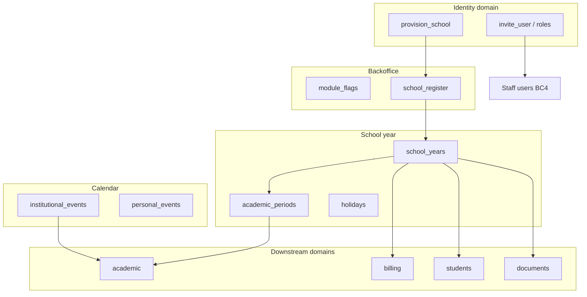

# PRD — Platform & Admin

> Status: validated  
> Relation to School Lab: cross-cutting MVP foundation — unblocks academic, billing, and documents calendar scoping per [`docs/product-map.md`](../../product-map.md) §5  
> Capability IDs: see [Competitive grounding](#competitive-grounding) — **6** MVP canonical `platform.*` rows in [`mvp-scope.md`](../../product/mvp-scope.md); **13** canonicals total in taxonomy  
> Domain PRDs: [`school-year.md`](school-year.md) (BC1), [`backoffice.md`](backoffice.md) (BC2), [`calendar.md`](calendar.md) (BC3), [`staff-users.md`](staff-users.md) (BC4), [`onboarding.md`](onboarding.md) (BC5)  
> Modeling: [`docs/modeling/009-platform-admin.md`](../../modeling/009-platform-admin.md)  
> API: [`docs/api/v1/platform-and-admin.md`](../../api/v1/platform-and-admin.md)  
> Traceability: BR-/UC-/AC- IDs per bounded context — see [`traceability.md`](../../product/traceability.md)

---

## 1. Context and motivation

Academic period closure, billing parcel cycles, enrollment class structure, and archive search all
require a **canonical school year** and **institutional calendar**. Identity owns tenant lifecycle
and permission keys; this folder owns **platform configuration**, **backoffice operations**, and
**school-staff admin surfaces** that other domains consume.

**Gaps today**

- No `school_year` or `academic_period` entities in `web/` — academic PRDs stub one active year
  `[product decision]`.
- Backoffice SPA exists at `/backoffice` but platform ops (module flags, tenant register) are
  minimal beyond fintech-first school create.
- No institutional calendar or staff roster admin beyond identity invites.
- Product access / getting-started content scattered in competitor help articles — not modeled
  ([`DIV-integration-001`](../../ref/divergencias.md)).

**Dependencies satisfied by prior increments**

- Identity: JWT, `provision_school`, onboarding lifecycle, role templates
  ([`identity-and-onboarding/`](../identity-and-onboarding/)).
- Students, communication, academic, billing, documents PRDs define **consumers** of school year
  and calendar contracts (this increment closes the provider side).

**Integrations domain:** `integrations.*` canonicals remain in taxonomy only — no integrations PRD
folder for Phase 3 gate. ERP sync, webhooks, and comms overlay sync are P2 per
[`mvp-scope.md`](../../product/mvp-scope.md).

---

## 2. Objective (north star)

Ship **school year configuration**, **backoffice tenant and module operations**, **institutional
calendar**, **staff user roster and menu visibility**, and **self-serve product access** so
academic, billing, documents, and enrollment domains share one time axis and DLA operators can
register schools without duplicating identity lifecycle rules.

---

## 3. Competitive grounding

All **13** canonical `platform.*` capabilities from [`capability-map.md`](../../product/capability-map.md#platform--admin).
Competitor depth: Proesc (school year, calendar, staff admin), Agenda Edu (calendar, onboarding
help). Presence: [`parity-matrix.md`](../../product/parity-matrix.md#platform--admin).

### MVP capability map (6)

| Capability | `capability_id` | Covered in | Evidence |
|------------|-----------------|------------|----------|
| Configure school year and periods | `platform.configure_school_year` | [`school-year.md`](school-year.md) | [`proesc/gestao-academica/modelo-de-dominio.md`](../../ref/proesc/gestao-academica/modelo-de-dominio.md) (exercício), [`proesc/gestao-academica/funcionalidades-por-ator.md`](../../ref/proesc/gestao-academica/funcionalidades-por-ator.md) |
| Backoffice tenant and module ops | `platform.manage_backoffice_ops` | [`backoffice.md`](backoffice.md) | `[product decision]` — DLA platform SPA; distinct from school staff admin |
| Manage staff users and role menus | `platform.manage_staff_users` | [`staff-users.md`](staff-users.md) | Proesc staff profiles (15 aliases), [`parity-matrix.md`](../../product/parity-matrix.md#platform--admin) |
| Manage school calendar | `platform.manage_school_calendar` | [`calendar.md`](calendar.md) | Proesc unit calendar, Agenda Edu events — [`parity-matrix.md`](../../product/parity-matrix.md#platform--admin) |
| Self-serve onboarding and product access | `platform.self_serve_onboarding` | [`onboarding.md`](onboarding.md) | [`DIV-integration-001`](../../ref/divergencias.md), Proesc in-app setup articles |
| General platform operations | `platform.manage_platform_operations` | [`staff-users.md`](staff-users.md) | Catch-all for miscatalogued platform tasks |

### P2 / N/A (not in this increment)

| Capability | Phase | Notes |
|------------|-------|-------|
| `platform.manage_multi_unit` | P2 | [`DIV-academic-008`](../../ref/divergencias.md) — group roll-ups; MVP one tenant per school |
| `platform.configure_help_taxonomy` | P2 | [`DIV-integration-003`](../../ref/divergencias.md) — module + persona help center |
| `platform.view_analytics_dashboard` | P2 | Cross-module BI deferred per vision §6 |
| `platform.export_operational_reports` | P2 | Favorited reports; domain exports stay in billing/academic |
| `platform.meter_digital_signatures` | P2 | Shares documents/billing signature infra |
| `platform.manage_transport_module` | P2 | Deferred module |
| `platform.quality_signal_support` | N/A | Help friction signal |

**Related capabilities in other domains** (boundary, not owned here):

| Capability | Domain | Boundary |
|------------|--------|----------|
| `identity.provision_school` | identity | Tenant lifecycle, white-glove provisioning, owner wizard — **not** product FAQ / app access |
| `identity.onboard_team` | identity | Invites, set-password, handoff checklists |
| `identity.manage_roles` | identity | Permission keys and role templates |
| `identity.manage_user_accounts` | identity | Activate/deactivate account |
| `academic.configure_multi_school` | academic | Tenancy **views** for staff — consumes platform year; group config is P2 `manage_multi_unit` |
| `academic.search_help_center` | academic | P2 — ships with `configure_help_taxonomy` |
| `communication.publish_calendar_event` | communication | Comunicados/events as comms objects; **sync** from institutional calendar later |
| `integrations.*` | integrations | Taxonomy only until integrations PRD wave |

Requirements without market anchor: `[product decision]` or `[invented]` per [`traceability.md`](../../product/traceability.md).

---

## 4. Target audience

| Audience | Need |
|----------|------|
| Secretaria | Configure school year, periods, holidays; manage staff roster and menus |
| Teachers | View institutional calendar and personal events |
| DLA backoffice | Register schools, enable modules, white-glove provisioning handoff |
| Engineering | Stable `school_year_id` / `academic_period_id` contracts for academic, billing, documents |
| Domain PRDs (academic, billing, students, documents) | Single provider for calendar boundaries |

---

## 5. MVP scope

### In scope

| BC | Document | Summary |
|----|----------|---------|
| BC1 | [`school-year.md`](school-year.md) | School year, academic periods, holidays; one active year per school MVP |
| BC2 | [`backoffice.md`](backoffice.md) | Tenant register, module flags, provisioning ops in `/backoffice` |
| BC3 | [`calendar.md`](calendar.md) | Institutional events + staff personal events |
| BC4 | [`staff-users.md`](staff-users.md) | Staff roster, menu visibility; defers auth/permissions to identity |
| BC5 | [`onboarding.md`](onboarding.md) | Product access, getting-started, app download — **not** tenant provisioning |

### Out of scope (MVP)

| Item | Phase | Notes |
|------|-------|-------|
| Multi-unit school groups | P2 | [`school-year.md`](school-year.md) — one `school_id` per campus |
| Help center taxonomy (persona quick-starts) | P2 | [`DIV-integration-003`](../../ref/divergencias.md) |
| Cross-module analytics dashboards | P2 | vision §6 |
| Platform SaaS billing / subscription engine | P2 | [`open-questions.md`](../../open-questions.md) — commercial model open |
| Real-time (Solid Cable) | P2 | [`mvp-scope.md`](../../product/mvp-scope.md) |
| Transport module | P2 | taxonomy capture only |
| `integrations.*` PRD folder | Post–Phase 3 | Taxonomy references only at Phase 3 gate |

---

## 6. Bounded contexts

| BC | Document | Answers |
|----|----------|---------|
| **BC1 — School year** | [`school-year.md`](school-year.md) | What is the active ano letivo? What are period boundaries and holidays? |
| **BC2 — Backoffice ops** | [`backoffice.md`](backoffice.md) | How does DLA register tenants and toggle modules? |
| **BC3 — Calendar** | [`calendar.md`](calendar.md) | What institutional and personal events exist? |
| **BC4 — Staff users** | [`staff-users.md`](staff-users.md) | Who is on staff and which menus do they see? |
| **BC5 — Product access** | [`onboarding.md`](onboarding.md) | How do users get the app and first-run guidance? |



---

## 7. Actors and surfaces

| Actor | Surfaces | Primary actions in this domain |
|-------|----------|--------------------------------|
| backoffice | Web SPA (`/backoffice`) | School register, module enablement, white-glove provisioning support |
| staff (secretary, director) | Web SPA (`/app`) | School year, calendar admin, staff roster, menu visibility |
| teacher | Web SPA + mobile | View calendar; personal events on web |
| guardian (UI: **Responsável**) | `frontend/app` web first; mobile parity | Product access links only (BC5); no school year admin |
| student | — | No login in MVP |

Detail: [`docs/actors-and-surfaces.md`](../../actors-and-surfaces.md).

---

## Segment applicability

| Segment | Applies | Notes |
|---------|---------|-------|
| `infantil` | yes | Same year/period model; fewer periods acceptable |
| `fundamental_medio` | yes | Primary target — bimester/trimester periods |
| `pj_financeiro` | yes | Billing cycles reference same `school_year_id` |
| `multi_unidade` | partial | MVP: one tenant per campus; group roll-ups P2 |

Period-template choice is decided: new schools default to `trimester`, may choose `bimester`, and
may use `custom` for fewer periods. Platform supplies the **container**; academic owns closure
rules ([`school-year.md`](school-year.md) BR-SY04).

---

## 8. Integration contract (cross-domain)

Shared with [`academic/`](../academic/index.md), [`billing/`](../billing/index.md),
[`students-and-enrollments/`](../students-and-enrollments/index.md),
[`documents-and-archive/`](../documents-and-archive/index.md), and
[`identity-and-onboarding/`](../identity-and-onboarding/index.md):

1. **School year as time axis** — exactly one `school_years.status = active` per school in MVP
   (BR-SY01). All enrollments, classes, charges, archive filters, and academic aggregates reference
   `school_year_id`. Creating a new year does not auto-migrate enrollments — students BC1 owns
   rollover/import flows.
2. **Academic periods** — `academic_periods` belong to a school year; academic BC6 (`periods.md`)
   owns closure state (`open` → `closed`). Platform BC1 owns **calendar boundaries** only.
3. **Billing cycles** — charge generation and parcel due dates align to school year start/end;
   billing does not define parallel "financial year" in MVP `[product decision]`.
4. **Documents archive** — metadata search includes `school_year_id` filter
   ([`documents-and-archive/archive.md`](../documents-and-archive/archive.md)).
5. **Identity boundary** — `identity.provision_school` creates tenant and drives
   `onboarding_status`; `platform.self_serve_onboarding` covers product access FAQs and app links
   only ([`onboarding.md`](onboarding.md) § Boundary).
6. **Backoffice provisioning** — backoffice uses `provision_school` permission during
   `onboarding_status == provisioning` (identity BR-O03); platform BC2 surfaces the UI and module
   flags, not duplicate lifecycle rules.
7. **Calendar vs communication events** — institutional events in BC3; communication
   `publish_calendar_event` may **duplicate or link** later — MVP: separate stores, optional
   manual publish to comms `[product decision]`.
8. **Staff users vs identity** — roster and menu visibility in BC4; authentication, invites, and
   permission keys remain identity BC1.

```mermaid
sequenceDiagram
    participant Dir as Director (web)
    participant Plat as Platform API
    participant SY as School year BC1
    participant Acad as Academic API
    participant Bill as Billing API

    Dir->>Plat: POST /school_years (2026)
    Plat->>SY: create year + periods + holidays
    SY-->>Dir: school_year_id active
    Dir->>Acad: configure diary (uses academic_period_id)
    Dir->>Bill: generate charges (uses school_year_id)
    Note over SY,Bill: Same year boundary; no duplicate calendars
```

---

## 9. Delivery waves

| Wave | Primary doc | Deliverable | Status |
|------|-------------|-------------|--------|
| **W1** | school-year.md | `school_years`, `academic_periods`, holidays API; one active year enforcement | **API frozen (4C.1)** — see [`platform-and-admin.md`](../../api/v1/platform-and-admin.md) |
| **W2** | calendar.md | Institutional + personal events CRUD (`calendar_events`) | Deferred — Phase 4C.1b |
| **W3** | backoffice.md | Backoffice school register, module flags, provisioning dashboard | Deferred — Phase 4C.1b |
| **W4** | staff-users.md | Staff roster list, menu visibility map from permission payload | Deferred — Phase 4C.1b |
| **W5** | onboarding.md | In-app getting started, store links, optional checklist UI | Deferred — Phase 4C.1b |
| **Phase 2** | — | Multi-unit, help taxonomy, analytics | — |

W1 is a **hard dependency** for academic modeling and period closure implementation. W2–W5 wave
ordering matches the frozen deferred table in [`platform-and-admin.md`](../../api/v1/platform-and-admin.md)
§ Deferred — Phase 4C.1b (W numbers ≠ BC numbers: BC2=backoffice, BC3=calendar).

---

## 10. Key decisions

| # | Decision | Status |
|---|----------|--------|
| D1 | One active school year per school in MVP | Documented — [`school-year.md`](school-year.md) BR-SY01 |
| D2 | Platform owns year/period **boundaries**; academic owns **closure** | Documented — cross-link [`academic/periods.md`](../academic/periods.md) |
| D3 | Multi-unit groups deferred — one tenant per campus | Documented — P2 `manage_multi_unit` |
| D4 | `identity.provision_school` vs `platform.self_serve_onboarding` split | Documented — [`onboarding.md`](onboarding.md) |
| D5 | Backoffice MVP: school register + module ops; platform billing deferred | Documented — [`open-questions.md`](../../open-questions.md) |
| D6 | Help taxonomy persona model deferred | Documented — [`DIV-integration-003`](../../ref/divergencias.md) P2 |
| D7 | New schools default to `trimester`; `bimester` and `custom` remain selectable | Decided — [`school-year.md`](school-year.md) BR-SY04 |

---

## 11. Non-functional requirements

Cross-cutting catalog: [`docs/product/non-functional-requirements.md`](../../product/non-functional-requirements.md).

| NFR | Domain application |
|-----|-------------------|
| [NFR-003](../../product/non-functional-requirements.md#nfr-003--multi-tenancy) | All platform entities scoped by `school_id`; backoffice cross-tenant reads audited |
| [NFR-005](../../product/non-functional-requirements.md#nfr-005--observability-and-audit) | School year changes, module toggles, and backoffice ops audited |

Domain-specific bullets:

- **Reliability** — active school year resolution must be deterministic for downstream jobs
  (attendance day boundary, billing overdue).
- **Timezone** — school timezone on `schools` drives calendar all-day events and holiday dates.

---

## 12. Open items / pending decisions

See [`docs/open-questions.md`](../../open-questions.md):

- [ ] Backoffice in MVP: only school registration, or also platform billing? (partially decided — register + modules; SaaS billing P2)
- [ ] Platform billing model (per student, per school, per plan)?
- [x] Default period template — `trimester` for new schools; `bimester` and `custom` remain selectable.
- [ ] Calendar event sync to communication announcements — manual vs automatic
- [x] Partner workshop deferred — documentation-phase sign-off Aug 2026 ([`open-questions.md`](../../open-questions.md)).

---

## 13. Definition of Done (documentation)

- [x] Folder `docs/prds/platform-and-admin/` with `index.md` and five bounded-context slices.
- [x] All **6** MVP `platform.*` capabilities mapped to slices.
- [x] Cross-domain contracts documented (school year → academic, billing, documents, students).
- [x] Identity boundary (`provision_school` vs `self_serve_onboarding`) explicit.
- [x] Competitive grounding with `capability_id` + `docs/ref/` links.
- [x] Segment applicability and NFR hooks.
- [x] Status promoted to `validated` (2026-08-15).
- [x] Partner workshop deferred — live stakeholder session is a separate milestone ([`open-questions.md`](../../open-questions.md)).

---

## 14. Out of Scope

- Full `integrations.*` domain PRD — taxonomy only at Phase 3 gate.
- ERP import/sync — P2 integrations wave.
- Landing / sales page — `site/` phase 2.
- MFA and student portal — identity / students P2.
