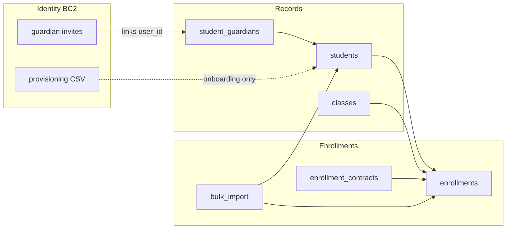
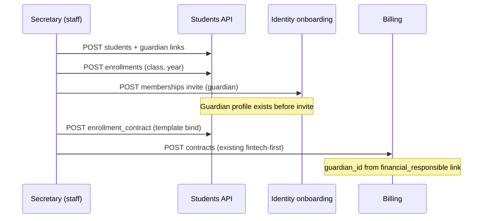

# PRD — Students & Enrollments

> Status: validated  
> Relation to School Lab: core MVP domain #4 per [`docs/product-map.md`](../../product-map.md) §5  
> Capability IDs: see [Competitive grounding](#competitive-grounding) — **20** canonical `students.*` rows in [`capability-taxonomy.yaml`](../../product/capability-taxonomy.yaml) (**9** MVP)  
> Domain PRDs: [`enrollments.md`](enrollments.md) (BC1), [`records.md`](records.md) (BC2)  
> Modeling: [`docs/modeling/005-students-enrollments.md`](../../modeling/005-students-enrollments.md)  
> API: [`docs/api/v1/students-and-enrollments.md`](../../api/v1/students-and-enrollments.md)  
> Traceability: BR-/UC-/AC- IDs per bounded context (`BR-E*`, `UC-E*`, `AC-E*` in enrollments; `BR-R*`, `UC-R*`, `AC-R*` in records) — see [`traceability.md`](../../product/traceability.md)

---

## 1. Context and motivation

School Lab's validated roadmap places **students & enrollments** after identity (#2–3) and
before **communication** (#5) and **academic** (#6). Communication channels, message
recipients, attendance rosters, grade books, billing contracts, and the digital archive all
depend on stable **student**, **guardian link**, **class**, and **enrollment** records scoped
per school.

The fintech-first partner slice shipped minimal `students`, `guardians`, and `student_guardians`
tables plus staff CRUD — sufficient for billing validation but not for Secretaria enrollment
workflows, class capacity, enrollment contracts, or bulk import at scale
([`docs/prds/fintech-first.md`](../fintech-first.md)).

**Gaps today**

- No enrollment entity with school-year lifecycle or status machine.
- No class structure (shifts, capacity, multigrade parent/child turmas).
- Guardian links exist in schema but lack relationship metadata (primary, financial, pickup).
- No enrollment contract templates or binding to enrollments.
- Bulk import is ad hoc via onboarding CSV only (white-glove provisioning).
- Student actor has no login surface in MVP — record-only via staff/guardian
  ([`docs/actors-and-surfaces.md`](../../actors-and-surfaces.md)).

---

## 2. Objective (north star)

Ship **registrable students**, **guardian–student links**, **class structure**, and
**enrollments** so Secretaria can matricular alunos, assign turmas, link responsáveis, and
export enrollment lists — with per-school and per-family isolation — without blocking the
communication MVP that follows.

---

## Competitive grounding

All **20** canonical `students.*` capabilities from [`capability-map.md`](../../product/capability-map.md#students--enrollments).
Competitor presence: [`parity-matrix.md`](../../product/parity-matrix.md#students--enrollments).

| Capability | `capability_id` | Phase | Covered in | Evidence |
|------------|-----------------|-------|------------|----------|
| Enroll student | `students.enroll_student` | MVP | [`enrollments.md`](enrollments.md) | [`proesc/gestao-academica/funcionalidades-por-ator.md`](../../ref/proesc/gestao-academica/funcionalidades-por-ator.md), [`agenda-edu/gestao-academica/funcionalidades-por-ator.md`](../../ref/agenda-edu/gestao-academica/funcionalidades-por-ator.md), [`classapp/gestao-academica/funcionalidades-por-ator.md`](../../ref/classapp/gestao-academica/funcionalidades-por-ator.md), [`parity-matrix.md`](../../product/parity-matrix.md#students--enrollments) |
| Import students in bulk | `students.import_students_bulk` | MVP | [`enrollments.md`](enrollments.md) | [`classapp/gestao-academica/funcionalidades-por-ator.md`](../../ref/classapp/gestao-academica/funcionalidades-por-ator.md), [`parity-matrix.md`](../../product/parity-matrix.md#students--enrollments) |
| Manage class structure | `students.manage_class_structure` | MVP | [`records.md`](records.md) | [`proesc/gestao-academica/funcionalidades-por-ator.md`](../../ref/proesc/gestao-academica/funcionalidades-por-ator.md) (turmas, turnos, capacidade), [`parity-matrix.md`](../../product/parity-matrix.md#students--enrollments) |
| Assign student to class | `students.assign_class` | MVP | [`records.md`](records.md) | `[product decision]` — assignment at enrollment create or update; respects capacity (BR-R08) |
| Manage enrollment contract | `students.manage_enrollment_contract` | MVP | [`enrollments.md`](enrollments.md) | [`DIV-financial-007`](../../ref/divergencias.md) — templates + binding; signature phase 2 |
| Update student record | `students.update_student_record` | MVP | [`records.md`](records.md) | [`proesc/gestao-academica/funcionalidades-por-ator.md`](../../ref/proesc/gestao-academica/funcionalidades-por-ator.md), [`parity-matrix.md`](../../product/parity-matrix.md#students--enrollments) |
| Manage guardian–student link | `students.manage_guardian_link` | MVP | [`records.md`](records.md) | [`proesc/gestao-academica/funcionalidades-por-ator.md`](../../ref/proesc/gestao-academica/funcionalidades-por-ator.md), [`parity-matrix.md`](../../product/parity-matrix.md#students--enrollments) |
| Export enrollment reports | `students.export_enrollment_reports` | MVP | [`enrollments.md`](enrollments.md) | [`proesc/gestao-academica/funcionalidades-por-ator.md`](../../ref/proesc/gestao-academica/funcionalidades-por-ator.md) (carteirinha, lists) |
| General enrollment operations | `students.manage_enrollment_operations` | MVP | [`enrollments.md`](enrollments.md) | [`proesc/gestao-academica/funcionalidades-por-ator.md`](../../ref/proesc/gestao-academica/funcionalidades-por-ator.md) — catch-all for miscatalogued tasks |
| Manage enrollment slots | `students.manage_enrollment_slots` | P2 | — *(out of scope)* | [`DIV-academic-003`](../../ref/divergencias.md); online trilha — [`enrollments.md`](enrollments.md) § Re-enrollment boundary |
| Cancel enrollment | `students.cancel_enrollment` | P2 | — *(out of scope)* | Proesc online matrícula — guardian self-cancel before processing |
| Sign enrollment contract | `students.sign_enrollment_contract` | P2 | — *(out of scope)* | [`DIV-financial-007`](../../ref/divergencias.md); Authentic integration — [`identity-and-onboarding/onboarding.md`](../identity-and-onboarding/onboarding.md) § Future integration |
| Capture prospect | `students.capture_prospect` | P2 | — *(out of scope)* | Proesc CRM module |
| Manage enrollment campaign | `students.manage_enrollment_campaign` | P2 | — *(out of scope)* | ClassApp matrícula campaigns — not comms mass send |
| Run online enrollment trail | `students.run_online_enrollment_trail` | P2 | — *(out of scope)* | [`DIV-academic-003`](../../ref/divergencias.md); trilha: data → contract → plan → pay |
| Unify person records | `students.unify_person_records` | P2 | — *(out of scope)* | Proesc merge homonyms — irreversible ops guarded |
| Transfer enrollment | `students.transfer_enrollment` | P2 | — *(out of scope)* | Proesc/Agenda Edu reclassificar turma — MVP uses assign_class + enrollment update |
| Invite student access | `students.invite_student_access` | P2 | — *(out of scope)* | Agenda Edu student invite + review queue — student login deferred |
| Access student portal | `students.view_student_portal` | P2 | — *(out of scope)* | Proesc Aluno, Agenda Edu carteirinha — MVP guardian/staff proxy |
| Students help troubleshooting | `students.quality_signal_support` | N/A | — | Quality signal — not parity target |

Requirements without market anchor are marked `[product decision]` or `[invented]` per
[`traceability.md`](../../product/traceability.md).

**Related P2 capabilities in other domains** (boundary, not owned here):

| Capability | Domain | Boundary |
|------------|--------|----------|
| `academic.process_reenrollment` | academic | Online rematrícula trilha — see [`enrollments.md`](enrollments.md) § Re-enrollment boundary |
| `billing.select_plan_on_enrollment` | billing | Payment plan step on trilha — billing PRD |
| `billing.pay_enrollment_online` | billing | Pay step on trilha — billing PRD |
| `billing.sign_enrollment_contract` | billing | Signature gate on trilha — shares documents infra phase 2 |

---

## 3. Target audience

| Audience | Need |
|----------|------|
| Secretaria / Direção | Enroll students, manage turmas, link guardians, export lists |
| Coordenação | Class rosters for academic and comms recipient assignment |
| Engineering | Clear BC boundaries, enrollment state machine, family isolation hooks |
| Communication PRD (increment 3) | Stable student/class/guardian IDs for channel membership |
| Billing | Enrollment → contract → charge linkage (fintech-first extension) |

---

## 4. MVP scope

### In scope

- Student person record (cadastral data, RA, identifiers) — BC2.
- Guardian–student links with relationship roles — BC2.
- Class structure (school year, shift, capacity, segment, multigrade parent/child) — BC2.
- Enrollment create/update with class assignment and status — BC1.
- Bulk spreadsheet import (post-onboarding) with validation — BC1.
- Enrollment contract templates and enrollment binding (unsigned in MVP) — BC1.
- Enrollment list and carteirinha-style exports — BC1.
- Permission key `manage_enrollment` and `manage_people` integration — identity BC1.

### Out of scope

- Online enrollment trilha, vacancy slots, guardian self-service matrícula (P2).
- Digital enrollment contract signature (phase 2 — Authentic; does not block login per BR-O11).
- Student app login and student portal (P2 — [`open-questions.md`](../../open-questions.md)).
- CRM prospects, enrollment campaigns, duplicate merge (P2).
- Class transfer workflow with finance side-effects (P2 — MVP: staff updates enrollment class).
- Academic curriculum (disciplines, diaries) — academic domain PRD.
- Guardian user invite and set-password — identity onboarding BC2.
- White-glove provisioning CSV during onboarding — identity onboarding UC-O06 (boundary below).

---

## 5. Bounded contexts

| BC | Document | Answers |
|----|----------|---------|
| **BC1 — Enrollments** | [`enrollments.md`](enrollments.md) | How does a student get matriculated for a school year? What is enrollment status? How do imports, contracts, and exports work? |
| **BC2 — Records** | [`records.md`](records.md) | Who is the student? Who are their guardians? Which turma are they in? What is class structure? |

---

## 6. Actors and surfaces

| Actor | Surfaces | Primary actions in this domain |
|-------|----------|--------------------------------|
| staff (secretary, director) | Web SPA (+ mobile read where applicable) | Enroll, import, manage classes, link guardians, export reports, contract templates |
| staff (coordination) | Web SPA | View rosters; segment-scoped `manage_people` when D6 enabled |
| teacher | Web SPA + mobile | Read assigned class rosters only (no enrollment write in MVP) |
| guardian | — *(MVP)* | No direct enrollment actions; record accessed via `/me/students` after identity invite |
| student | — *(MVP)* | No login; person record managed by staff ([`actors-and-surfaces.md`](../../actors-and-surfaces.md)) |
| backoffice | Web SPA (backoffice) | No school enrollment CRUD; white-glove CSV flows through onboarding BC |

Detail: [`docs/actors-and-surfaces.md`](../../actors-and-surfaces.md).

---

## Segment applicability

| Segment | Applies | Notes |
|---------|---------|-------|
| `infantil` | yes | Same enrollment model; turmas tagged `segment: infantil`; guardian is primary consumer (no student login) |
| `fundamental_medio` | yes | Primary target; RA and cadastral fields; class capacity enforced |
| `pj_financeiro` | partial | Financial guardian link role (`financial_responsible`) drives billing `guardian_id`; CNPJ payer is billing P2 (`billing.manage_corporate_payer`) |
| `multi_unidade` | partial | All records scoped by `school_id`; cross-unit enrollment reports deferred to platform P2 |

Open segment decisions: [`open-questions.md`](../../open-questions.md) § Identity (D6 `segments` MVP depth).

---

## 7. Integration contract

Shared with [`identity-and-onboarding/`](../identity-and-onboarding/index.md):

1. **Guardian user accounts** — students domain owns `guardians` person rows and
   `student_guardians` links; identity onboarding owns invite token, set-password, and
   `guardians.user_id` linkage (UC-O04). Staff creates guardian profile first; invite is
   optional and separate (BR-R05).
2. **Permissions** — enrollment and people mutations require `staff_with?(:manage_enrollment)`
   or `staff_with?(:manage_people)` per [`permissions.md`](../identity-and-onboarding/permissions.md).
   Segment-scoped partial `manage_people` limits list/create to segment when D6 enabled.
3. **CSV import boundary** — **Onboarding** UC-O06 imports during `provisioning` / white-glove
   handoff (`provisioning_imports` audit). **Students** UC-E05 is ongoing Secretaria bulk import
   after `onboarding_status == active`. Same row format may be shared; services differ by entry
   point and audit metadata (BR-E12).
4. **Family isolation (NFR-002)** — guardian `/me/*` routes resolve students only via
   `student_guardians` for the authenticated guardian. Cross-family access returns `404`.
5. **Enrollment contracts vs login** — unsigned enrollment contracts do **not** block guardian
   portal login or staff access (BR-O11 from identity onboarding). Signature is phase 2
   ([`DIV-financial-007`](../../ref/divergencias.md)).
6. **Billing linkage** — fintech-first `contracts` reference `student_id` and `guardian_id`;
   enrollment PRD adds explicit `enrollments` → billing contract binding in UC-E03 (extends
   fintech-first, does not duplicate charge rules).
7. **School year** — validated `platform.configure_school_year` supplies `school_year_id` on
   classes and enrollments, with exactly one active year per school in MVP
   ([`platform-and-admin/school-year.md`](../platform-and-admin/school-year.md) BR-SY01).

---

## 8. Delivery waves

| Wave | Primary doc | Deliverable |
|------|-------------|-------------|
| **W1** | records.md | Student CRUD, guardian links, class structure |
| **W2** | enrollments.md | Enrollment entity, status machine, assign class at enroll |
| **W3** | enrollments.md | Bulk import, enrollment exports |
| **W4** | enrollments.md | Contract templates + enrollment binding |
| **Phase 2** | — | Online trilha, re-enrollment, e-signature, student portal |

W1 is a hard dependency for W2–W4 and for communication increment 3 (recipient resolution).

---

## 9. Key decisions

| # | Decision | Status |
|---|----------|--------|
| D1 | Student is a person record, not a login role in MVP | Decided — [`open-questions.md`](../../open-questions.md) |
| D2 | One active enrollment per student per school year (default) | Documented — BR-E02 |
| D3 | Class capacity soft warning + hard block at assign | Documented — BR-R08 |
| D4 | Guardian invite optional after link creation | Documented — BR-R05 |
| D5 | Provisioning CSV (onboarding) vs bulk import (students) — separate services | Documented — BR-E12 |
| D6 | `segments` on classes/enrollments use the full identity-owned entity | Decided — [`open-questions.md`](../../open-questions.md) |
| D7 | Re-enrollment online trilha owned by academic P2, not students MVP | Documented — enrollments § boundary |
| D8 | Enrollment contract unsigned in MVP; signature phase 2 | Documented — BR-E08, BR-O11 |

---

## 10. Non-functional requirements

Cross-cutting catalog: [`docs/product/non-functional-requirements.md`](../../product/non-functional-requirements.md).

| NFR | Domain application |
|-----|-------------------|
| [NFR-002](../../product/non-functional-requirements.md#nfr-002--lgpd-and-privacy) | Minimize student PII; guardian routes family-scoped via `student_guardians`; children's data legal basis recorded when consent slice lands (identity) |
| [NFR-003](../../product/non-functional-requirements.md#nfr-003--multi-tenancy) | All student, class, enrollment queries scoped by `school_id` |
| [NFR-001](../../product/non-functional-requirements.md#nfr-001--reliability-critical-domains) | Enrollment status transitions use explicit state machine; no silent loss on import commit |
| [NFR-005](../../product/non-functional-requirements.md#nfr-005--observability-and-audit) | Student, link, class, and enrollment mutations audited; bulk import batches on `enrollment_imports` |

Domain-specific bullets:

- **LGPD** — collect only cadastral fields required for enrollment and billing; sensitive
  health fields out of MVP student record (academic/incidents domain).
- **Family isolation** — staff listing guardians on a student must not expose unrelated
  families; guardian `/me/students` returns linked children only.
- **Import safety** — bulk import supports `dry_run` preview; commit is transactional per
  batch (BR-E06).

---

## 11. Open items / pending decisions

See [`docs/open-questions.md`](../../open-questions.md):

- [x] **Student login in MVP** — record-only ([`open-questions.md`](../../open-questions.md)).
- [x] **`segments` MVP depth** — full entity ([`open-questions.md`](../../open-questions.md)).
- [ ] Legal basis for processing children's data — consent record in identity [`consent.md`](../identity-and-onboarding/consent.md).
- [ ] RA (registro do aluno) format — school-defined vs national ID validation rules.
- [ ] Enrollment contract PDF generation library and object-storage implementation; the relational
      handoff is decided as `enrollment_contracts.document_id` → `archive_documents.id`.
- [ ] Whether coordination role may create enrollments or read-only rosters in MVP.
- [x] Partner workshop deferred — documentation-phase sign-off Aug 2026 ([`open-questions.md`](../../open-questions.md)).

---

## 12. Relation to fintech-first

[`docs/prds/fintech-first.md`](../fintech-first.md) shipped minimal `students`, `guardians`,
`student_guardians`, and billing `contracts`. This folder **extends** people and enrollment
modeling without duplicating charge/boleto rules. Existing partner school data migrates via
enrollment backfill (W2) and class structure seed (W1).

---

## 13. Definition of Done (documentation)

- [x] Three PRD files in `docs/prds/students-and-enrollments/` with complete sections.
- [x] All **9** MVP `students.*` capabilities mapped to BC docs with competitive grounding.
- [x] BR-/UC-/AC- IDs standardized (`BR-E*`, `BR-R*` prefixes).
- [x] Cross-links to identity PRD (invites, CSV boundary, NFR-002, BR-O11).
- [x] Re-enrollment boundary with `academic.process_reenrollment` documented.
- [x] Segment applicability and NFR hooks.
- [x] Status promoted to `validated` (2026-08-15).
- [x] Modeling [`005-students-enrollments.md`](../../modeling/005-students-enrollments.md), validated/published DBML, and [`der_005.png`](../../database/der_005.png) completed in Phase 4B.1; API [`students-and-enrollments.md`](../../api/v1/students-and-enrollments.md) remains a draft contract pending engineering implementation.
- [x] Partner workshop deferred — live stakeholder session is a separate milestone.
