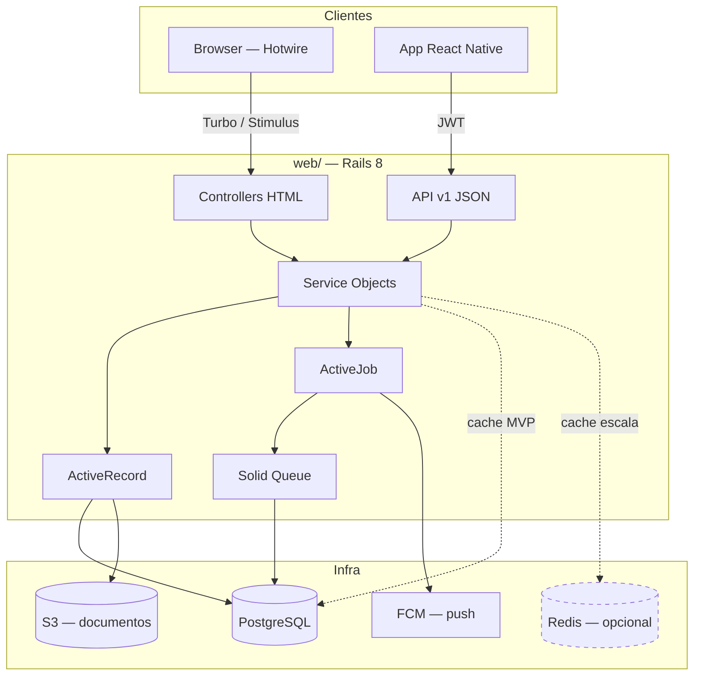
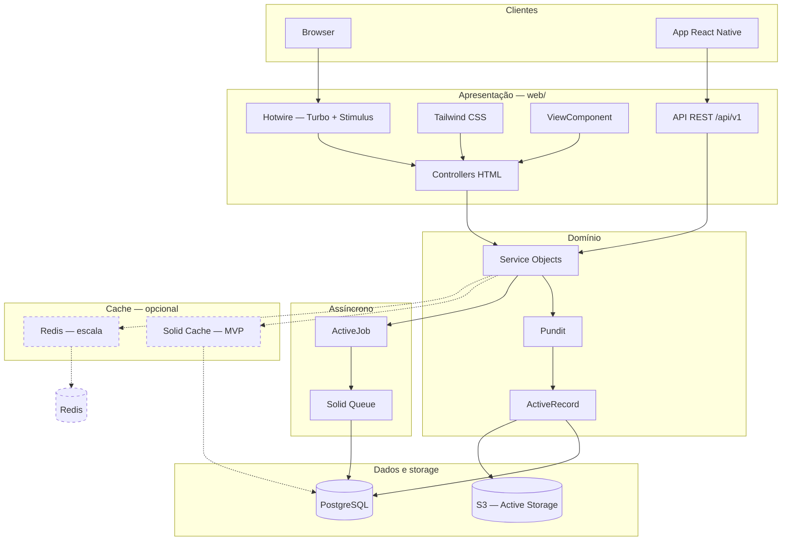
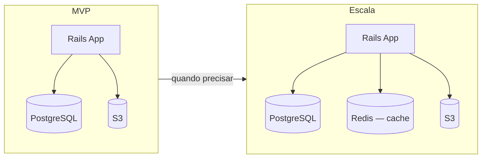

# Stack Web — School Lab

> Pasta: `web/`
> Status: decisão fechada (camada web)

Monolito Rails 8 com Hotwire para superfícies web e API REST JSON versionada
para o app mobile. Várias escolas no mesmo sistema. Infra mínima no MVP: app +
PostgreSQL + S3.

## 1. Resumo

| Camada | Tecnologia |
|--------|------------|
| Linguagem | Ruby 3.3.x |
| Framework | Rails 8.x |
| UI web | Hotwire (Turbo + Stimulus) + Tailwind CSS |
| Componentes | ViewComponent |
| Banco | PostgreSQL 16+ |
| Background jobs | Solid Queue (PostgreSQL) |
| Cache | Solid Cache no MVP; Redis opcional na escala |
| Storage | Active Storage → S3 |
| Push notifications | Firebase Cloud Messaging (FCM) |
| Locale | pt-BR |

## 2. Dois modos de entrega

A pasta `web/` entrega dois modos com a mesma base de regras de negócio:

| Modo | Consumidor | Abordagem |
|------|------------|-----------|
| HTML + Hotwire | Browsers (backoffice, escola, professor, pais) | Server-rendered, Turbo, Stimulus |
| JSON API | App mobile (`app/`) | REST versionada, autenticação por token |

Controllers HTML e API delegam para os mesmos service objects — regra de negócio
não é duplicada.

## 3. Frontend web

```
┌─────────────────────────────────────────────────┐
│  Views (ERB + ViewComponent) + Tailwind CSS       │
├─────────────────────────────────────────────────┤
│  Stimulus — interatividade local                  │
│  (modais, máscaras, toggles, validação inline)    │
├─────────────────────────────────────────────────┤
│  Turbo Drive  — navegação SPA-like                │
│  Turbo Frames — atualização parcial de seções     │
│  Turbo Streams — updates em tempo real (fase 2)   │
└─────────────────────────────────────────────────┘
```

| Componente | Papel |
|------------|-------|
| **Hotwire (Turbo)** | Navegação e updates sem SPA completo |
| **Stimulus** | JS mínimo e declarativo |
| **Tailwind CSS** | Estilização (gem `tailwindcss-rails`) |
| **ViewComponent** | Componentes reutilizáveis (cards, tabelas, badges) |
| **Propshaft** | Asset pipeline |
| **importmap-rails** | JS sem bundler pesado |

**Princípio:** HTML no servidor como default. Só adicionar JS quando Turbo/Stimulus
não resolverem.

## 4. Autenticação e autorização

| Canal | Mecanismo |
|-------|-----------|
| **Web** | Sessão (cookie) — Rails 8 Authentication Generator ou Devise |
| **API (app mobile)** | JWT + refresh token |

| Componente | Decisão |
|------------|---------|
| **Autorização** | Pundit — papéis: backoffice, escola, professor, pais |
| **Isolamento por escola** | A definir na modelagem; enforcement via policies e services |

## 5. API para o app mobile

| Aspecto | Decisão |
|---------|---------|
| **Formato** | REST JSON, versionada (`/api/v1/...`) |
| **Serialização** | A definir (`jsonapi-serializer` ou `blueprinter`) |
| **Contratos** | OpenAPI em `docs/api/` (fase posterior) |

## 6. Camada de domínio

| Camada | Ferramenta | Exemplo |
|--------|------------|---------|
| **Models** | ActiveRecord + validações | `Aluno`, `Nota`, `Boleto` |
| **Services** | Plain Ruby objects | `Financeiro::GerarBoleto` |
| **Forms** | ActiveModel form objects | Cadastro de aluno com responsável |
| **Jobs** | ActiveJob + Solid Queue | Emissão de boleto, envio de e-mail, push (FCM) |
| **Notificações** | FCM + máquina de estado | Push confiável; eventos validados antes do envio |
| **Uploads** | Active Storage + S3 | Arquivo digital / auditoria |
| **Auditoria** | `paper_trail` ou `audited` | Histórico de notas e documentos |
| **Paginação** | Pagy | Listagens de alunos, boletos |
| **Busca** | pg_search (MVP) | Busca por nome/CPF |

## 7. Infra de suporte

| Componente | Tecnologia | Notas |
|------------|------------|-------|
| **Banco** | PostgreSQL 16+ | Dados, filas (Solid Queue) e cache (Solid Cache) |
| **Background jobs** | Solid Queue | ActiveJob; sem Redis |
| **Cache** | Solid Cache (MVP) → Redis (escala) | Redis opcional, só cache |
| **Real-time** | Solid Cable (fase 2) | Turbo Streams — não necessário no MVP |
| **Push** | FCM via Solid Queue | Entrega assíncrona; não exige real-time |
| **Storage** | Active Storage → S3 | Documentos / auditoria |
| **Servidor** | Puma | Padrão Rails |

### Infra mínima (MVP)

```
Rails App  →  PostgreSQL  →  S3
```

Redis entra quando houver evidência de necessidade (dashboard lento, leituras
repetidas). Quando entrar, é **só para cache** — jobs continuam no Solid Queue.

### Push notifications (decisão fechada)

Entrega de push via **FCM** (Firebase Cloud Messaging), enfileirada no
**Solid Queue**. Na API, eventos passam por **máquina de estado** antes de
disparar o push — garante que notificações (ex.: ausência na chamada) só
saem quando o estado do evento está correto e confirmado.

Não exige real-time (WebSocket/Solid Cable): a informação deve chegar em
tempo hábil, não instantaneamente. Solid Cable fica para fase 2.

```
Evento (ex.: chamada registrada)
  → Service valida estado
  → Máquina de estado confirma transição
  → Job enfileirado (Solid Queue)
  → Worker envia via FCM
  → App recebe push
```

## 8. Testes

| Tipo | Ferramenta |
|------|------------|
| Unit / model / service | RSpec |
| Request / API | RSpec request specs |
| System (web) | Capybara + Cuprite |
| Factories | FactoryBot |

## 9. Superfícies web

| Superfície | MVP | Observação |
|------------|-----|------------|
| Backoffice DLA | Sim | Cadastro de escolas, visão da plataforma |
| Admin da escola | Sim | Turmas, alunos, financeiro, documentos |
| Professor | Sim | Notas, plano de aula, chamada, mensagens |
| Pais | Fase 2 | Prioridade no app mobile |

## 10. Convenções

- Service objects em `app/services/`
- Policies em `app/policies/`
- Locale default: `pt-BR`

## 11. Fora do escopo

- SPA JavaScript separado (React/Vue no web)
- GraphQL
- Microserviços
- Redis para background jobs (Sidekiq)

## 12. Arquitetura



### Camadas detalhadas



### Evolução de infra



## 13. Decisões pendentes

Itens ainda em aberto — ver `docs/open-questions.md` (seção Stack web):

- Serialização da API (`jsonapi-serializer` vs. `blueprinter`)
- Auth web: Rails 8 Authentication Generator vs. Devise
- Provider de e-mail (Postmark, SES, etc.)
- Integração de boleto (gateway/banco)
- Firebase Authentication — necessário ou auth próprio (JWT) basta?

**Decisões fechadas (jul/2026):**

- Push notifications: FCM + Solid Queue + máquina de estado na API.
- Real-time (Solid Cable / Turbo Streams): fase 2 — não necessário no MVP.
