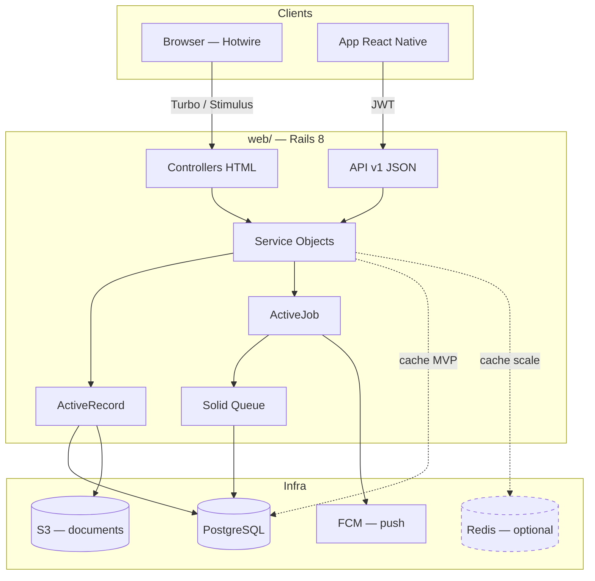
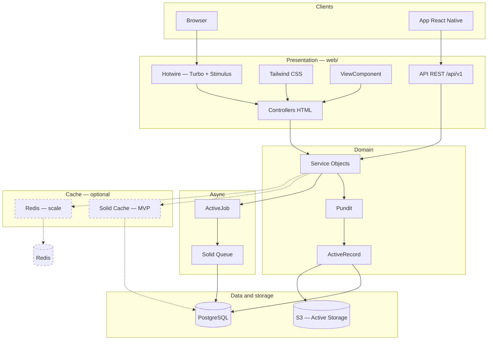
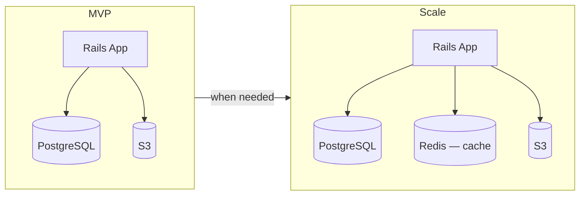

# Web Stack — School Lab

> Folder: `web/`
> Status: finalized decision (web layer)

A Rails 8 monolith with Hotwire for web surfaces and a versioned JSON REST API
for the mobile app. Many schools in the same system. Minimal infrastructure in
the MVP: app + PostgreSQL + S3.

## 1. Summary

| Layer | Technology |
|--------|------------|
| Language | Ruby 3.3.x |
| Framework | Rails 8.x |
| Web UI | Hotwire (Turbo + Stimulus) + Tailwind CSS |
| Components | ViewComponent |
| Database | PostgreSQL 16+ |
| Background jobs | Solid Queue (PostgreSQL) |
| Cache | Solid Cache in the MVP; Redis optional at scale |
| Storage | Active Storage → S3 |
| Push notifications | Firebase Cloud Messaging (FCM) |
| Locale | pt-BR |

## 2. Two delivery modes

The `web/` folder delivers two modes from the same business-rules base:

| Mode | Consumer | Approach |
|------|------------|-----------|
| HTML + Hotwire | Browsers (backoffice, school, teacher, guardian) | Server-rendered, Turbo, Stimulus |
| JSON API | Mobile app (`app/`) | Versioned REST, token authentication |

HTML and API controllers delegate to the same service objects — business rules
are not duplicated.

## 3. Web frontend

```
┌─────────────────────────────────────────────────┐
│  Views (ERB + ViewComponent) + Tailwind CSS       │
├─────────────────────────────────────────────────┤
│  Stimulus — local interactivity                   │
│  (modals, masks, toggles, inline validation)      │
├─────────────────────────────────────────────────┤
│  Turbo Drive  — SPA-like navigation               │
│  Turbo Frames — partial section updates           │
│  Turbo Streams — real-time updates (phase 2)      │
└─────────────────────────────────────────────────┘
```

| Component | Role |
|------------|-------|
| **Hotwire (Turbo)** | Navigation and updates without a full SPA |
| **Stimulus** | Minimal, declarative JS |
| **Tailwind CSS** | Styling (gem `tailwindcss-rails`) |
| **ViewComponent** | Reusable components (cards, tables, badges) |
| **Propshaft** | Asset pipeline |
| **importmap-rails** | JS without a heavy bundler |

**Principle:** server-side HTML as the default. Only add JS when Turbo/Stimulus
can't solve it.

## 4. Authentication and authorization

| Channel | Mechanism |
|-------|-----------|
| **Web** | Session (cookie) — Rails 8 Authentication Generator or Devise |
| **API (mobile app)** | JWT + refresh token |

| Component | Decision |
|------------|---------|
| **Authorization** | Pundit — roles: backoffice, school, teacher, guardian |
| **Per-school isolation** | To be defined in the modeling; enforcement via policies and services |

## 5. API for the mobile app

| Aspect | Decision |
|---------|---------|
| **Format** | REST JSON, versioned (`/api/v1/...`) |
| **Serialization** | To be defined (`jsonapi-serializer` or `blueprinter`) |
| **Contracts** | OpenAPI in `docs/api/` (later phase) |

## 6. Domain layer

| Layer | Tool | Example |
|--------|------------|---------|
| **Models** | ActiveRecord + validations | `Student`, `Grade`, `Payment`, `Message` |
| **Services** | Plain Ruby objects | `Billing::GenerateBoleto`, `Communication::SendMessage` |
| **Forms** | ActiveModel form objects | Student registration with guardian |
| **Jobs** | ActiveJob + Solid Queue | Boleto issuance, email sending, push (FCM) |
| **Notifications** | FCM + state machine | Reliable push; events validated before sending |
| **Uploads** | Active Storage + S3 | Digital archive, images in messages |
| **Auditing** | `paper_trail` or `audited` | History of grades and documents |
| **Pagination** | Pagy | Student and boleto listings |
| **Search** | pg_search (MVP) | Search by name/CPF |

## 7. Supporting infrastructure

| Component | Technology | Notes |
|------------|------------|-------|
| **Database** | PostgreSQL 16+ | Data, queues (Solid Queue), and cache (Solid Cache) |
| **Background jobs** | Solid Queue | ActiveJob; no Redis |
| **Cache** | Solid Cache (MVP) → Redis (scale) | Redis optional, cache only |
| **Real-time** | Solid Cable (phase 2) | Turbo Streams — not needed in the MVP |
| **Push** | FCM via Solid Queue | Async delivery; does not require real-time |
| **Storage** | Active Storage → S3 | Documents / auditing |
| **Server** | Puma | Rails default |

### Minimal infrastructure (MVP)

```
Rails App  →  PostgreSQL  →  S3
```

Redis comes in when there is evidence of need (slow dashboard, repeated reads).
When it does, it is **cache only** — jobs stay on Solid Queue.

### Push notifications (finalized decision)

Push delivery via **FCM** (Firebase Cloud Messaging), queued in **Solid Queue**.
On the API, events pass through a **state machine** before triggering the push —
this ensures notifications (e.g., attendance absence) only go out when the
event's state is correct and confirmed.

It does not require real-time (WebSocket/Solid Cable): the information must
arrive in a timely manner, not instantly. Solid Cable is left for phase 2.

```
Event (e.g., attendance recorded)
  → Service validates state
  → State machine confirms transition
  → Job enqueued (Solid Queue)
  → Worker sends via FCM
  → App receives push
```

## 8. Testing

| Type | Tool |
|------|------------|
| Unit / model / service | RSpec |
| Request / API | RSpec request specs |
| System (web) | Capybara + Cuprite |
| Factories | FactoryBot |

## 9. Web surfaces

| Surface | MVP | Note |
|------------|-----|------------|
| DLA backoffice | Yes | School registration, platform overview |
| School admin | Yes | Classes, students, billing, documents, push |
| Teacher | Yes | Grades, lesson plans, attendance, messages |
| Parents (app) | Yes | Communication, boletos, grades, documents |
| Parents (web) | Phase 2 | Priority on the mobile app in the MVP |

## 10. Conventions

- Service objects in `app/services/`
- Policies in `app/policies/`
- Locale default: `pt-BR`

## 11. Out of scope

- A separate JavaScript SPA (React/Vue on web)
- GraphQL
- Microservices
- Redis for background jobs (Sidekiq)

## 12. Architecture



### Detailed layers



### Infrastructure evolution



## 13. Pending decisions

Items still open — see `docs/open-questions.md` (Web stack section):

- API serialization (`jsonapi-serializer` vs. `blueprinter`)
- Web auth: Rails 8 Authentication Generator vs. Devise
- Email provider (Postmark, SES, etc.)
- Boleto integration (gateway/bank)
- Firebase Authentication — needed, or is proprietary auth (JWT) enough?

**Finalized decisions (Jul 2026):**

- Push notifications: FCM + Solid Queue + state machine on the API.
- Real-time (Solid Cable / Turbo Streams): phase 2 — not needed in the MVP.

## 14. Phase 2 — technical directions (draft)

Items not yet finalized — see `docs/open-questions.md` (Livro Ata):

| Component | Likely direction | Notes |
|------------|------------------|-------|
| **Digital signature** | Proprietary (scribble + email + IP + hash) or DocuSign/Authentique integration | Legal validation pending |
| **Livro Ata** | Minutes model by type + signatory workflow | Shares signature infrastructure |
| **Semantic search** | pgvector in PostgreSQL or an external service | Scope: minutes or the entire archive |
| **Transcription / AI** | Meet integration or audio upload → draft generation | Later, within the module |
