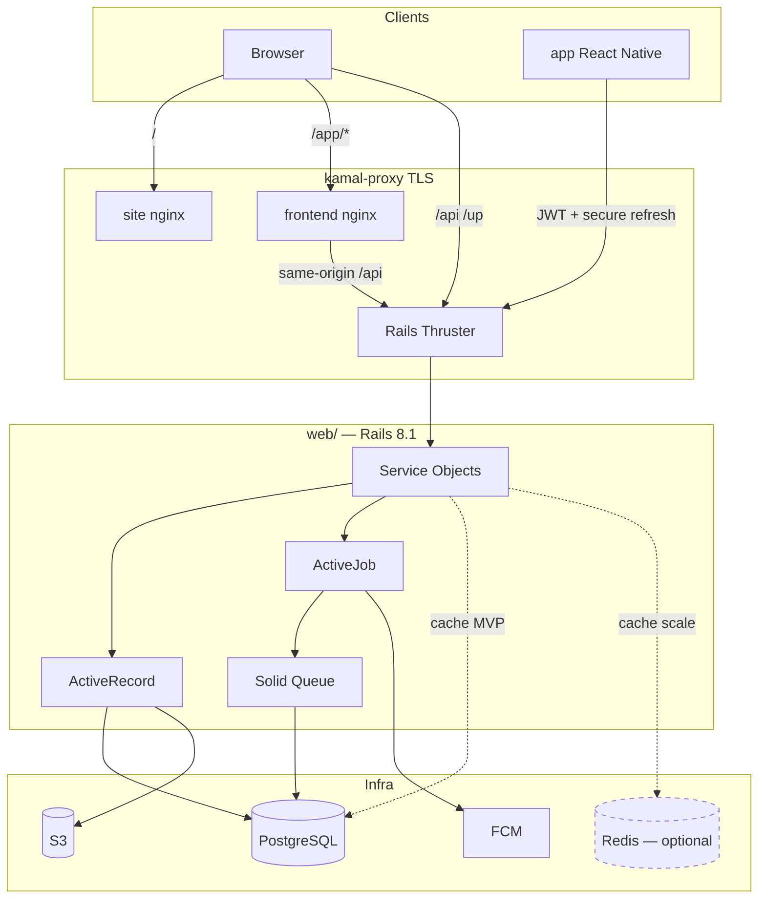
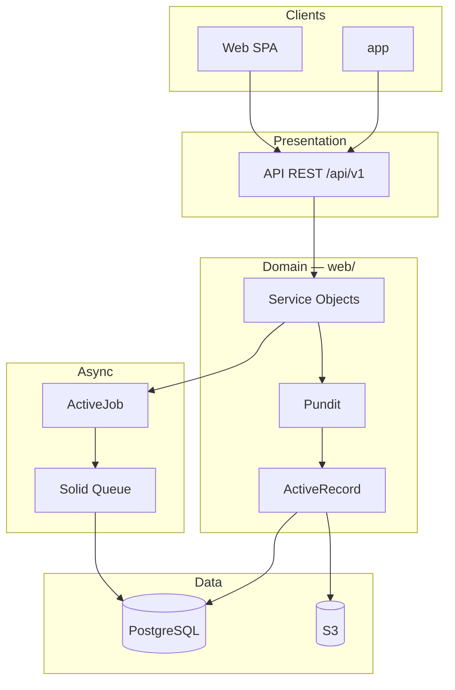

# Web Stack — School Lab

> Folders: `web/`, `frontend/app/` (school SPA at `/app`), `frontend/backoffice/` (platform SPA at `/backoffice`), `site/`, `mobile/` (React Native)  
> **ADR:** [001-monorepo-surfaces](adr/001-monorepo-surfaces.md)  
> Status: finalized decision (web layer)

Rails 8.1 API monolith with a versioned JSON REST API consumed by **React web** and
**React Native** clients. Many schools in the same system. Minimal infrastructure in
the MVP: app + PostgreSQL + S3.

## 1. Summary

| Layer | Technology |
|--------|------------|
| Language | Ruby 4.0.x |
| Framework | Rails 8.1.x |
| API | REST JSON `/api/v1` |
| Web UI (school) | **React 19** SPA (`frontend/app/`) — Vite 7 + TypeScript, **MUI v7**, `/app` |
| Web UI (platform) | **React 19** SPA (`frontend/backoffice/`) — same stack, `/backoffice` |
| Marketing site | Static HTML (`site/`) at domain root `/` |
| Mobile UI | **React Native** (`mobile/`) |
| API docs | **rswag** → OpenAPI (`swagger/v1/swagger.yaml`) |
| Database | PostgreSQL 16+ |
| Background jobs | Solid Queue (PostgreSQL) |
| Cache | Solid Cache in the MVP; Redis optional at scale |
| Storage | Active Storage → S3 |
| Push notifications | Firebase Cloud Messaging (FCM) |
| Locale | pt-BR (API errors via i18n) |

**Pinned versions (Jul 2026):** Ruby 4.0.5, Rails 8.1.3.

## 2. Monorepo layout

Decision record: [ADR 001](adr/001-monorepo-surfaces.md).

```
school_lab/
  web/                      # Rails — API, services, models, jobs (no Hotwire UI)
  frontend/
    app/                    # School SPA at /app
    backoffice/             # Platform SPA at /backoffice
    design-system-docs/     # Catalog build → docs/design-system/
    base/                   # upstream template — reference only
  mobile/                   # React Native
  packages/design-tokens/   # Shared tokens — SPA + mobile
  site/                     # static institutional landing at /
  docs/api/                 # API conventions + route narratives
```

| Folder | Role |
|--------|------|
| `web/` | Single source of business rules; `/api/v1`; future Flipper / ops UI |
| `frontend/app/` | School staff web UI; JWT + refresh cookie; deployed at `/app` |
| `frontend/backoffice/` | DLA platform UI; same auth; deployed at `/backoffice` |
| `site/` | Static marketing placeholder; no API dependency |
| `frontend/base` | Upstream template (`dashdark-x`); reference only |
| `mobile/` | Same API; refresh in secure device storage |
| `packages/design-tokens` | Color/shadow tokens shared by web SPAs and mobile |

All product controllers delegate to the same service objects — rules are not duplicated.

## 3. School web SPA (`frontend/app/`)

React 19 SPA on Vite 7 + TypeScript 5.9 (SWC via `@vitejs/plugin-react-swc`). Deployed at
`/app` (`VITE_BASE_PATH=/app/`). The table below describes what is **installed today**, not a plan.

| Concern | Approach |
|---------|----------|
| UI kit / styling | **MUI v7** (`@mui/material`) on Emotion (`@emotion/react`, `@emotion/styled`); custom theme and component overrides in `src/theme/` |
| Rich components | `@mui/x-data-grid` v8 (tables), `@mui/x-date-pickers` v8 (dates) |
| Routing | **React Router v7** (`react-router`) — data router via `createBrowserRouter`; guards in `src/routes/guards.tsx` |
| API client | Hand-written `fetch` wrapper (`src/services/api.ts`) — no axios and no generated client; unwraps `{ error: { code, message, details } }` |
| Auth | Access token in memory (`src/services/tokenStore.ts`); refresh via httpOnly cookie (`credentials: 'include'`) with one transparent 401 retry |
| State | React Context only — `src/providers/AuthProvider.tsx` for the session; local `useState` elsewhere |
| Forms | Controlled components with `useState` + native `onSubmit`; no form library |
| Charts | ECharts (`echarts`, `echarts-for-react`) |
| Icons / scrolling | `@iconify/react`, `simplebar` |
| Dates | `date-fns` and `dayjs` (dayjs backs the MUI date pickers) |
| Lint / format | ESLint 9 flat config + Prettier, enforced during `vite dev`/`build` by `vite-plugin-checker` |
| Tests | **Vitest** + React Testing Library on jsdom; `test` block in `vite.config.ts`, shared render helper in `src/test/renderWithTheme.tsx`. `npm run test` (watch) / `npm run test:run` (CI). Conventions: `docs/guidelines/web-ui/testing.md` |
| API mocking | **MSW** (`msw/node`) — handlers in `src/test/msw/`, server started from `src/test/setup.ts` with `onUnhandledRequest: 'error'` |
| Config | `VITE_API_BASE_URL` (`frontend/app/.env.example`); empty in production for same-origin `/api/...`; `VITE_BASE_PATH=/app/` for deploy builds; dev server on port 5173 |

**Principle:** thin client — validation and business rules stay in the API.

### Design system

| Piece | Location |
|-------|----------|
| Shared tokens | `packages/design-tokens/` (`@school-lab/design-tokens`) |
| MUI theme | `frontend/app/src/theme/createAppTheme.ts` |
| Pattern components | `frontend/app/src/design-system/`; path alias `design-system` |
| **Canonical catalog** | `docs/design-system/` — built from `frontend/design-system-docs/` with `make design-system-docs` |
| Development sandbox | Ladle — `npm run ladle` in the school SPA package. **Not** a documentation surface (§15) |
| Guidelines | `docs/guidelines/web-ui/` |

Theme toggle persists to `localStorage` key `school-lab-color-mode`. Mobile (`mobile/`) imports dark tokens only.

### Not in the school SPA yet

Absent from the school SPA as of Aug 2026. Planning work there means introducing these, not
consuming them — the corresponding choices are open items in §15.

| Missing | What that means today |
|---------|-----------------------|
| **i18n** | No i18next or equivalent; strings are hardcoded in components (mixed English and pt-BR). The topbar `LanguageSelect` is inert template UI |
| **Data fetching library** | No TanStack Query or SWR — components call `src/services/` directly and track loading/error state by hand |
| **Global state library** | No Zustand or Redux — React Context is the only shared state |
| **Generated API types** | No `openapi-typescript` or orval; request/response types are hand-written in `src/types/` |
| **Tailwind CSS** | Not installed anywhere under `frontend/` — MUI is the UI kit (§15) |

## 4. Platform backoffice SPA (`frontend/backoffice/`)

Second React SPA for DLA operators — same stack as §3 (React 19, Vite 7, MUI v7, React Router
v7). Deployed at `/backoffice` (`VITE_BASE_PATH=/backoffice/`).

| Concern | Approach |
|---------|----------|
| Scope | School register, white-glove provisioning wizard, future platform billing/support |
| Routing | English URL segments (`/schools`, `/schools/:id/provisioning`) — see ADR 001 |
| Auth | Same JWT + refresh cookie as school SPA; sign-in UI in school SPA with post-login redirect |
| Shared code | Copy minimal API client first; extract to `packages/` on third stable duplication |

## 5. Mobile frontend (`mobile/`)

React Native consuming the same `/api/v1` contract.

| Concern | Approach |
|---------|----------|
| Auth | JWT access in memory; refresh in Keychain/Keystore |
| Push | FCM device tokens via `POST /api/v1/me/device_tokens` |
| API client | Shared patterns with the web SPA where possible |

## 6. Authentication and authorization

| Channel | Mechanism |
|-------|-----------|
| **Web SPAs** | JWT access (Bearer) + refresh **httpOnly cookie** (`path: '/'`) |
| **Mobile (`mobile/`)** | JWT access + refresh token (secure storage) |
| **Credentials** | **Devise** on `users` (password, reset, lock) |

Details: `docs/modeling/002-api-auth.md`.

| Token | TTL |
|-------|-----|
| Access JWT | 20 minutes |
| Refresh | 90 days sliding (180 with remember me) |
| Rotation | New refresh on every refresh call |

| Component | Decision |
|------------|---------|
| **Authorization** | Pundit — roles: backoffice, staff, teacher, guardian |
| **Per-school isolation** | Path `/schools/:school_id/...` + Pundit + services |
| **Per-family isolation** | Guardian `.../me/...` routes + policies |

## 7. API

| Aspect | Decision |
|---------|---------|
| **Format** | REST JSON, versioned (`/api/v1/...`) |
| **Serialization** | **blueprinter** (provisional) |
| **Contracts** | OpenAPI via **rswag** request specs |
| **Conventions** | `docs/api/README.md` |
| **Fintech MVP routes** | `docs/api/v1/fintech-first.md` |

## 8. Domain layer

| Layer | Tool | Example |
|--------|------------|---------|
| **Models** | ActiveRecord + validations | `Student`, `Charge`, `Payment` |
| **Services** | Plain Ruby objects | `Billing::IssueChargeService`, `Auth::IssueTokensService` |
| **Forms** | ActiveModel form objects | Student registration with guardian |
| **Jobs** | ActiveJob + Solid Queue | Boleto issuance, email, push (FCM) |
| **Notifications** | FCM + state machine | Reliable push |
| **Uploads** | Active Storage + S3 | Documents, message images |
| **Auditing** | **audited** | Change history on domain records (`audits` table, jsonb) |
| **State machines** | **aasm** | Domain lifecycles (`status` column — charges, documents, push delivery) |
| **Pagination** | Pagy | List endpoints |
| **Search** | pg_search (MVP) | Search by name/CPF |
| **Soft delete** | **discard** gem | `discarded_at` on domain tables |

## 9. Supporting infrastructure

| Component | Technology | Notes |
|------------|------------|-------|
| **Database** | PostgreSQL 16+ | Data, queues (Solid Queue), cache (Solid Cache) |
| **Background jobs** | Solid Queue | ActiveJob; no Redis |
| **Cache** | Solid Cache (MVP) → Redis (scale) | Redis optional, cache only |
| **Real-time** | WebSocket client (phase 2) | Polling or push-first in MVP |
| **Push** | FCM via Solid Queue | Async delivery |
| **Outbound HTTP** | **Faraday** via `SchoolLab::Http` + `SchoolLab::Integrations::*` | Transport + vendor clients; see `docs/guidelines/web/http-client.md` and `integrations.md` |
| **Storage** | Active Storage → S3 | Documents |
| **Server** | Puma | Rails default |
| **CORS** | rack-cors | Web SPA origins |

### Minimal infrastructure (MVP)

```
kamal-proxy
  ├── site/ (nginx)     → /
  ├── frontend/ (nginx) → /app
  └── web/ (Rails)      → /api, /up, …
PostgreSQL, S3
React Native → stores
```

### Push notifications (finalized decision)

Push delivery via **FCM**, queued in **Solid Queue**. Events pass through an **AASM**
state machine (see `docs/guidelines/web/state-machines.md`) before triggering push.

```
Event (e.g., attendance recorded)
  → Service validates state
  → State machine confirms transition
  → Job enqueued (Solid Queue)
  → Worker sends via FCM
  → App receives push
```

## 10. Testing

| Type | Tool |
|------|------|
| Unit / model / service | RSpec |
| API + OpenAPI | RSpec request specs + **rswag** |
| Web UI | Vitest + React Testing Library (jsdom) in the school SPA package, API calls intercepted by MSW — `npm run test:run` (§3) |
| Mobile | Jest + RN Testing Library (in `mobile/`) |
| Factories | FactoryBot |

Behavior-focused testing philosophy and conventions: `docs/guidelines/web/testing.md` (API) and
`docs/guidelines/web-ui/testing.md` (SPA).

## 11. Client surfaces

| Surface | Folder | Channel | MVP |
|---------|--------|---------|-----|
| DLA backoffice | `frontend/backoffice/` | Web SPA at `/backoffice` | Yes |
| School admin | `frontend/app/` | Web SPA at `/app` (+ light mobile) | Yes |
| Teacher | `frontend/app/` + `mobile/` | Web + mobile | Yes |
| Guardian (UI: Responsável) | `frontend/app/` + `mobile/` | Web-first portal; mobile parity after stable contracts, mobile primary for push | Yes |

## 12. Conventions

- Service objects in `app/services/`
- Policies in `app/policies/`
- API controllers in `app/controllers/api/v1/`
- Locale default: `pt-BR`

## 13. Out of scope

- GraphQL
- Microservices
- Redis for background jobs (Sidekiq)
- Server-rendered Hotwire as primary web UI (superseded by React SPA)
- Tailwind CSS in the school SPA (superseded by MUI — §15)

## 14. Architecture



### Detailed layers



## 15. Pending decisions

See `docs/open-questions.md` (Web stack section):

- ~~Email provider~~ — **Postmark** for transactional mail (collection régua; `POSTMARK_API_TOKEN`)
- When to add Redis (cache only)

Open for the school SPA — each is missing today (§3):

- **i18n library** — needed before the UI can honor the `pt-BR` product locale properly.
- **Data fetching** — keep hand-rolled `fetch` calls, or adopt TanStack Query / SWR.
- **Global state** — stay on React Context, or adopt a store once more than one feature needs it.
- **API types** — hand-written, or generated from `swagger/v1/swagger.yaml`.

**Finalized decisions (Aug 2026):**

- **SPA test runner: Vitest + React Testing Library** on jsdom in `frontend/app`, configured
  through the existing `vite.config.ts` so tests and the app share one alias source. Specs live
  beside the component; `src/test/renderWithTheme.tsx` provides the themed render.
  Conventions: `docs/guidelines/web-ui/testing.md`.
- **SPA API mocking: MSW** (`msw/node`), closing the item §3 used to list as missing. The server
  is started from `src/test/setup.ts` with `onUnhandledRequest: 'error'`, so a call to an
  unmocked endpoint fails the test rather than reaching the network; default handlers live in
  `src/test/msw/` and a spec overrides one endpoint at a time with `server.use()`. Specs mock at
  the network boundary — `src/services/` and `fetch` itself are never stubbed, which is what lets
  `src/services/api.test.ts` cover the 401 → refresh → retry path for real.
- **Design token versioning:** `@school-lab/design-tokens` is semantically versioned with a
  `CHANGELOG.md`; a rendered value change is at least a minor bump, never a patch. Currently
  `1.2.0`. Policy: `docs/guidelines/web-ui/versioning.md`.
- **Design system catalog: the static site is canonical.** `frontend/design-system-docs/` builds
  into `docs/design-system/` with `make design-system-docs`, and that committed output is the
  surface a reviewer checks. **Ladle is a development sandbox only** — no page or component may
  exist solely in Ladle, and the catalog never links to it. Nav and router are kept in agreement by
  `scripts/check-nav-routes.mjs`, and every route is render-checked by `scripts/smoke-pages.mjs`
  against the built bundle. Recorded in `docs/prds/layer-web-spa.md` (Interfaces → Catalog).
- **Design system accessibility target: WCAG 2.1 AA**, ratified 2026-08-04. Contrast is audited in
  both colour schemes and every shortfall is either fixed or waived in writing
  (`docs/guidelines/web-ui/accessibility.md`). Four waivers stand; the one that needed a product
  call is **W3**, which keeps the `#CB3CFF` brand purple named in §15 on the contained primary
  Button even though no flat label colour clears 4.5:1 across its gradient — white's 3.73:1 is the
  measured ceiling, and darkening the first stop to `#B733E5` was declined rather than overlooked.
- **MUI `Card*` and `Table*`: forbidden by default** in `frontend/app`, with no override created.
  `SectionCard` is the card surface, `DataTable` the tabular one. Neither primitive is imported
  anywhere today, so the ban records the status quo and keeps a single sanctioned route to each
  result. Revisit only for genuinely static, non-paginated tabular content that `DataTable` is the
  wrong tool for. Rationale: `docs/guidelines/web-ui/theming.md`.
- **SPA UI kit: MUI v7 + Emotion** in `frontend/app` — **not Tailwind**. The SPA was generated
  from the `dashdark-x` template (kept as `frontend/base`); MUI, its theme, and the MUI X
  DataGrid/Date Pickers came with the template and were kept instead of re-styling the app.
  No migration to Tailwind is planned, and no Tailwind code exists under `frontend/`. Any
  Tailwind reference elsewhere in the repo concerns `web/` (Rails), not the SPA.
- **Bank slip (boleto): Cora** in *Integração Direta* (Direct Integration) on the school's
  own Cora account — the platform is not the payee. mTLS client certificate plus OAuth
  token, registered boleto with embedded Pix. Implemented behind the `Gateways::BankSlip`
  port (`cora` and `fake` adapters); see `docs/guidelines/web/gateways.md`.

**Finalized decisions (Jul 2026):**

- Language & framework: Ruby 4.0.5, Rails 8.1.3.
- **Web UI: React SPA** (`frontend/app`), not Hotwire.
- **Mobile: React Native** (`mobile/`).
- **One API** for web and mobile (`/api/v1`).
- Auth: Devise credentials + JWT access + `refresh_tokens`.
- Access 20 min; refresh 90 days sliding (180 remember me); rotation on refresh.
- Web refresh: httpOnly cookie; mobile: secure storage.
- API docs: **rswag** → OpenAPI.
- Serialization: **blueprinter** (provisional).
- Push: FCM + Solid Queue + state machine.
- Real-time WebSockets: phase 2 — MVP uses push + polling.

## 16. Phase 2 — technical directions (draft)

| Component | Likely direction | Notes |
|------------|------------------|-------|
| **Digital signature** | Proprietary or DocuSign/Authentique | Legal validation pending |
| **Livro Ata** | Minutes + signatory workflow | Shares signature infra |
| **Semantic search** | pgvector or external service | Minutes / archive |
| **Real-time** | WebSocket or Action Cable for messages | Optional upgrade from push |
