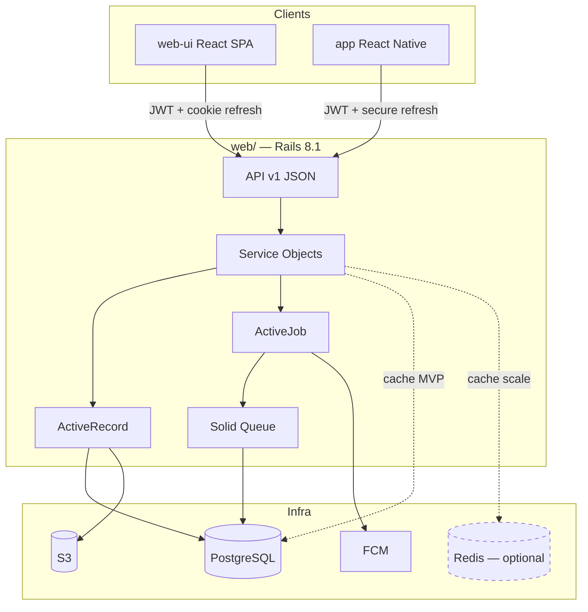
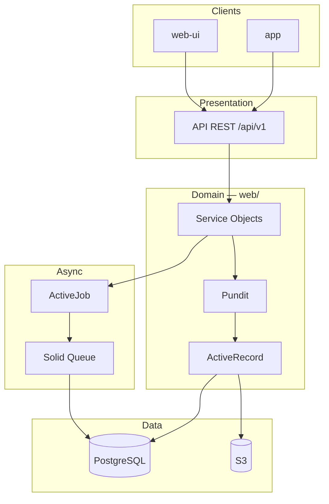

# Web Stack — School Lab

> Folders: `web/` (Rails API), `web-ui/` (React SPA), `app/` (React Native)  
> Status: finalized decision (web layer)

Rails 8.1 API monolith with a versioned JSON REST API consumed by **React web** and
**React Native** clients. Many schools in the same system. Minimal infrastructure in
the MVP: app + PostgreSQL + S3.

## 1. Summary

| Layer | Technology |
|--------|------------|
| Language | Ruby 4.0.x |
| Framework | Rails 8.1.x |

**Pinned versions (Jul 2026):** Ruby 4.0.5, Rails 8.1.3.
| API | REST JSON `/api/v1` |
| Web UI | **React** SPA (`web-ui/`) — Vite |
| Mobile UI | **React Native** (`app/`) |
| API docs | **rswag** → OpenAPI (`swagger/v1/swagger.yaml`) |
| Database | PostgreSQL 16+ |
| Background jobs | Solid Queue (PostgreSQL) |
| Cache | Solid Cache in the MVP; Redis optional at scale |
| Storage | Active Storage → S3 |
| Push notifications | Firebase Cloud Messaging (FCM) |
| Locale | pt-BR (API errors via i18n) |

## 2. Monorepo layout

```
school_lab/
  web/       # Rails — API, services, models, jobs (no Hotwire UI)
  web-ui/    # React SPA — backoffice, school, teacher, guardian (web)
  app/       # React Native — school, teacher, parents (mobile)
  docs/api/  # API conventions + route narratives
```

| Folder | Role |
|--------|------|
| `web/` | Single source of business rules; `/api/v1` only for product UI |
| `web-ui/` | Consumes API with JWT; refresh via httpOnly cookie |
| `app/` | Consumes same API; refresh in secure device storage |

All product controllers delegate to the same service objects — rules are not duplicated.

## 3. Web frontend (`web-ui/`)

React SPA (planned: Vite + TypeScript + Tailwind).

| Concern | Approach |
|---------|----------|
| Routing | React Router (or TanStack Router) |
| API client | Fetch/axios + OpenAPI types (optional `openapi-typescript`) |
| Auth | Access token in memory; refresh in httpOnly cookie |
| State | Context / Zustand per feature |
| Styling | Tailwind CSS |

**Principle:** thin client — validation and business rules stay in the API.

## 4. Mobile frontend (`app/`)

React Native consuming the same `/api/v1` contract.

| Concern | Approach |
|---------|----------|
| Auth | JWT access in memory; refresh in Keychain/Keystore |
| Push | FCM device tokens via `POST /api/v1/me/device_tokens` |
| API client | Shared patterns with `web-ui` where possible |

## 5. Authentication and authorization

| Channel | Mechanism |
|-------|-----------|
| **Web (`web-ui`)** | JWT access (Bearer) + refresh **httpOnly cookie** |
| **Mobile (`app`)** | JWT access + refresh token (secure storage) |
| **Credentials** | **Devise** on `users` (password, reset, lock) |

Details: `docs/modeling/002-api-auth.md`.

| Token | TTL |
|-------|-----|
| Access JWT | 20 minutes |
| Refresh | 90 days sliding (180 with remember me) |
| Rotation | New refresh on every refresh call |

| Component | Decision |
|------------|---------|
| **Authorization** | Pundit — roles: backoffice, school, teacher, guardian |
| **Per-school isolation** | Path `/schools/:school_id/...` + Pundit + services |
| **Per-family isolation** | Guardian `.../me/...` routes + policies |

## 6. API

| Aspect | Decision |
|---------|---------|
| **Format** | REST JSON, versioned (`/api/v1/...`) |
| **Serialization** | **blueprinter** (provisional) |
| **Contracts** | OpenAPI via **rswag** request specs |
| **Conventions** | `docs/api/README.md` |
| **Fintech MVP routes** | `docs/api/v1/fintech-first.md` |

## 7. Domain layer

| Layer | Tool | Example |
|--------|------------|---------|
| **Models** | ActiveRecord + validations | `Student`, `Charge`, `Payment` |
| **Services** | Plain Ruby objects | `Billing::GenerateBoleto`, `Auth::IssueTokens` |
| **Forms** | ActiveModel form objects | Student registration with guardian |
| **Jobs** | ActiveJob + Solid Queue | Boleto issuance, email, push (FCM) |
| **Notifications** | FCM + state machine | Reliable push |
| **Uploads** | Active Storage + S3 | Documents, message images |
| **Auditing** | **audited** | Change history on domain records (`audits` table, jsonb) |
| **State machines** | **aasm** | Domain lifecycles (`status` column — charges, documents, push delivery) |
| **Pagination** | Pagy | List endpoints |
| **Search** | pg_search (MVP) | Search by name/CPF |
| **Soft delete** | **discard** gem | `discarded_at` on domain tables |

## 8. Supporting infrastructure

| Component | Technology | Notes |
|------------|------------|-------|
| **Database** | PostgreSQL 16+ | Data, queues (Solid Queue), cache (Solid Cache) |
| **Background jobs** | Solid Queue | ActiveJob; no Redis |
| **Cache** | Solid Cache (MVP) → Redis (scale) | Redis optional, cache only |
| **Real-time** | WebSocket client (phase 2) | Polling or push-first in MVP |
| **Push** | FCM via Solid Queue | Async delivery |
| **Storage** | Active Storage → S3 | Documents |
| **Server** | Puma | Rails default |
| **CORS** | rack-cors | `web-ui` origins |

### Minimal infrastructure (MVP)

```
Rails API  →  PostgreSQL  →  S3
web-ui SPA →  CDN or static host
React Native → stores
```

### Push notifications (finalized decision)

Push delivery via **FCM**, queued in **Solid Queue**. Events pass through an **AASM**
state machine (see `docs/guidelines/web/state-machines.md`) before triggering push.

```
Event (e.g., attendance recorded)
  → Service validates state
  → State machine confirms transition
  → Job enqueued (Solid Queue)
  → Worker sends via FCM
  → App receives push
```

## 9. Testing

| Type | Tool |
|------|------|
| Unit / model / service | RSpec |
| API + OpenAPI | RSpec request specs + **rswag** |
| Web UI | Vitest + React Testing Library (in `web-ui/`) |
| Mobile | Jest + RN Testing Library (in `app/`) |
| Factories | FactoryBot |

Behavior-focused testing philosophy and conventions: `docs/guidelines/web/testing.md`.

## 10. Client surfaces

| Surface | Channel | MVP |
|---------|---------|-----|
| DLA backoffice | `web-ui` | Yes |
| School admin | `web-ui` (+ light `app`) | Yes |
| Teacher | `web-ui` + `app` | Yes |
| Parents | `app` (+ `web-ui` phase 2) | App first for boletos |

## 11. Conventions

- Service objects in `app/services/`
- Policies in `app/policies/`
- API controllers in `app/controllers/api/v1/`
- Locale default: `pt-BR`

## 12. Out of scope

- GraphQL
- Microservices
- Redis for background jobs (Sidekiq)
- Server-rendered Hotwire as primary web UI (superseded by React SPA)

## 13. Architecture



### Detailed layers



## 14. Pending decisions

See `docs/open-questions.md` (Web stack section):

- Email provider (Postmark, SES, etc.)
- Boleto integration (gateway/bank)
- When to add Redis (cache only)

**Finalized decisions (Jul 2026):**

- Language & framework: Ruby 4.0.5, Rails 8.1.3.
- **Web UI: React SPA** (`web-ui/`), not Hotwire.
- **Mobile: React Native** (`app/`).
- **One API** for web and mobile (`/api/v1`).
- Auth: Devise credentials + JWT access + `refresh_tokens`.
- Access 20 min; refresh 90 days sliding (180 remember me); rotation on refresh.
- Web refresh: httpOnly cookie; mobile: secure storage.
- API docs: **rswag** → OpenAPI.
- Serialization: **blueprinter** (provisional).
- Push: FCM + Solid Queue + state machine.
- Real-time WebSockets: phase 2 — MVP uses push + polling.

## 15. Phase 2 — technical directions (draft)

| Component | Likely direction | Notes |
|------------|------------------|-------|
| **Digital signature** | Proprietary or DocuSign/Authentique | Legal validation pending |
| **Livro Ata** | Minutes + signatory workflow | Shares signature infra |
| **Semantic search** | pgvector or external service | Minutes / archive |
| **Real-time** | WebSocket or Action Cable for messages | Optional upgrade from push |
